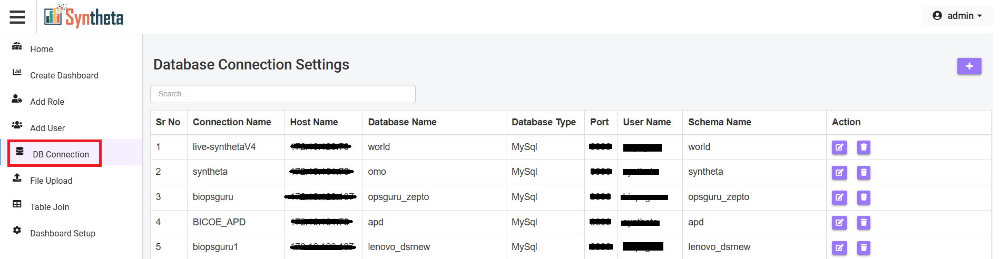
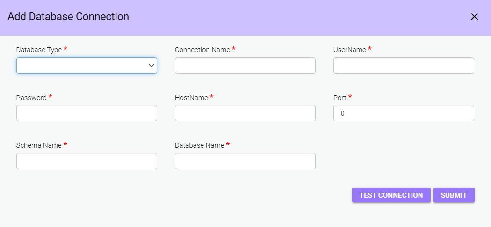
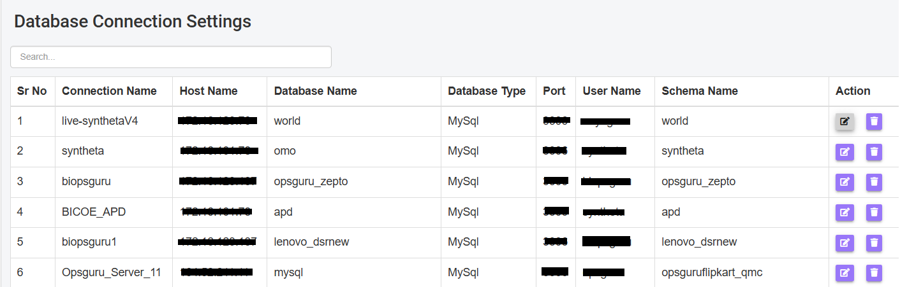
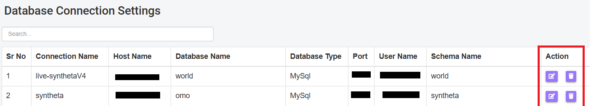

# DB CONNECTION
A Database Connection allows an application or service to establish a communication link with a database in order to send and receive data. This connection acts as the bridge between the application and the database server, enabling queries, data retrieval, updates, and various database operations.

## Accessing DB connection form
**Step 1**: Click on "DB connection".

**Step 2**: Click on "Add".
(on the top right corner)

A form Will open with *Add Database Connection*

**Step 3**: Fill in the required information in the form

- **Database Type**: Select the type of database you are connecting to like
    - *MySQL*: A widely-used open-source relational database management system.
    - *PostgreSQL*: An advanced, open-source, object-relational database system known for its extensibility and standards compliance.
    - *MSSQL*: Refers to Microsoft SQL Server, a relational database management system by Microsoft.
    - *MariaDB*: An open-source fork of MySQL, known for its performance improvements and additional features.
    - *SQLite*: A lightweight, serverless, self-contained SQL database engine often used in embedded systems and small-scale applications.
- **Connection Name**: Choose a name for this database connection (e.g., "Production DB", "Test DB").
- **UserName**: Enter the database username.
- **Password**: Enter the database password.
- **HostName**: Enter the host server address where the database is located.
- **Port**: Enter the port number used by the database server.
- **Schema Name**: Enter the schema name (if applicable).
- **Database Name**: Specify the name of the database you wish to connect to.

**Step 4**: Test and Submit

- **TEST CONNECTION**: Click the "Test Connection" button to verify if the connection details are correct.
- **SUBMIT**: After testing, click Submit to save the database connection.

## View or Search DB Connection 

- **View Created DB Connection**: User can see all created DB connections, including their *Connection Name*, *Host Name*, *Database Name*, *Database Type*, *Port*, *User Name*, and *Schema Name*.
- **Search for a Specific DB Connection**: Use the search bar to find a particular database connection by name or other attributes.

## Manage DB connection Actions

### Edit
Click the *Edit icon* to modify the connection details.
### Delete
Click the *Delete icon* to remove an unwanted connection.

