# ADD ROLE
The "Add Role" feature allows administrators to create and manage user roles within a system. These roles define the level of access and permissions granted to different roles, helping to control and organize user interactions with the system. The process consists of several key steps, each of which allows administrators to tailor the access control for different user groups.

## Create Role
**Step 1**: Click on "Add Role".

**Step 2**: Click on "Create". 

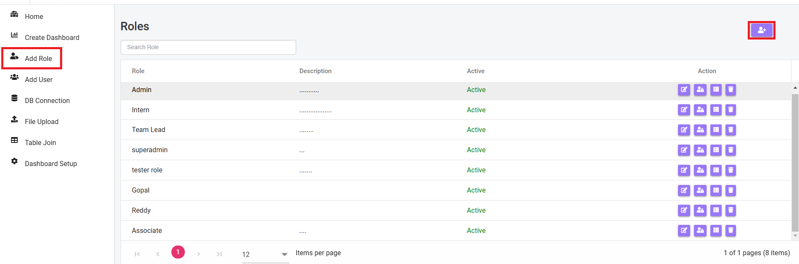

A form will appear where you can create a new role:

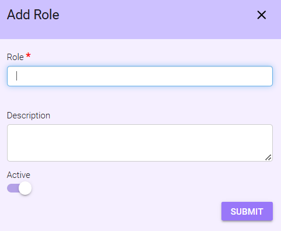

- **Role**: Enter the name of the new role in the text box.
- **Description**: Provide a description for the role.
- **Active**: This is toggle option 
    - If the "Active" option is enabled, the role will be active.
    - If the "Active" option is disabled, the role will be inactive.
- **Submit**: Click the "Submit" button to save the role.

## View or Search Created Role
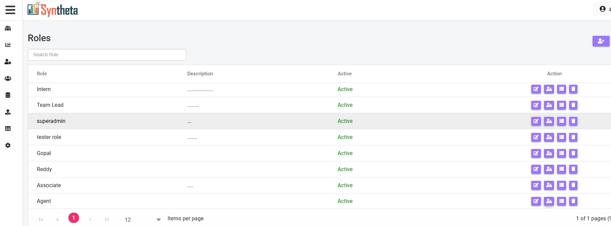

- **View Created Role**: The created role will appeared in the end of list, along with its description and active status.

- **Search any particular Role**: User can use the search bar to search any particular role.

## Manage Add Role Actions
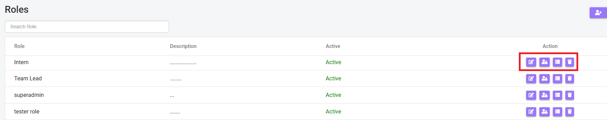

### 1. Edit
- Click the 1st icon **Edit** to make changes to an existing role.

### 2. Role Permission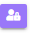
- Click the 2nd icon **Role Permission** to configure the role's access permissions.

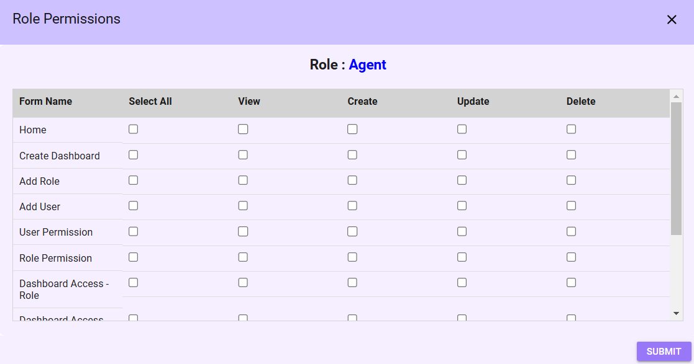

A tab will open where user can assign permissions for the sidebar menu, dashboard roles, and dashboard users.

User can click the "Select All" checkbox to grant full access, including actions like View, Create, Update, and Delete for the sidebar and dashboard.

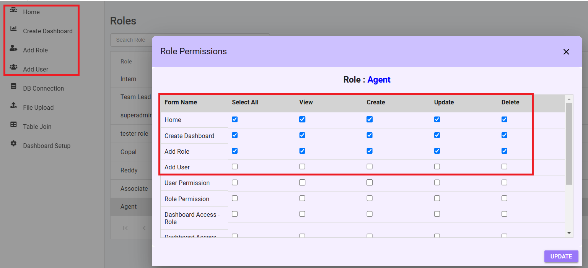
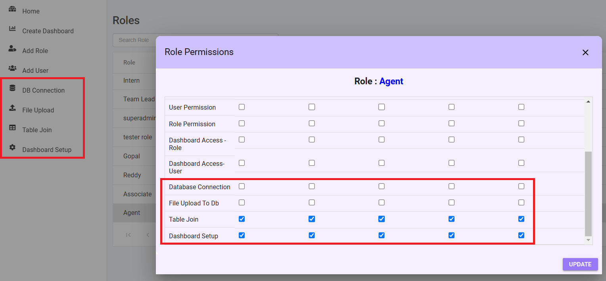

The highlighted once are the permission given 

**Home Page**: Permissions for the home page are automatically granted by the system once a user is created. No specific manual configuration is required.

**Create Dashboard**
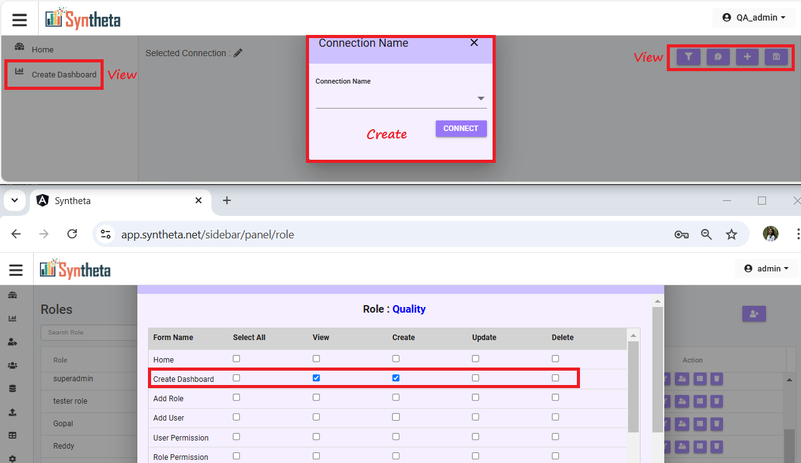

- Update and Delete permissions do not display any actionable items.

**Add Role and Role Permission**
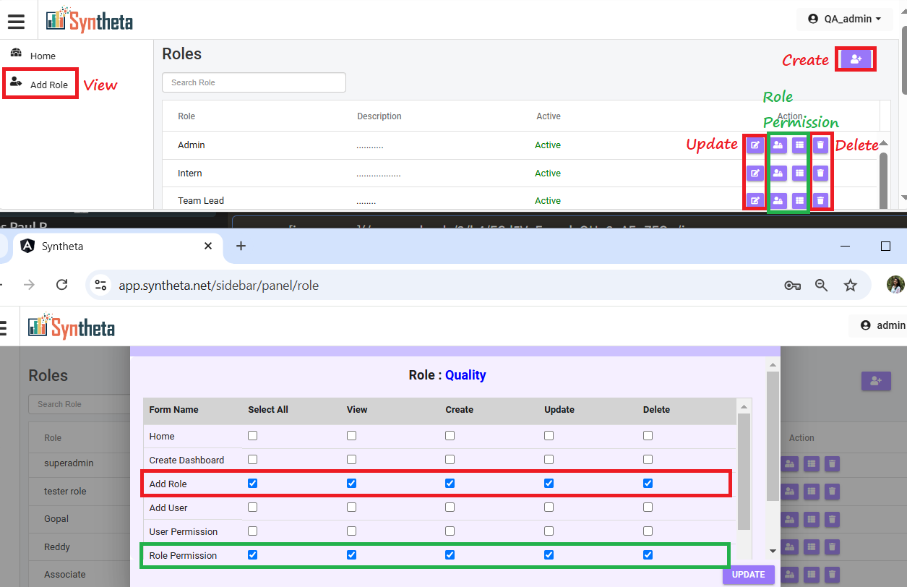

- Includes necessary permissions for managing roles and their associated permissions.

**Add User and User Permission**
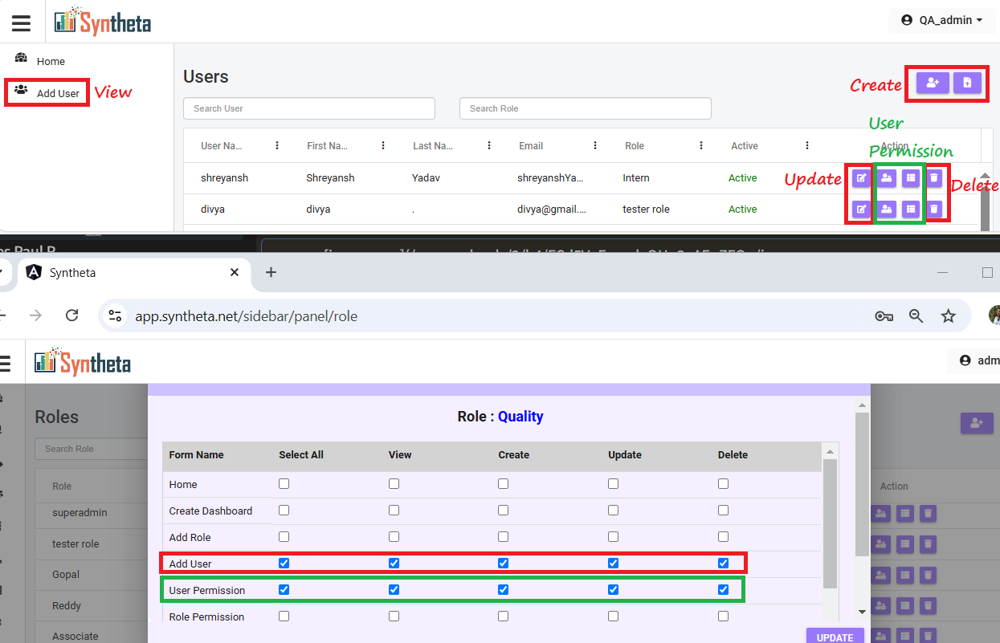

- Allows administrators to configure user accounts and access permissions.

**DB Connection**
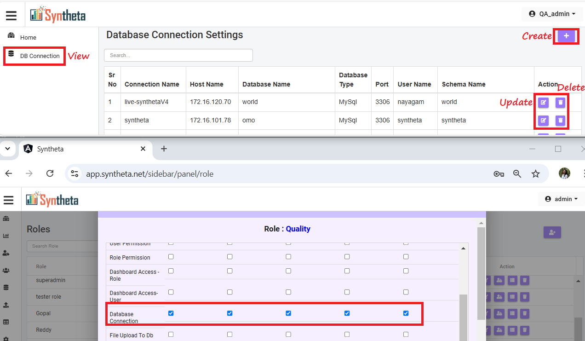

- Grants access to configure and manage database connections.

**File Upload**
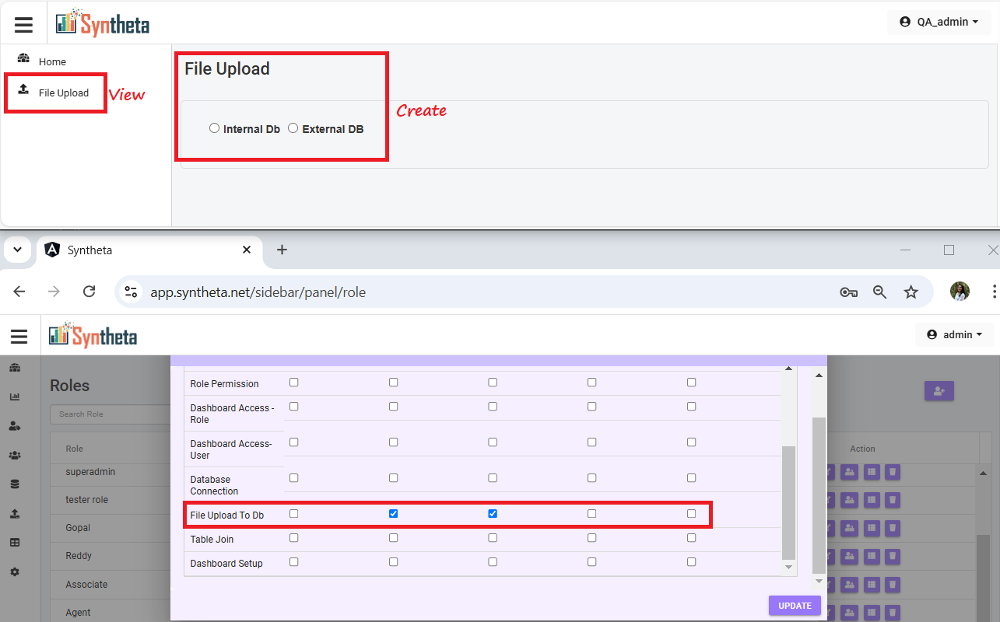

-  Update and Delete permissions do not display any actionable items.

**Table Join**
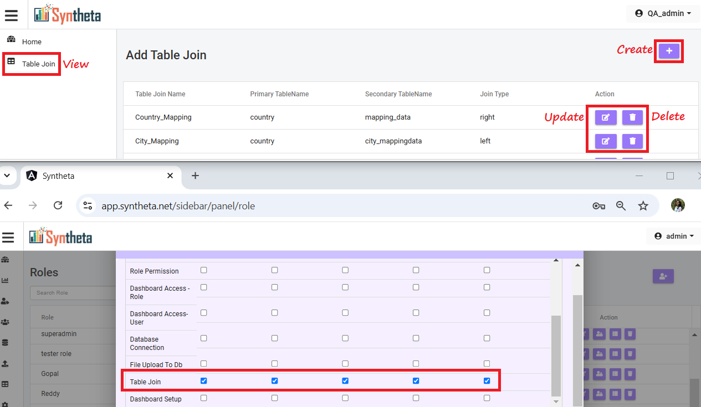

- Permissions allows configuring table joins within the system.

**Dashborad Setup**
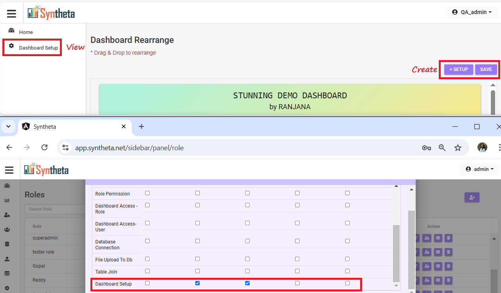

- The Update option becomes visible only after selecting a display type.
- Delete permission is not required for this menu.

### DashBoard Permission 
Click on the 3rd icon **Dashboard Permission**.

User can view the list of dashboards available for the role.

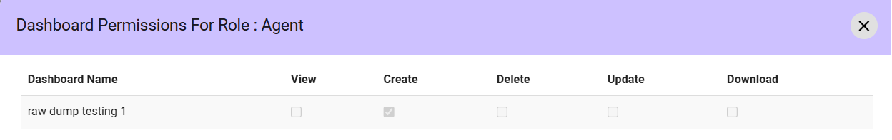

### Delete
Click the 4th icon **Delete** to remove an unwanted role.

## Note 
Only Super Admins and Admins have access to all features and settings.