# ADD USER
The **Add User** functionality provides a streamlined approach to managing user accounts within the system. It includes features for creating individual users, uploading multiple users in bulk, and managing user actions.

## Create User
**Step 1**: Click on "Add User".

**Step 2**: Click on "Create". 

A form will appear to create a new user

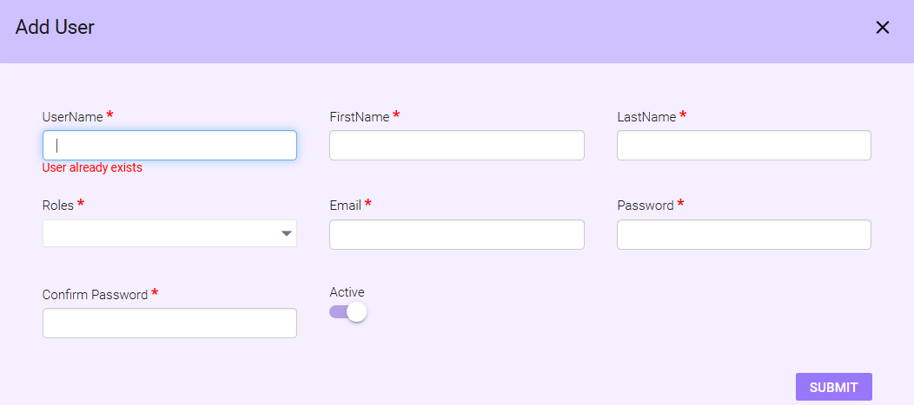

**Step 3**: Fill in all the information

- **Username**: Enter the desired username.
- **First Name**: Enter the user's first name.
- **Last Name**: Enter the user's last name.
- **Roles**: Select the appropriate role from the dropdown menu.
- **Email**: Enter a valid email address.
- **Password**: Create a password that meets the system's password requirements.
- **Confirm Password**: Retype the password to confirm.
- **Active**: Toggle this option
    - Enabled: Activates the user.
    - Disabled: Deactivates the user.

**Step 4**: **Submit**: Click Submit to save the new user.

**Note**: The Created user will be seen at the bottom of the list.

## Upload User
This feature allows bulk user creation.

**Step 1**: Click the Upload User icon next to the Create button.

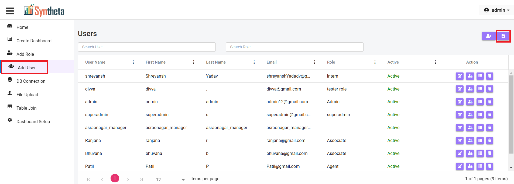

A pop up will open 

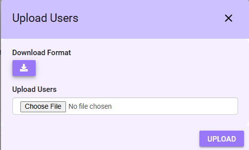

**Step 2**: **Download Format**: Click this option to download a sample Excel sheet.

**Step 3**: Fill in the required information in the sheet and save it.

**Step 4**: **Upload User**: Click Choose File to select the filled Excel sheet.

**Step 5**: Uploaded users will seen in the list.as shown in the pictures

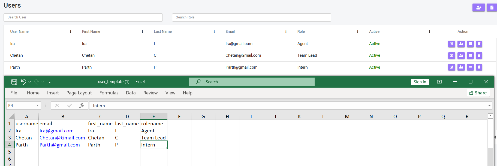

## Manage Add User Actions

### 1. Edit
- Click the 1st icon **Edit** to modify an existing user's details.

### 2. User Permission
- Click the 2nd icon **User Permission** to set or adjust a user's access permissions.

## Note
When specific user permissions are assigned to a user, these permissions will override the role-based permissions, making the role permissions no longer applicable for that user.

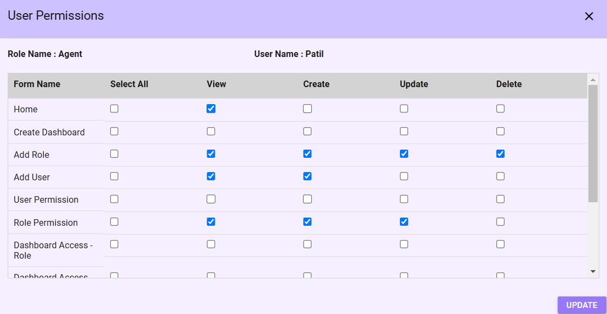

A permissions tab will open, where user can:

- Assign access for the sidebar menu, dashboard roles, and dashboard users.
- Use the Select All checkbox to grant full permissions (e.g., View, Create, Update, Delete).

Sidebar permissions can be adjusted as shown:

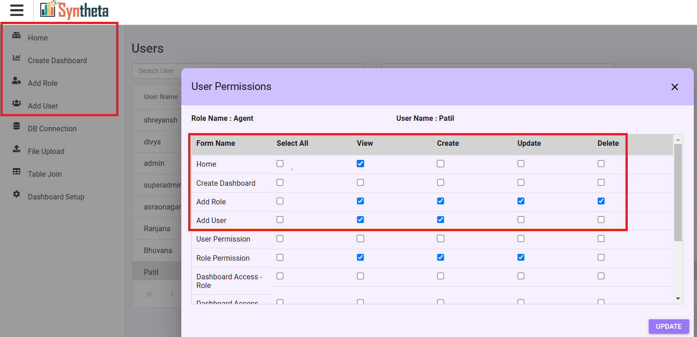
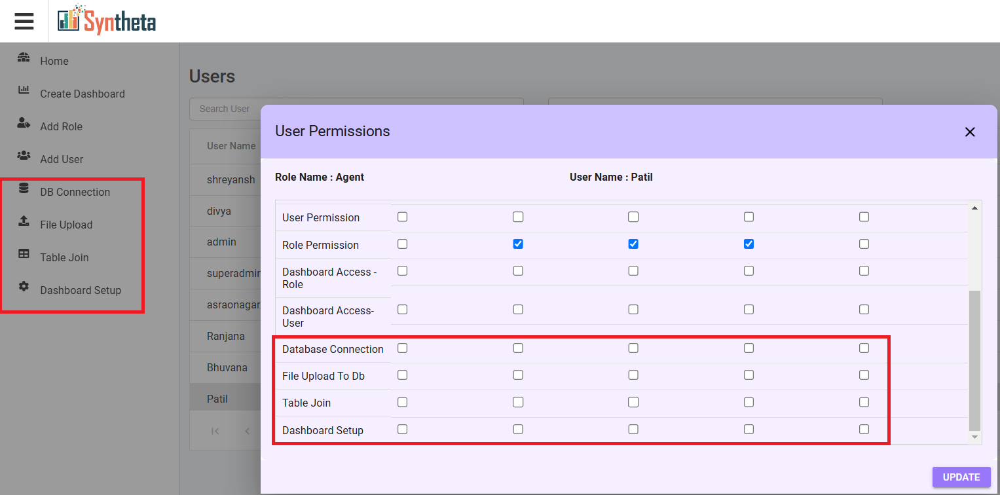

The highlighted once are the permission given 

- **Home Page**: Permissions for the home page are automatically granted by the system once a user is created. No specific manual configuration is required.

**Create Dashboard**
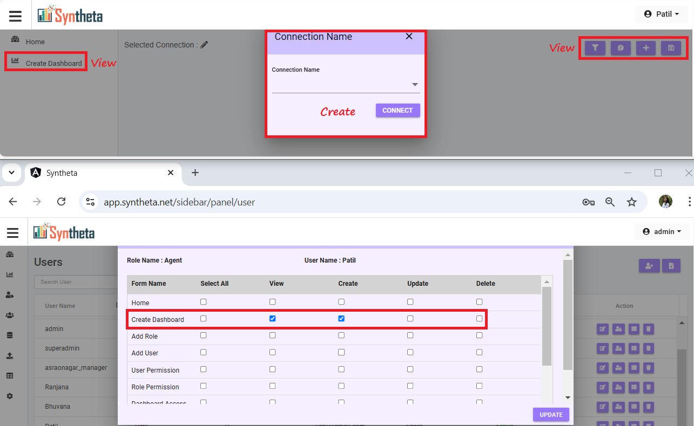

- Update and Delete permissions do not display any actionable items.

**Add User and Role Permission**
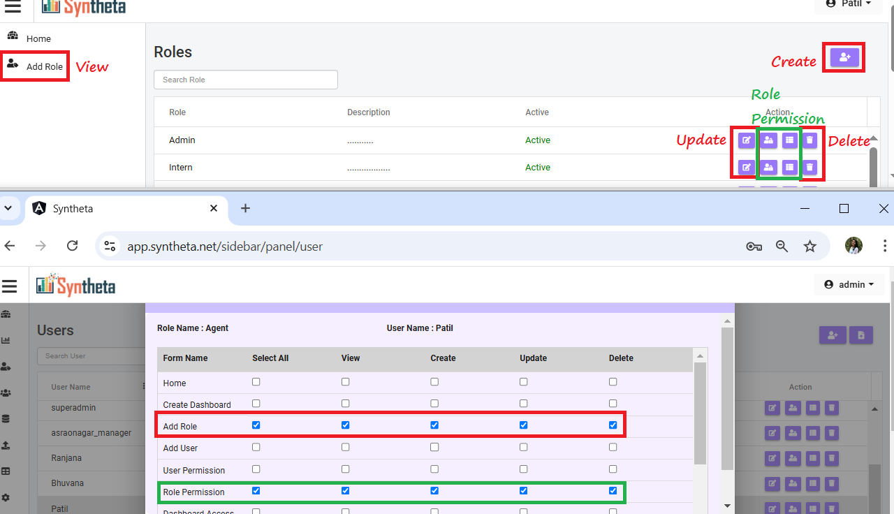

- Includes necessary permissions for managing roles and their associated permissions.

**Add User and User Permission**
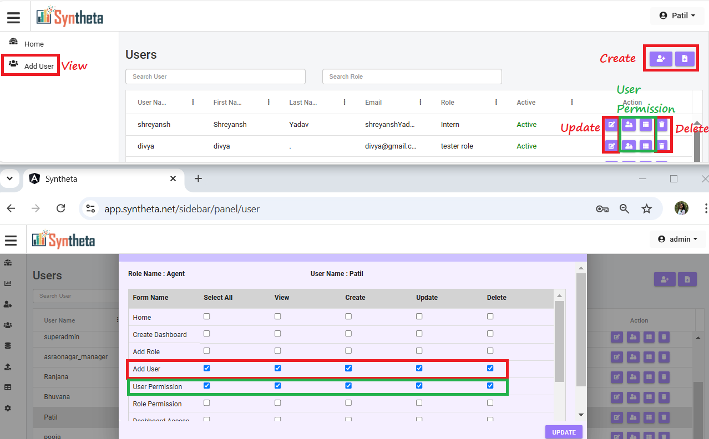

- Allows administrators to configure user accounts and access permissions.

**DB Connection**
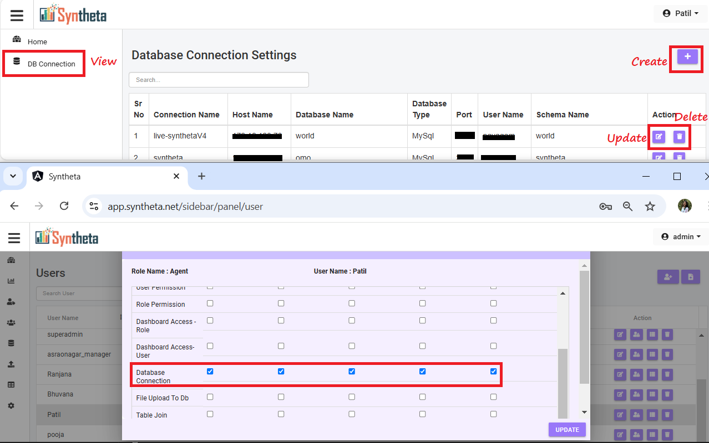

- Grants access to configure and manage database connections.

**File Upload**
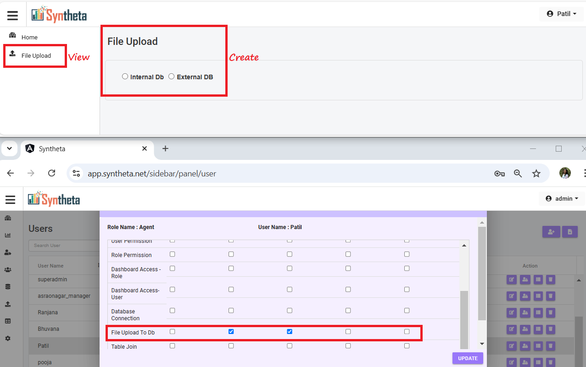

- Update and Delete permissions do not display any actionable items.

**Table Join**
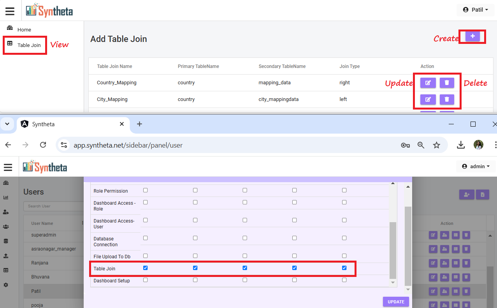

- Permissions allows configuring table joins within the system.

**Dashborad Setup**
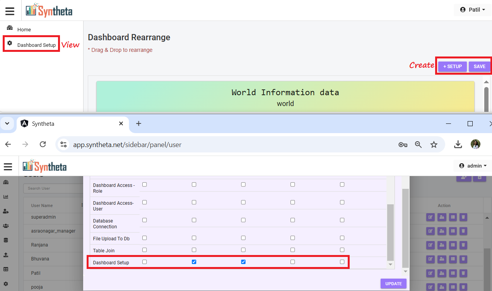

- The Update option becomes visible only after selecting a display type.
- Delete permission is not required for this menu.

### 3. DashBoard Permission
Click the 3rd icon **Dashboard Permission**.

View and manage the list of dashboards available to the assigned user.

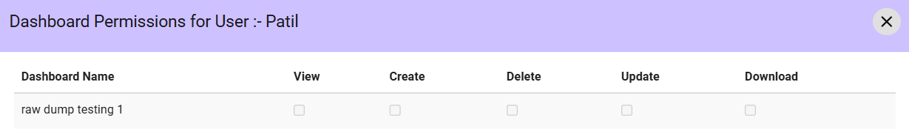

### 4. Delete
Click the **Delete**icon to delete the User permanently.

## Note 
Only Super Admins and Admins have access to all features and settings.