# BOX
The Box Panel allows users to display summarized data or key performance indicators (KPIs) in a visually engaging format. 

## Adding a Box Panel
**Step 1**: Select **Box** from the **Add Panel** options and click **Submit**.

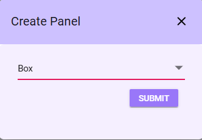

A Box panel will appear on the Dashboard.

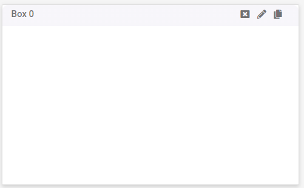

**Step 2**: Click the *Pencil Icon* to open a configuration tab with various fields for customization.

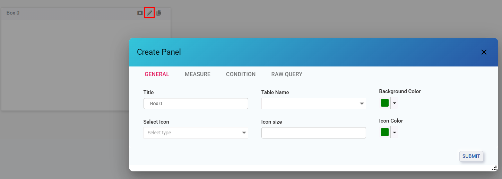

The following options are available for customizing the Box Panel:

## General 
Define the basic properties and appearance of the Box Panel

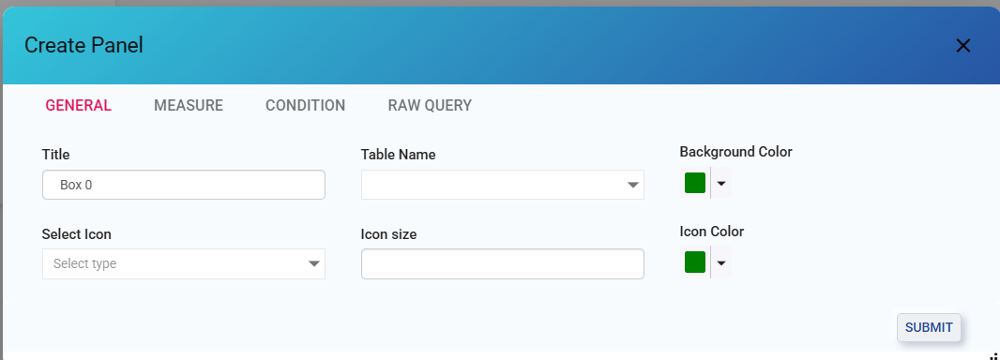

**Step 3**: Define fields in Genral Tab

- **Title**: Enter the title to identify the Box Panel.
- **Table Name**: Select the table name from the dropdown box and these are populated from the connection selected earlier.
- **Background Color**: Select the background color for the panel using a color picker or hex code.
- **Select Icon**: Pick an icon for the panel from the dropdown list
- **Icon Size**: Use the arrow buttons to set the font size for the selected icon.
- **Icon Color**: Choose the icon color from the color palette.

## Measure 
Configure the data to be displayed within the Box Panel:

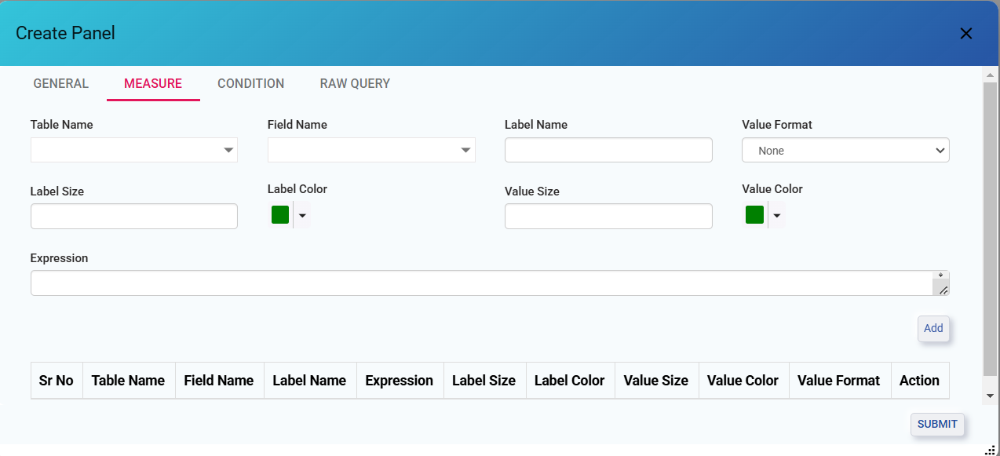

**Step 4**: configure the fields in Measure tab 

- **Table Name**: Select a table from the dropdown menu. The list is populated based on the selected database connection.
- **Field Name**: Field names are fetched from the selected table. Choose a specific field to display as list options.
- **Label Name**: By default, the field name is used as the label name, but users can change it if necessary.
- **Value Format**: Define how the value is displayed (e.g., currency, percentage).
- **Label Size**: Adjust the font size for the label text.
- **Label Color**: Set the label text color.
- **Value Size**: Specify the size for the value.
- **Value Color**: Choose the value's text color.
- **Expression**: Add a custom formula or calculation for the value.

**Step 5**: **Add Button**: After configuring the measure, click Add to save the measure and display it in a tabular list with available actions.

**Step 6**: **Submit**: Click on submit to save the selection made.

*NOTE: The panel will only display information after both the General tab and the Measure tab have been configured. To set it up:*

- *Begin by configuring the General tab.*
- *Proceed to the Measure tab, where you can select the desired fields and click Add.*
- *Once fields are added, they will appear in a tabular format below, along with action buttons for further interaction.*

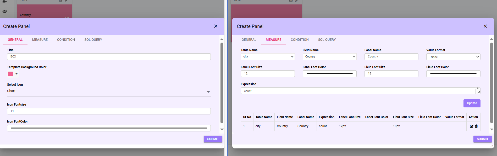

*After configuration, the panel will appear as shown below:*

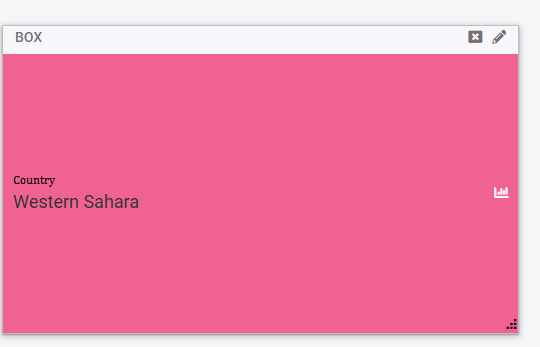*

***NOTE*** :*If the user wants to edit or add new fields:*

*Click the Pencil icon to access the editing mode.*
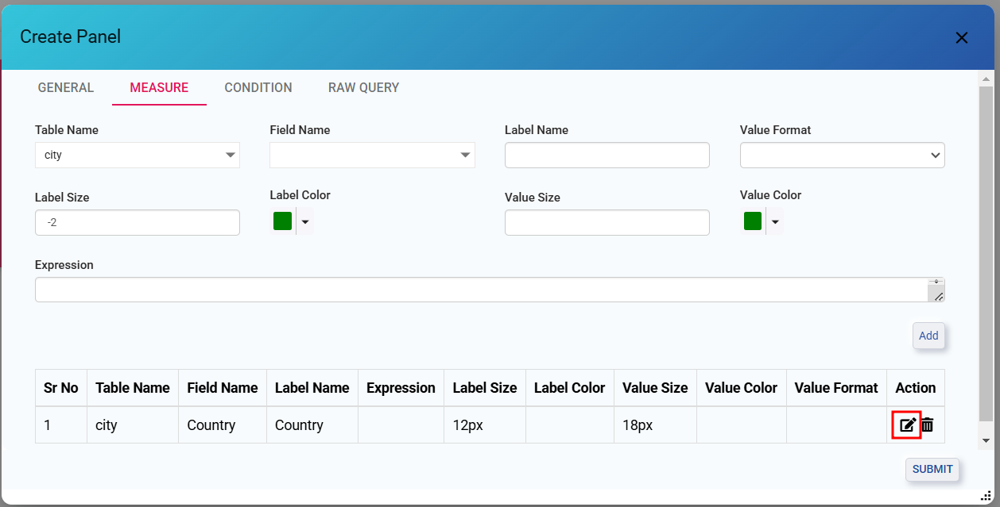

***Customization Options***

- *Users can customize the font size and color of labels and fields:*
- *Additionally, users can modify the font size and color of icons in the General tab.*
- *This setup allows flexibility in adjusting the appearance of the table to match user preferences.*

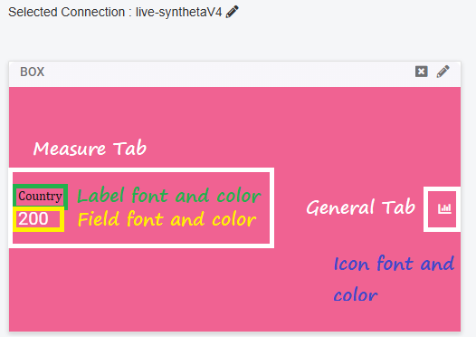

## Condition
Apply logical filters to refine the data displayed in the Box Panel:

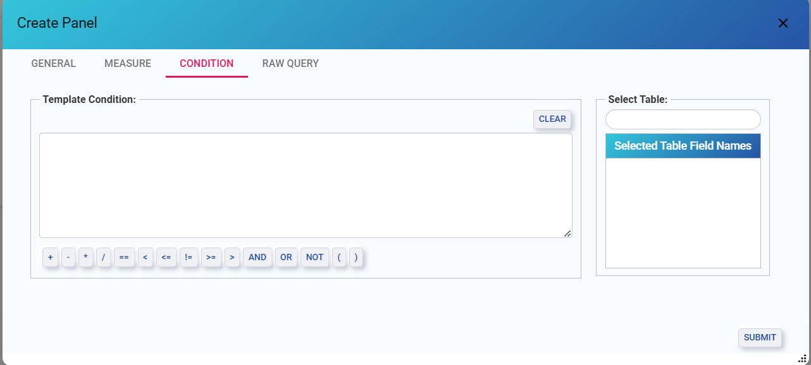

- **Template Conditions**: Enter a custom condition in the text box (e.g., country == 'Western sahara').

*Note: Enclose all conditions in single quotes.At once only one condition can be given*

- **Operators**:
    - Arithmetic Operators: +, -, *, /
    - Comparison Operators: ==, <, >, <=, >=, !=
    - Logical Operators: AND, OR, NOT
    - Parentheses: Use ( ) to group expressions.
- **Clear Button**: Clears the current condition input box.
- **Select Table**:
    - **Select Table Field**: Add fields from the table for filtering.
    - **Selected Table Field Name**s: View and manage selected fields.
- **Submit**: Apply conditions and update the data in the Box Panel.

*Example: The panel will display only the filtered data based on the condition country == 'Western Sahara', showing information specific to that country.* 

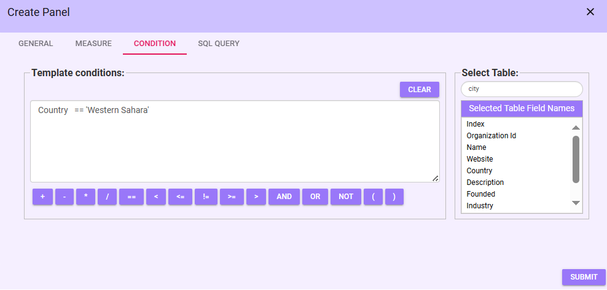

*Panel View*

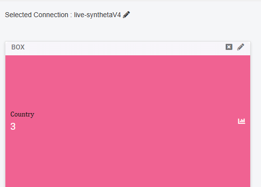

## RAW Query 
The Raw Query tab allows users to define both conditions and expressions directly using SQL-like syntax. User can refer condition tab to use the raw query.

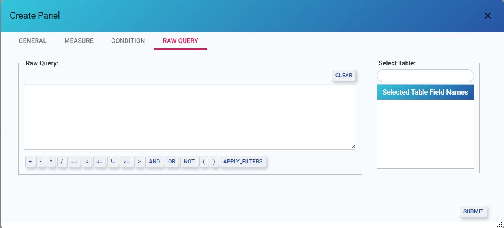

- **Raw Query**: In the Text box field Enter custom condition.

*NOTE: Enclose all conditions in single quotes.*

- **Operators**: Use the same operators as in the Condition tab:
    - Arithmetic Operators: +, -, *, /
    - Comparison Operators: ==, <, >, <=, >=, !=
    - Logical Operators: AND, OR, NOT
    - Parentheses: Use ( ) to group conditions.
    - Apply Filters: Whenever users are using a raw query, and if there is a WHERE clause in the query, `{apply_filters}` should be added. 
- **Clear Button**: Reset the SQL query input box.
- **Select Table**: Whatever table is selected in general tab the same will be displayed here.
    - **Selected Table Field Names**: Select the field name which was selected in the field name section in the general tab.
- **Submit**: Execute the query and refresh the Box Panel with the updated dataset.

Once the Raw Query is submitted, the panel will reflect the updated dataset.