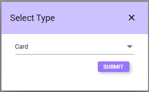
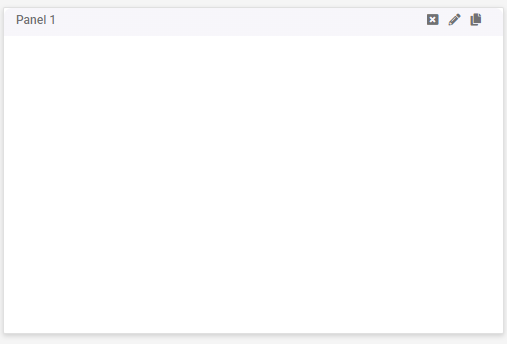
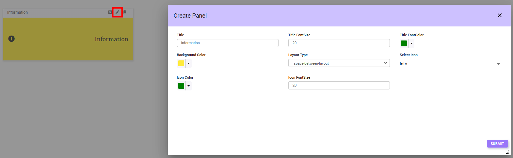
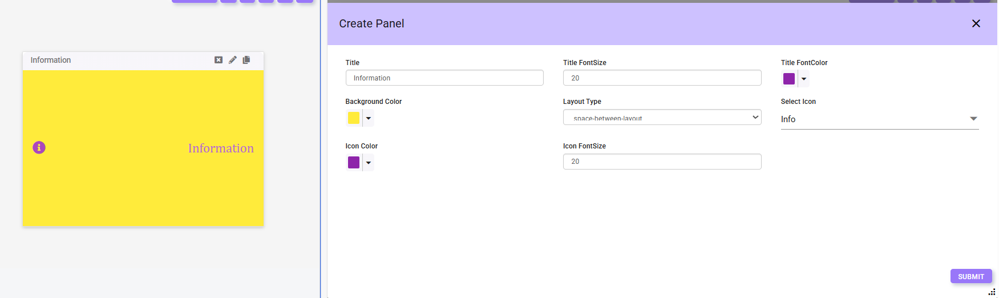
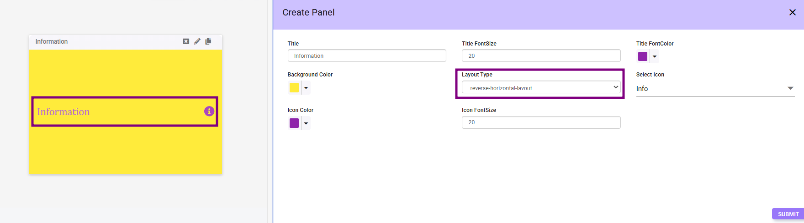
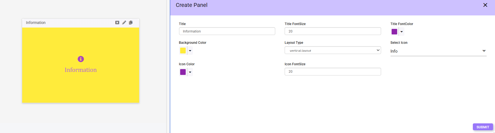
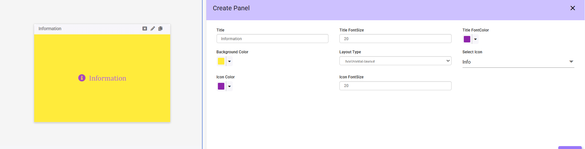
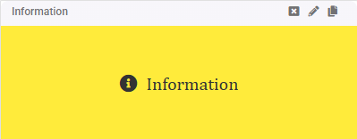

# CARD
The Card component allows users to display information the name of the fields with the icons.

## Adding a Card Panel
**Step 1**: Select **Card** from the **Add Panel** options and click **Submit**.

A Card panel will appear on the Dashboard.

**Step 2**: Click the *Pencil Icon* to open a configuration tab with various fields for customization.

## Panel Configuration Options:

- **Title**: Enter the name of the panel.  
- **Title Font Size**: Adjust the font size of the panel title.  
- **Title Font Color**: Choose the font color for the title.  
- **Background Color**: Select the background color for the panel.  
- **Layout Type**: Choose a layout type from the dropdown menu:  

  - **Space-between Layout** :

  

  - **Reverse Horizontal Layout** 
    
  
 
  - **Vertical Layout**  
  
  

  - **Horizontal Layout**  

  
 
- **Select Icon**: Choose an icon from the dropdown menu.  
- **Icon Color**: Select the color of the icon.  
- **Icon Font Size**: Adjust the font size of the icon.

