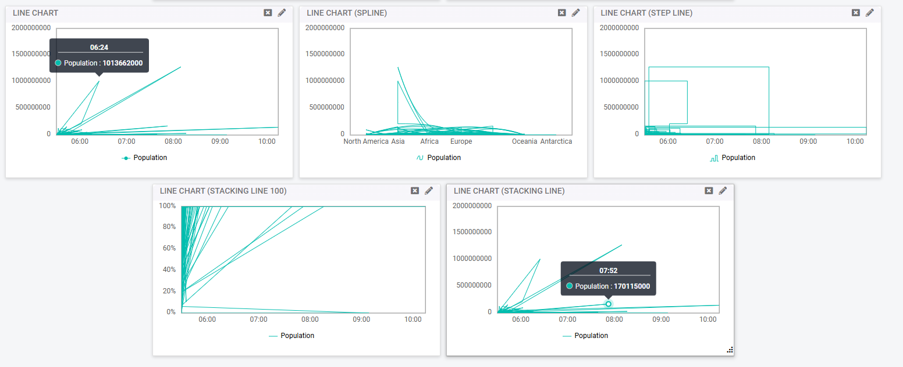
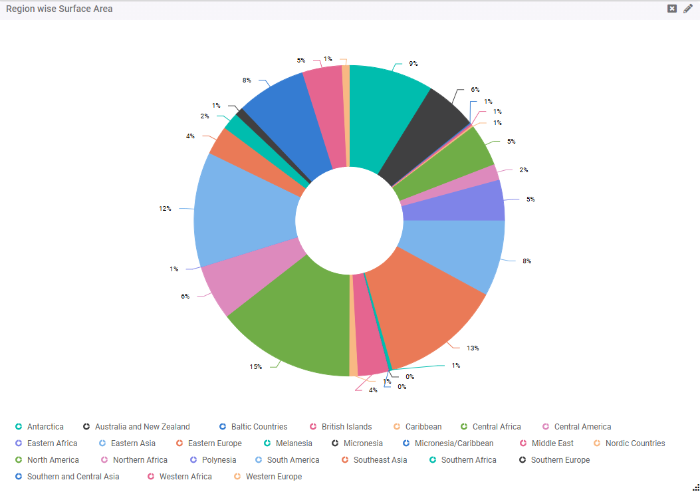

# CHART
The Create Panel interface allows users to design and configure visualizations by specifying various parameters such as dimensions, measures, conditions, and chart properties.

**Adding a Chart Panel**

**Step 1**: Select **Chart** from the **Add Panel** options and click **Submit**.

A chart panel will appear on the Dashboard.

**Step 2**: Click the **Pencil Icon** to open a configuration tab with various fields for customization.

The following options are available for customizing the chart Panel:

- Each section is tabbed, enabling users to configure specific properties for their visualizations.

## General 
The General Tab includes basic settings for identifying and initializing your chart.

**Step 3**: Fields in General Tab

- **Title**: Enter a name for your chart to identify it easily.
- **Table Name**: Select a table from the dropdown menu. The list is populated based on the selected database connection.
- **Chart Type**: Choose a chart type for visualization:
    - Column: Vertical bar chart.
    - Line: Trend analysis chart.
    - Area: Area chart.
    - Combine Chart: Combines multiple chart types.
    - Pie: Proportional data as a pie chart.
    - Donut: Proportional data with a central hole.
- **Background Color**: Pick a background color using the color picker or a hex code.
- **Add Scrollbar**: Toggle to enable or disable the scrollbar.
- **Scrollbar Percentage**: Set the percentage using the dropdown.

## Dimension (X-Axis)
The Dimension (X-Axis) Tab defines the fields and settings for the X-Axis.

**Step 4**: Fields in Dimension (X-Axis) Tab

<!-- - **Table Name**: The table selected in the General tab will be chosen here. -->
- **Field Name**: Field names are fetched from the selected table. Select the field for the X-Axis.
- **Label Name**: Define a label for the X-Axis.
- **Title Name**: Define the Title Name.
- **Level Number**: Specify the hierarchy level (level 0 - level 10).

**Add Button**: Once all the fields are selected click on Add grouping button.

- The same selected value will be displayed in the tabular form

Once the fields are selected and added, they will be displayed in a tabular format with options to **Edit**, **Delete**, and **Add Query**

- **Edit**: Click the **Edit** icon to make changes to the selected fields.  
- **Delete**: Click the **Delete** icon to remove the selected fields.  
- **Add Query**: Click the **Add Query** icon to include a SQL query.

*NOTE: The user must define either a raw query or an expression.If the user wants to set a raw condition, they can click on **Add Query**.*

## Measure (Y-Axis)
The Measure (Y-Axis) Tab allows configuration of numerical and aggregate fields for the Y-Axis.

**Step 5**: Fields in Measure (Y-Axis) Tab

- **Table Name**: Select a table from the dropdown menu. The list is populated based on the selected database connection.
- **Field Name**: Field names are fetched from the selected table. Choose the field for the Y-Axis.
- **Series Type**: Select a series type (e.g., Line, Column, Area).
- **Draw Type**:
- **Label Name**: Define a label for the series.
- **Series Color**: Choose a color for the series.
- **Expression**: Add a formula or calculation for the Y-Axis.
- **Secondary Axis**: Toggle to assign the series to a secondary Y-Axis. This is disabled by default.
- **Show Markers**: Toggle to display markers on the chart. By default this is enabled.
- **Show DataLabels**: Toggle to enable data labels. By default this is enabled.
- **DataLabel Position**: Select the data label position.
- **DataLabel Format**: Define the format (e.g., Number, currency, percentage).
- **Font Weight**: Adjust the data label font weight (e.g., 400 for normal, bold, etc.).
- **Font Color**: Choose the font color for data labels.
- **Font Size**: Adjust the font size.
- **Datalabel Rotation**: User can adjust the label (e.g., 45,60,90,-45 etc.).

**Add Button**: Click on add the configuration will be saved, and the values will be shown in a tabular form.

**Submit Button**: Click on Submit Button to Save and apply all the configurations.

### *NOTE*
*First, configure the General tab, followed by adding fields in the Dimension tab, ensuring they appear in the table. Next, add fields in the Measure tab, so they are reflected in the table. Once these three main tabs are properly configured.*

*The chart panel will display the information as shown*

*If the user wants to set the color or font, they can click on the edit icon in the table*

*choose the desired settings. and the panel would like this*

### Secondary Axis
This is a toggle option. When enabled in the chart, you can add a secondary axis by providing the necessary information and clicking Add. The axis will then be listed below and displayed in the panel.

panel would look like this

## Condition
The Condition Tab helps filter and refine the dataset using grouping, sorting, and conditional logic.

Fields in Condition Tab:

- **Group By**: Specify fields to group data for aggregation.
- **Order By**: Define fields to sort data.
- **Order By Type**: Select sorting order (Ascending or Descending).
- **Template Conditions**: Use this section to create logical filtering expressions.
- **Condition Input Box**: Enter filter expressions (e.g., country == 'Africa').
- **Operators**: Use available buttons to add:
    - Arithmetic Operators: +, -, *, /
    - Comparison Operators: ==, <, >, <=, >=, !=
    - Logical Operators: AND, OR, NOT
    - Parentheses: ( ) to group conditions.
- **Clear Button**: Reset the condition input box.
- **Select Table**: Choose fields from the table to include in the condition.
    - **Selected Table Field Names**: View selected fields.

**Submit Button**: Apply conditions and update the dataset.

**For example:**

If a condition is set, the panel will be displayed based on the specified condition

## Chart Props
The Chart Props Tab allows customization of chart appearance and tooltips.

Fields in Chart Props Tab:

- **ChartArea Border Width**: Adjust the chart area border width.
- **ChartArea Border Color**: Choose the border color.
- **Show Tooltip**: Toggle tooltip visibility:
    - Enabled: Tooltips are displayed.
    - Disabled: Tooltips are hidden.
- **Tooltip Format**: Choose from dropdown options (Percentage, Value)
- **DataLabel Format**: Select label format (Percentage, Value)
- **Show Legends**: Toggle legend visibility
- **Legends Position**: Choose position (Top, Bottom, Left, Right).
- **Legends Font Size**: Adjust legend font size.
- **Legends Font Color**: Choose font color for legends.

**Submit Button**: Click on Submit to Save all chart property configurations.

when the color,Font Size are set the panel would look like this

## X-Axis Props
The X-Axis Props Tab customizes X-Axis formatting.

Fields in X-Axis Props Tab

- **Title**: Enter a title for the X-Axis.
- **Label Format**: Choose from available formats
- **GridLines Width**: Set gridline width.
- **GridLines Color**: Choose gridline color.
- **TickLines Width**: Adjust tickline width.
- **TickLines Color**: Choose tickline color.
- **LineStyle Width**: Adjust linestyle width.
- **LineStyle Color**: Choose linestyle color.
- **Trim**: Toggle trimming of labels.
- **Label Position**: Choose position (Outside, Inside).
- **Label Rotation**: Select rotation angle (e.g., 30, 45, 90 degrees).
- **Label Intersect Action**: Select how overlapping labels are handled (e.g., Hide, Trim, Wrap, Rotate45, Rotate90, etc.).
- **Font Size**: Adjust the Font size.
- **Font color**: Adjust the Font colour.

**Submit Button**: Click on Submit to Save all configurations.

## Y-Axis Props
The Y-Axis Props Tab allows for customizing the Y-Axis.

Fields in Y-Axis Props Tab

- **Title**: Enter a title for the Y-Axis.
- **GridLines Width**: Adjust gridline width.
- **GridLines Color**: Choose gridline color.
- **TickLines Width**: Adjust tickline width.
- **TickLines Color**: Choose tickline color.
- **LineStyle Width**: Adjust linestyle width.
- **LineStyle Color**: Choose linestyle color.
- **Label Rotation**: Select rotation angle (e.g., 30, 45, 90 degrees).
- **Font Size**: Adjust the Font size.
- **Font color**: Adjust the Font colour.

**Submit Button**: Click on Submit to Save all settings.

***NOTE***: *Fields marked with a red asterisk (*) are mandatory.*

## Y2-Axis Props

- **Title**: Enter the title for Secondary Y-axis.
- **Font Size**: Adjust the Font Size.
- **Font Color**: Select the font color.
- **Label Format**: Select the Label Format from the DRop down Menu.
- **Label Size**: Set and Adjust the label size.
- **Label Color**: Set and adjust the Label Color
- **Label Rotation**: Set and can adjust the Label Rotation.

**Submit Button**: Click on Submit to save the configurations.

## Types of Charts 
1.COLUMN CHART

2.LINE CHART

3.AREA CHART

4.COMBINE CHART

5.PIE CHART

6.DONUT CHART

**Drill-Down Functionality**

Users can explore detailed information about any specific section of a chart by clicking on the desired area.

**Example**:

If a user wants to view data for Central Africa from a pie chart:

**Step 1**: Hover over and click on the respective section of the pie chart.

**Step 2**: A detailed pie chart for that specific area (e.g., Central Africa) will open.

**Further Drill-Down**: If the detailed chart contains multiple fields, users can drill down further for more granular insights.

**Drill up**: To return to the main graph, users can click the arrow icon in the top-right corner of the screen.

**Downloading Charts**

Click the download arrow icon.

- Select the preferred file format from the available options.
- The chart will be downloaded in the chosen format.

To download a specific drill-down chart can follow the same procedure 