# CREATE DASHBOARD
A Dashboard is a visual interface that helps you see, understand, and analyze your data in one place. It usually includes elements like charts, tables, graphs, and KPIs to present information clearly and effectively.

### Key Features of a Dashboard
- Organizes complex data into a simple, readable format.
- Displays real-time insights for faster decision-making.
- Combines multiple data sources into one view.
- Includes interactive panels or widgets like Box Panels, Charts, and Tables.

**Step 1**: Click on "Create Dashboard".

<!-- 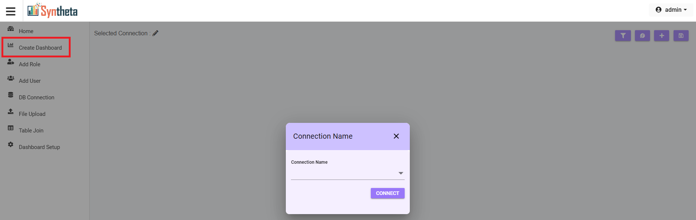 -->

<!-- This opens a new tab with a popup window -->

**Step 2**: From the dropdown menu, select the desired connection.

<!-- 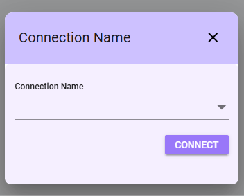 -->

**Step 3**: Click on the *Connect* button.

**Step 4**: The selected connection name will appear on the page.

<!-- 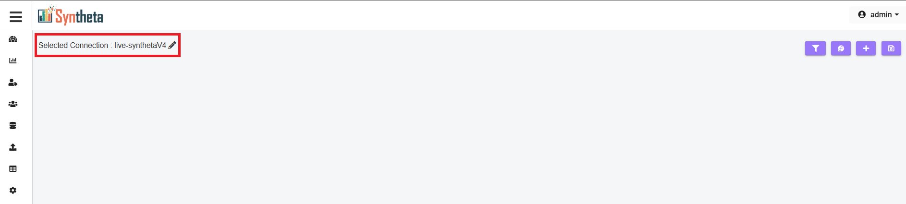 -->

- Use the *Edit Icon* to edit the connection name if necessary.

# ICONS OVERVIEW
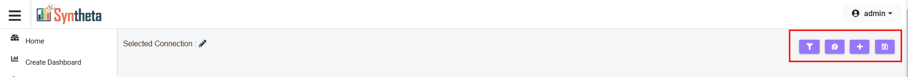

## 1. Initial Filters 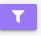
Initial Filters are used to restrict and customize the data displayed when the dashboard or panel first loads. This helps in reducing data load and showing only the most relevant or necessary information at the start, especially useful when dealing with large datasets.

- Click on the **Initial Filters** icon, represented by a filter symbol.

<!-- 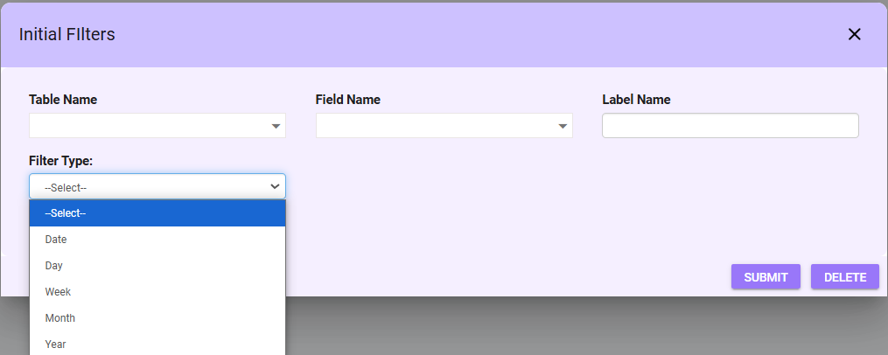 -->

### Initial Filters Fields
- **Table Name**: Select the table name from the dropdown menu. These tables will come from the selected connection name.
- **Field Name**: Field names are fetched from the selected table. Choose a specific field.
- **Label Name**: Enter a custom label name.
- **Filter Type**: Select available filter types from the dropdown menu:
    - *Date*: Choose the current date or specify the number of previous days.
    - *Day*: Select the current day or specify the number of previous days.
    - *Week*: Select the current week or specify the number of previous weeks.
    - *Month*: Choose the current month or specify the number of previous months.
    - *Year*: Select the current year or specify the number of previous years.

For dynamic values, additional input boxes appear where users can increase or decrease the value using arrow buttons.

- **Submit**: Click *Submit* to save the configured filters.
- **Delete**: Click *Delete* to remove the selected filter configuration.

## 2. Role Mapping 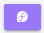
The Role Mapping feature is used to control data access based on user roles. It allows administrators to define which tables and fields a specific role can view or interact with, ensuring that users only see the data relevant to them.

Admins can associate users with specific roles and assign permissions accordingly. This setup ensures that different users can view different data depending on their assigned role—enhancing data security, personalization, and efficient user management.

#### For example:
A manager might see company-wide metrics, while a team member sees only their own performance data.

By clicking on the **Role Mapping** Icon, a form will open with a few fields.

<!-- 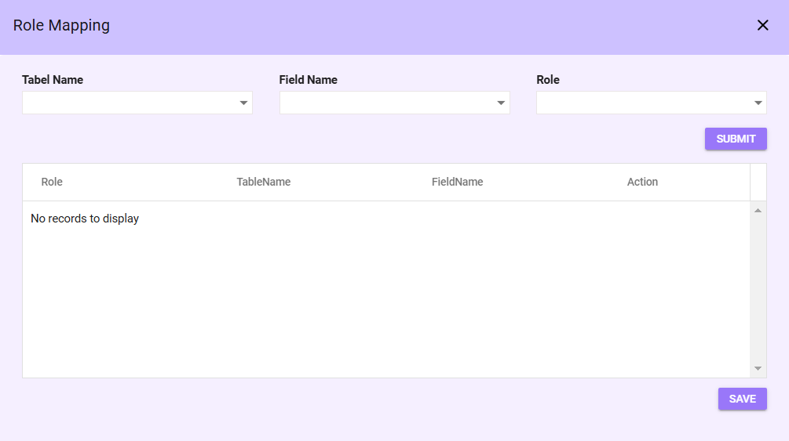 -->

### Role Mapping Fields
- **Table Name**: Select a table from the dropdown menu. The list is populated based on the selected database connection.
- **Field Name**: Field names are fetched from the selected table. Choose a specific field to display as list options.
- **Role**: Assign a role from the dropdown menu. These roles are populated from the user list.
- **Submit**: Click *Submit* to save the configuration.

<!-- 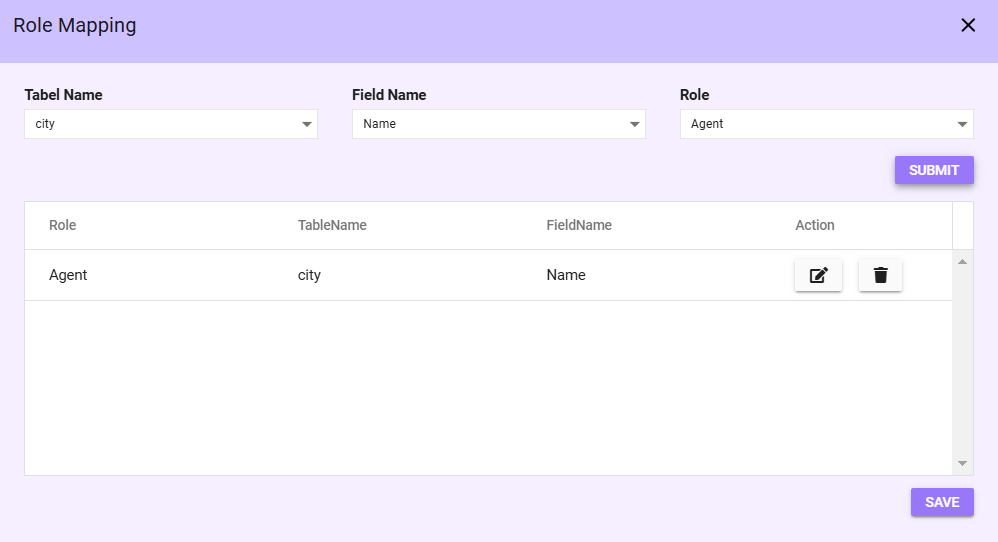 -->

The role mapping will appear in a table with action buttons.

- **Edit**: Click on **Edit** to modify an existing role mapping.
- **Delete**: Click on **Delete** to remove a role mapping.
- **Save**: Click *Save* once all changes are finalized.

## 3. Add Panel 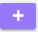
The Add Panel feature allows users to create and configure various data visualization components within a dashboard or report. These panels act as interactive elements, helping users display and analyze data in multiple formats based on their needs.

Click on the plus icon to **Add Panel**. A popup window appears, prompting the user to choose the panel type from a dropdown menu.

## Available Panel Types:

📊 **Chart**: Visualizes data in formats like bar, line, pie, etc., making trends easy to understand.

🗂️ **Box (Template)**: Used to create sections or boxes to organize data.

📋 **Table**: Displays data in rows and columns for easy comparison.

🔄 **Pivot Table**: Summarizes data dynamically, letting you group and filter.

📅 **Date Picker**: Select a single date to filter data.

📆 **Date Range Picker**: Select a range of dates to filter data.

🔢 **List Box**: A list for selecting options to filter data.

⬇️ **Dropdown List**: A dropdown menu for selecting a single option.

🔽 **Multi-select Dropdown**: Allows selecting multiple options for filtering.

📄 **Raw Data Dump**: Shows data in its raw, unprocessed form.

✍️ **Input Box**: A field to enter custom data or values.

🏷️ **Card**: Displays key metrics or KPIs in an easy-to-read format.

### Note for Add Panel

- **📝 Panel Data Limit**:  
  All panels have a **limit of 200 data** entries when creating a dashboard.  

- **🔍 Raw Query/SQL**:  
  Only **SQL queries** will be considered for Raw Query.  

- **➕ Multiple Conditions in Raw Query**:  
  Raw Query **supports multiple conditions**.  

- **⚙️ Condition Setup**:  
  Users can define **only one condition** at a time.  

- **🛠 Expression and Condition**:  
  If both **Expression** and **Condition** are defined, they will work together but must be configured in **separate tabs**.  

- **🚫 Raw Query Overrides**:  
  If a **Raw Query** is provided, the **Expression** and **Condition** tabs will be ignored, and only the raw query will be executed.  

- **🧮 Expression Tab Operations**:  
  The Expression tab supports operations like **FROM**, **COUNT**, **MIN**, and **MAX**.  

- **💾 Direct Data Retrieval**:  
  For direct data retrieval from the database, use the **Raw Query** option.  

### Panel Setup and Arrangement

- **🖱 Drag and Drop Panels**:  
  Users can **drag and drop panels** to arrange them as needed.

  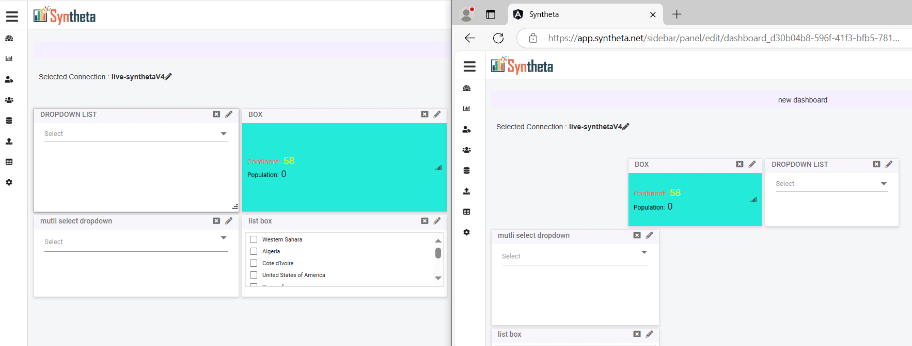

- **🔲 Resize Panels**:  
  Hold and drag the **four dots at the bottom-right corner** of the panel to resize it.

  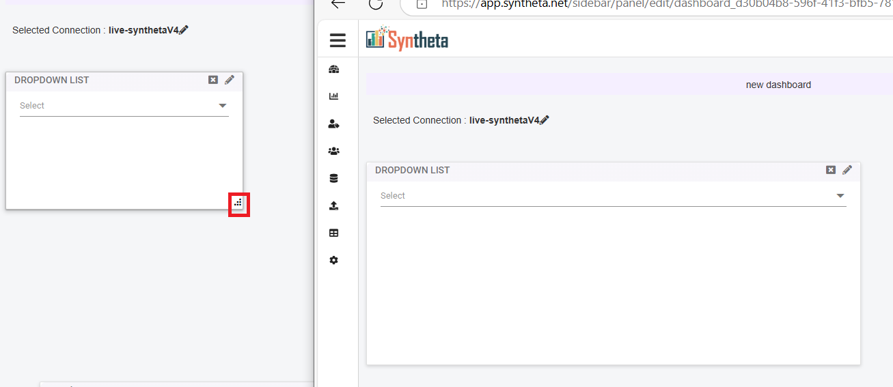

- **🔄 Duplicate Panel**:  
  Click the **copy icon** at the **top right corner** to duplicate a panel.

  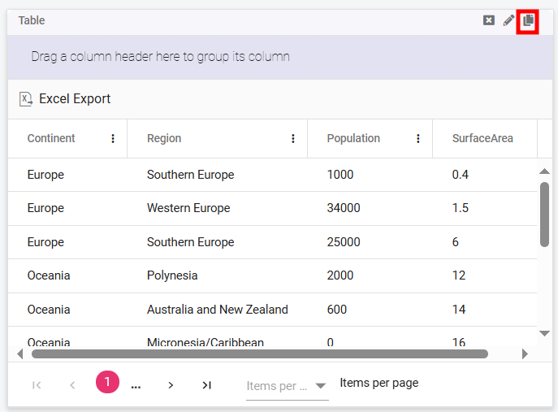

<!-- 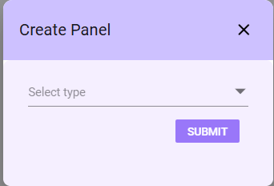 -->

## CHART

#### Steps to add a Chart Panel

**Step 1**: Select **Chart** from the **Add Panel** options and click **Submit**.

<!-- 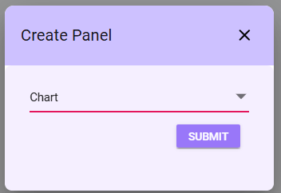 -->

A chart panel will appear on the Dashboard.

<!--  -->

**Step 2**: Click the **Edit Icon** to open a configuration tab with various fields for customization.

<!-- 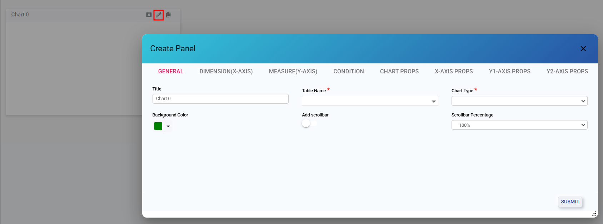 -->

The following options are available for customizing the chart panel:

- Each section is tabbed, enabling users to configure specific properties for their visualizations.

### General 
The General Tab includes basic settings for identifying and initializing your chart.

<!-- 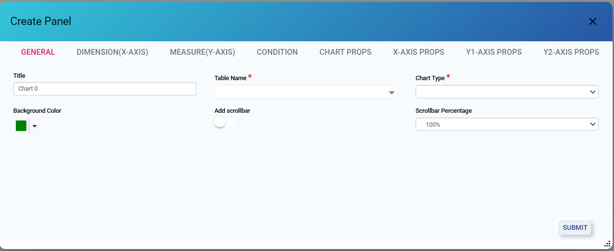 -->

**Step 3**: **Fields in the General Tab** to be filled

- **Title**: Enter a name for your chart to identify it easily.
- **Table Name**: Select a table from the dropdown menu. The list is populated based on the selected database connection.
- **Chart Type**: Choose a chart type for visualization:
    - Column: Vertical bar chart.
    - Line: Trend analysis chart.
    - Area: Area chart.
    - Combine Chart: Combines multiple chart types.
    - Pie: Proportional data as a pie chart.
    - Donut: Proportional data with a central hole.
- **Background Color**: Pick a background color using the color picker or a hex code.
- **Add Scrollbar**: Toggle to enable or disable the scrollbar.
- **Scrollbar Percentage**: Set the percentage using the dropdown.

<!-- 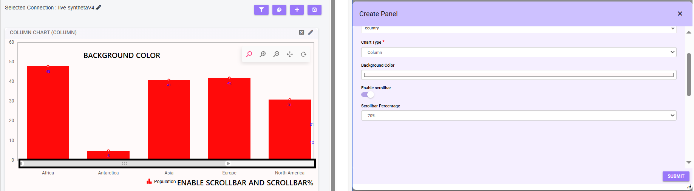 -->

### Dimension (X-Axis)
The Dimension (X-Axis) Tab defines the fields and settings for the X-Axis.

<!-- 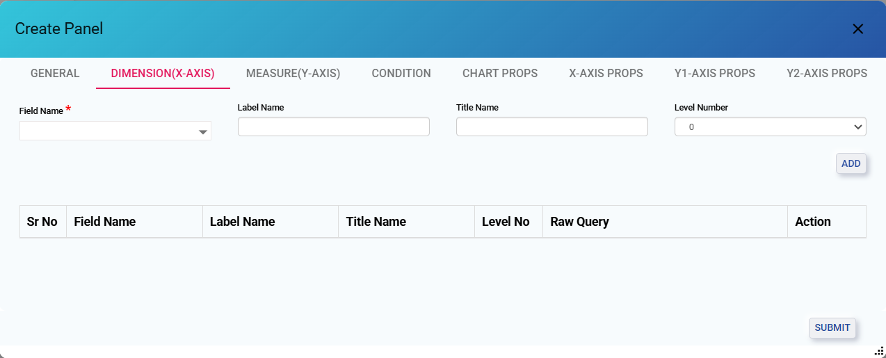 -->

**Step 4**: **Fields in the Dimension (X-Axis) Tab** to be filled

<!-- - **Table Name**: The table selected in the General tab will be chosen here. -->
- **Field Name**: Field names are fetched from the selected table. Select the field for the X-Axis.
- **Label Name**: Define a label for the X-Axis.
- **Title Name**: Define the Title Name.
- **Level Number**: Specify the hierarchy level (level 0 - level 10).

**Add Button**: Once all the fields are selected, click on the Add Grouping button.

<!-- 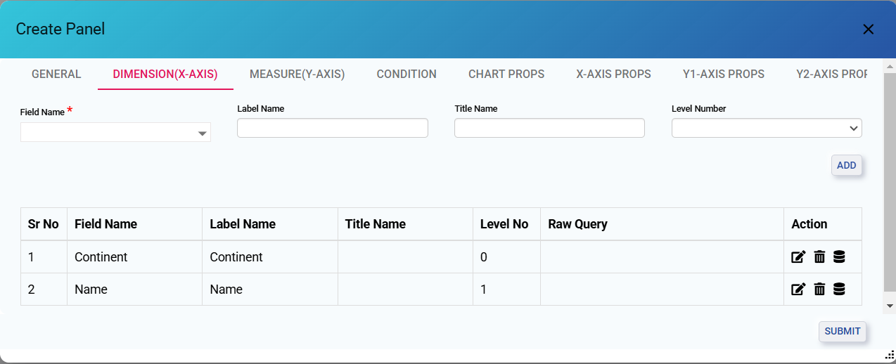 -->

Once the fields are selected and added, they will be displayed in a tabular format with options to **Edit**, **Delete**, and **Add Query**.

- **Edit**: Click the **Edit** icon to make changes to the selected fields.  
- **Delete**: Click the **Delete** icon to remove the selected fields.  
- **Add Query**: Click the **Add Query** icon to include a SQL query.

<!-- ***NOTE***: *The user must define either a raw query or an expression. If the user wants to set a raw condition, they can click on **Add Query**.* -->

<!--  -->

### Measure (Y-Axis)
The Measure (Y-Axis) Tab allows configuration of numerical and aggregate fields for the Y-Axis.

<!-- 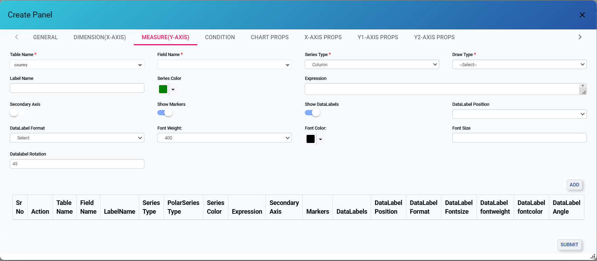 -->

**Step 5**: **Fields in the Measure (Y-Axis) Tab** to be filled

- **Table Name**: Select a table from the dropdown menu. The list is populated based on the selected database connection.
- **Field Name**: Field names are fetched from the selected table. Choose the field for the Y-Axis.
- **Series Type**: Select a series type (e.g., Line, Column, Area).
- **Label Name**: Define a label for the series.
- **Series Color**: Choose a color for the series.
- **Expression**: Add a formula or calculation for the Y-Axis.
- **Secondary Axis**: This option adds a second vertical axis to your chart. It's off by default. When turned on, you can assign a data series to this axis, and it will appear below the chart as the secondary axis.
- **Show Markers**: Toggle to display markers on the chart. By default, this is enabled.
- **Show DataLabels**: Toggle to enable data labels. By default, this is enabled.
- **DataLabel Position**: Select the data label position.
- **DataLabel Format**: Define the format (e.g., Number, currency, percentage).
- **Font Weight**: Adjust the data label font weight (e.g., 400 for normal, bold, etc.).
- **Font Color**: Choose the font color for data labels.
- **Font Size**: Adjust the font size.
- **Datalabel Rotation**: User can adjust the label (e.g., 45, 60, 90, -45, etc.).

**Add Button**: Click on Add to save the configuration. The values will be shown in a tabular form.

**Submit Button**: Click the **Submit** button to save and apply all the configurations.

<!-- ***NOTE***: *First, configure the General tab, followed by adding fields in the Dimension tab, ensuring they appear in the table. Next, add fields in the Measure tab, so they are reflected in the table. Once these three main tabs are properly configured.* -->

<!--  -->

<!-- *The chart panel will display the information.*

<!--  -->

<!-- *If the user wants to set the color or font, they can click on the edit icon in the table.* -->

<!-- 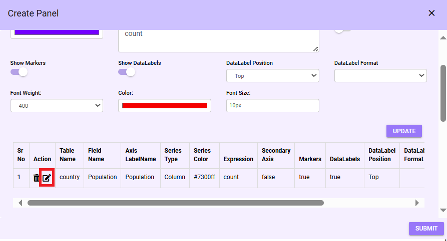 -->

<!-- *Choose the desired settings, and the panel would look according to the the selected information.* --> -->

<!--  -->

<!-- ### Secondary Axis
This is a toggle option. When enabled in the chart, you can add a secondary axis by providing the necessary information and clicking Add. The axis will then be listed below and displayed in the panel. -->

<!--  -->

<!-- The panel would look like this. -->

<!--  -->

### Condition
The Condition Tab helps filter and refine the dataset using grouping, sorting, and conditional logic.

**Fields in the Condition Tab**:

<!--  -->

- **Group By**: Specify fields to group data for aggregation.
- **Order By**: Define fields to sort data.
- **Order By Type**: Select sorting order (Ascending or Descending).
- **Template Conditions**: Use this section to create logical filtering expressions.
- **Condition Input Box**: Enter filter expressions (e.g., country == 'Africa').
- **Operators**: Use available buttons to add:
    - Arithmetic Operators: +, -, *, /
    - Comparison Operators: ==, <, >, <=, >=, !=
    - Logical Operators: AND, OR, NOT
    - Parentheses: ( ) to group conditions.
- **Clear Button**: Reset the condition input box.
- **Select Table**: Choose fields from the table to include in the condition.
    - **Selected Table Field Names**: View selected fields.

**Submit Button**: Apply conditions and update the dataset.

<!-- **For example:**

If a condition is set, the panel will be displayed based on the specified condition. -->

<!--  -->

### Chart Props
The Chart Props Tab allows customization of chart appearance and tooltips.

**Fields in the Chart Props Tab**
<!--  -->

- **Chart Area Border Width**: Adjust the chart area border width.
- **Chart Area Border Color**: Choose the border color.
- **Show Tooltip**: Toggle tooltip visibility:
    - Enabled: Tooltips are displayed.
    - Disabled: Tooltips are hidden.
- **Tooltip Format**: Choose from dropdown options (Percentage, Value).
- **DataLabel Format**: Select label format (Percentage, Value).
- **Show Legends**: Toggle legend visibility.
- **Legends Position**: Choose position (Top, Bottom, Left, Right).
- **Legends Font Size**: Adjust legend font size.
- **Legends Font Color**: Choose font color for legends.

**Submit Button**: Click on Submit to save all chart property configurations.

<!-- When the color and font size are set, the panel would look like this. -->

<!--  -->

### X-Axis Props
The X-Axis Props Tab customizes X-Axis formatting.

<!-- 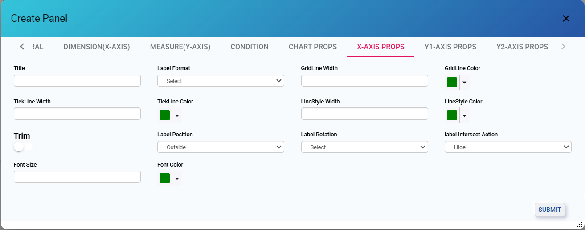 -->

**Fields in the X-Axis Props Tab**

- **Title**: Enter a title for the X-Axis.
- **Label Format**: Choose from available formats.
- **GridLines Width**: Set gridline width.
- **GridLines Color**: Choose gridline color.
- **TickLines Width**: Adjust tickline width.
- **TickLines Color**: Choose tickline color.
- **LineStyle Width**: Adjust linestyle width.
- **LineStyle Color**: Choose linestyle color.
- **Trim**: Toggle trimming of labels.
- **Label Position**: Choose position (Outside, Inside).
- **Label Rotation**: Select rotation angle (e.g., 30, 45, 90 degrees).
- **Label Intersect Action**: Select how overlapping labels are handled (e.g., Hide, Trim, Wrap, Rotate 45, Rotate 90, etc.).
- **Font Size**: Adjust the font size.
- **Font Color**: Adjust the font color.

**Submit Button**: Click on Submit to save all configurations.

<!-- 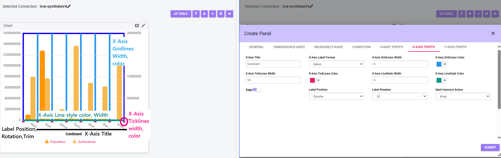 -->

### Y1-Axis Props(Primary Y-Axis)
The Y-Axis Props Tab allows for customizing the Y-Axis.

<!--  -->

**Fields in the Y1-Axis Props Tab**

- **Title**: Enter a title for the Y-Axis.
- **GridLines Width**: Adjust gridline width.
- **GridLines Color**: Choose gridline color.
- **TickLines Width**: Adjust tickline width.
- **TickLines Color**: Choose tickline color.
- **LineStyle Width**: Adjust linestyle width.
- **LineStyle Color**: Choose linestyle color.
- **Label Rotation**: Select rotation angle (e.g., 30, 45, 90 degrees).
- **Font Size**: Adjust the font size.
- **Font Color**: Adjust the font color.

**Submit Button**: Click on Submit to save all settings.

<!--  -->

<!-- ***NOTE***: *Fields marked with a red asterisk (*) are mandatory.* -->

### Y2-Axis Props(Secondary Y axis)

<!-- 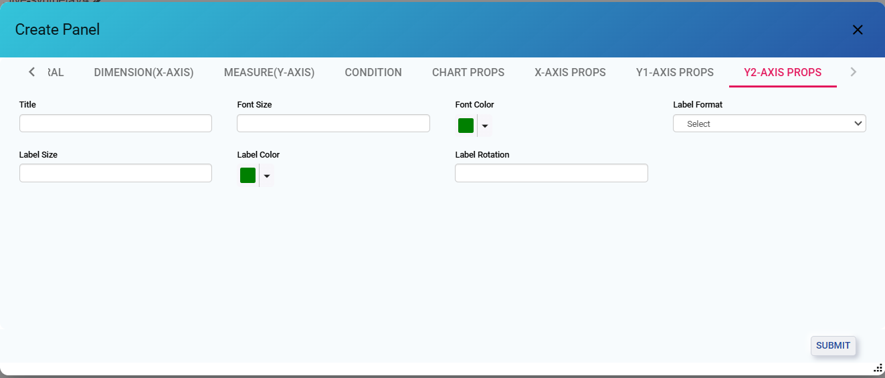 -->
**Fields in the Y2-Axis Props Tab**

- **Title**: Enter the title for the Secondary Y-Axis.
- **Font Size**: Adjust the font size.
- **Font Color**: Select the font color.
- **Label Format**: Select the label format from the dropdown menu.
- **Label Size**: Set and adjust the label size.
- **Label Color**: Set and adjust the label color.
- **Label Rotation**: Set and adjust the label rotation.

**Submit Button**: Click on Submit to save the configurations.

#### Types of Charts 
These are the main chart types listed in the General tab. Depending on the selection, different charts will be displayed in the measure Tab. 

1. Column Chart <!--  -->
2. Line Chart <!--  -->
3. Area Chart <!--  -->
4. Combine Chart <!-- 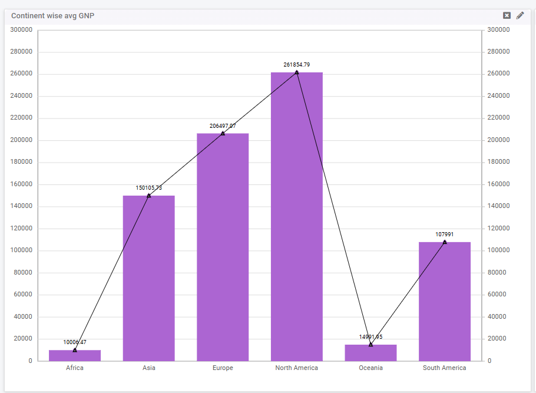 -->
5. Pie Chart <!-- 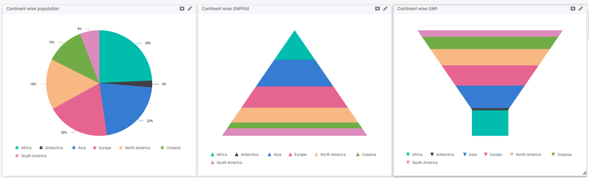 -->
6. Donut Chart <!--  -->

#### Drill-Down Functionality
Users can explore detailed information about any specific section of a chart by clicking on the desired area.

**Example**: If a user wants to view data for Central Africa from a pie chart:

- **Step 1**: Hover over and click on the respective section of the pie chart.
- **Step 2**: A detailed pie chart for that specific area (e.g., Central Africa) will open.

<!-- 

 -->

**Further Drill-Down**: If the detailed chart contains multiple fields, users can drill down further for more granular insights.

#### Drill up
To return to the main graph, users can click the arrow icon in the top-right corner of the screen.

<!-- 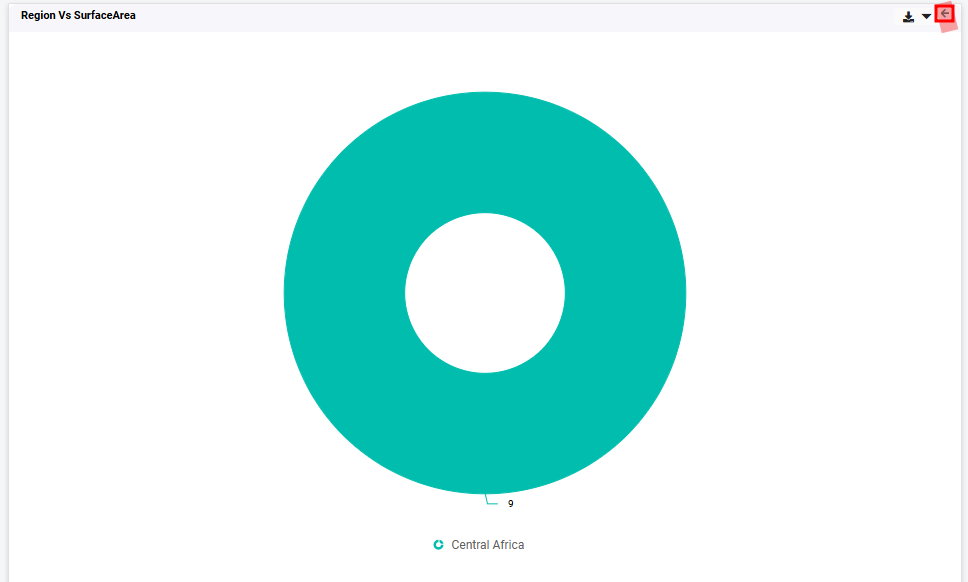 -->

#### Downloading Chart
Click the **Download Arrow** icon.

<!-- - Select the preferred file format from the available options. -->
- The chart will be downloaded in the chosen format.
    - JPEG
    - PNG
    - SVG 
    - PDF
    - XLS

<!-- 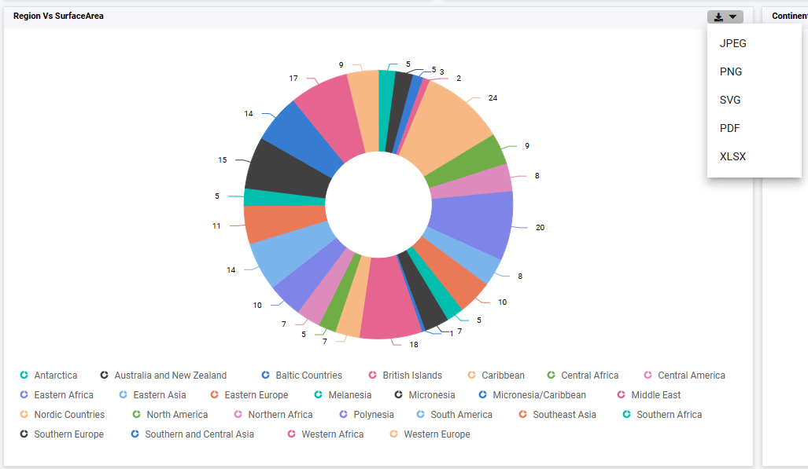 -->

To download a specific drill-down chart, follow the same procedure.

<!-- ## [Box](/create_dashboard/box)
Used to showcase key metrics or summary values in a compact format, often referred to as KPI (Key Performance Indicator) boxes.

- To create a Box panel, the configuration of General, Measure, or Raw Query is important.
- When both an expression and a raw query are defined, the raw query takes precedence. --> 

## BOX
#### Steps to Add a Box Panel
**Step 1**: Select **Box** from the **Add Panel** options and click **Submit**.

<!-- 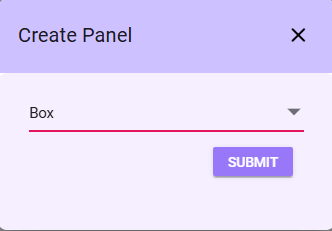 -->

A Box panel will appear on the Dashboard.
<!-- 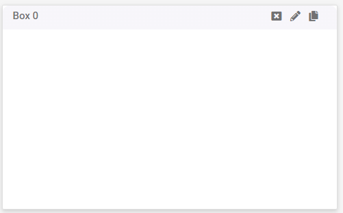 -->

**Step 2**: Click the *Pencil Icon* to open a configuration tab with various fields for customization.

<!--  -->

The following options are available for customizing the Box Panel:

### General 
Define the basic properties and appearance of the Box Panel.

<!-- 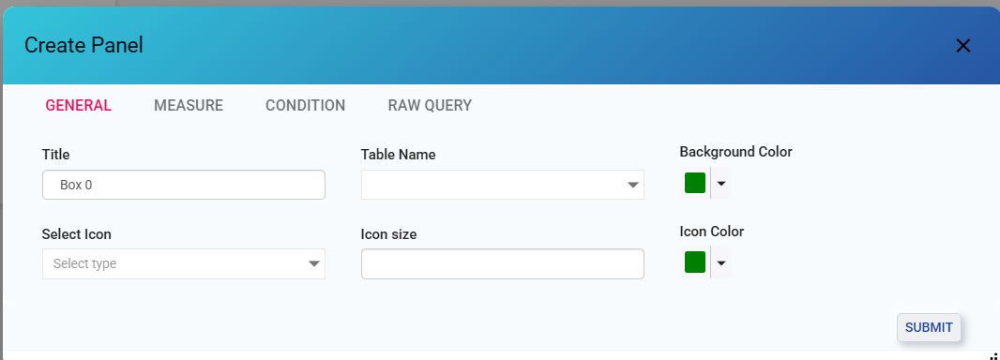 -->

**Step 3**: Define fields in the General Tab

- **Title**: Enter the title to identify the Box Panel.
- **Table Name**: Select the table name from the dropdown box; these are populated from the connection selected earlier.
- **Background Color**: Select the background color for the panel using a color picker or hex code.
- **Select Icon**: Pick an icon for the panel from the dropdown list.
- **Icon Size**: Use the arrow buttons to set the font size for the selected icon.
- **Icon Color**: Choose the icon color from the color palette.

### Measure 
Configure the data to be displayed within the Box Panel:

<!--  -->

**Step 4**: Configure the fields in the Measure tab.

- **Table Name**: Select a table from the dropdown menu. The list is populated based on the selected database connection.
- **Field Name**: Field names are fetched from the selected table. Choose a specific field to display as a list option.
- **Label Name**: By default, the field name is used as the label name, but users can change it if necessary.
- **Value Format**: Define how the value is displayed (e.g., currency, percentage).
- **Label Size**: Adjust the font size for the label text.
- **Label Color**: Set the label text color.
- **Value Size**: Specify the size for the value.
- **Value Color**: Choose the value's text color.
- **Expression**: Add a custom formula or calculation for the value.

**Step 5**: **Add Button**: After configuring the measure, click **Add** to save the measure and display it in a tabular list with available actions.

**Step 6**: **Submit**: Click on **Submit** to save the selections made.

<!-- *NOTE: The panel will only display information after both the General tab and the Measure tab have been configured. To set it up:*

- *Begin by configuring the General tab.*
- *Proceed to the Measure tab, where you can select the desired fields and click Add.*
- *Once fields are added, they will appear in a tabular format below, along with action buttons for further interaction.* -->

<!-- 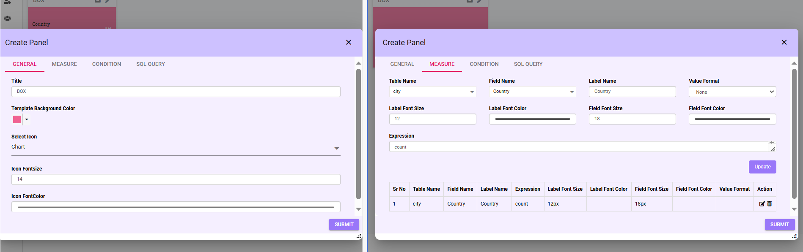 -->

<!-- *After configuration, the panel will appear as shown below:* -->

<!-- 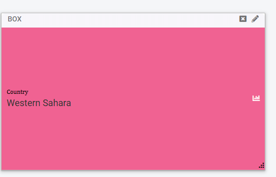 -->

<!-- ***NOTE***: *If the user wants to edit or add new fields:*

*Click the Pencil icon to access the editing mode.* -->

<!-- 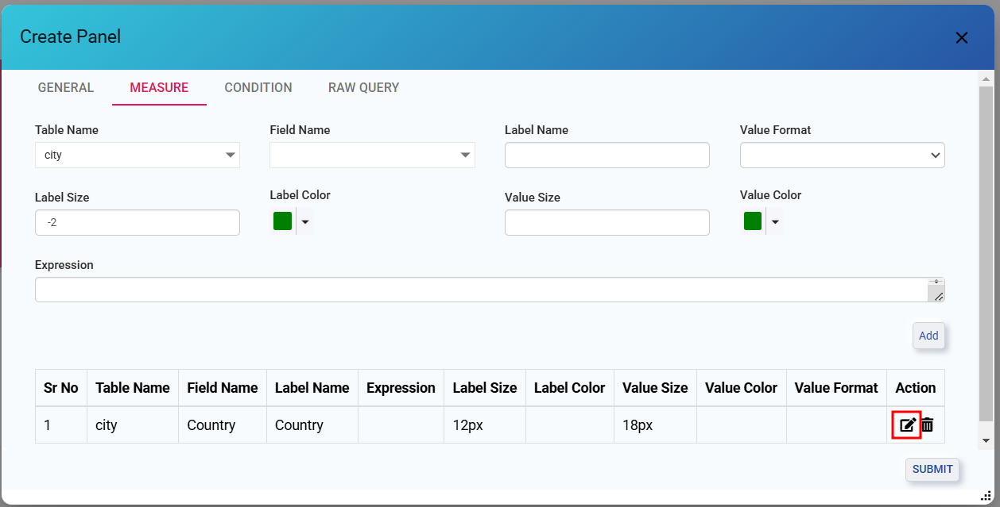 -->

<!-- ***Customization Options***

- *Users can customize the font size and color of labels and fields.*
- *Additionally, users can modify the font size and color of icons in the General tab.*
- *This setup allows flexibility in adjusting the appearance of the table to match user preferences.* -->

<!-- 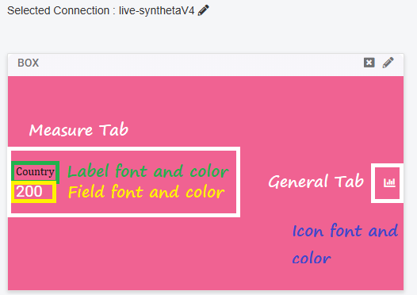 -->

### Condition
Apply logical filters to refine the data displayed in the Box Panel:

<!-- 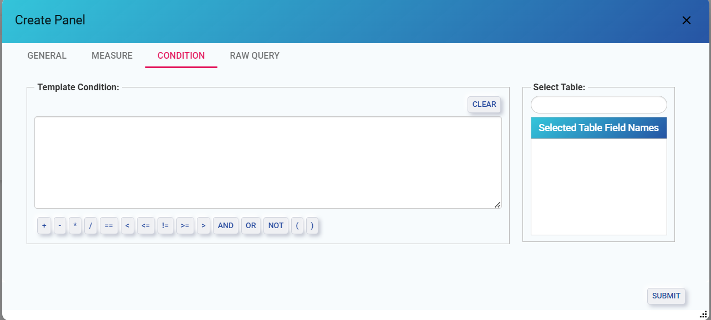 -->

- **Template Conditions**: Enter a custom condition in the text box (e.g., country == 'Western Sahara').

***Note***: *Enclose all conditions in single quotes. Only one condition can be given at a time.*

- **Operators**:
    - Arithmetic Operators: +, -, *, /
    - Comparison Operators: ==, <, >, <=, >=, !=
    - Logical Operators: AND, OR, NOT
    - Parentheses: Use ( ) to group expressions.
- **Clear Button**: Clears the current condition input box.
- **Select Table**:
    - **Select Table Field**: Add fields from the table for filtering.
    - **Selected Table Field Names**: View and manage selected fields.
- **Submit**: Apply conditions and update the data in the Box Panel.

*Example: The panel will display only the filtered data based on the condition `country == 'Western Sahara'`, showing information specific to that country.* 

<!-- 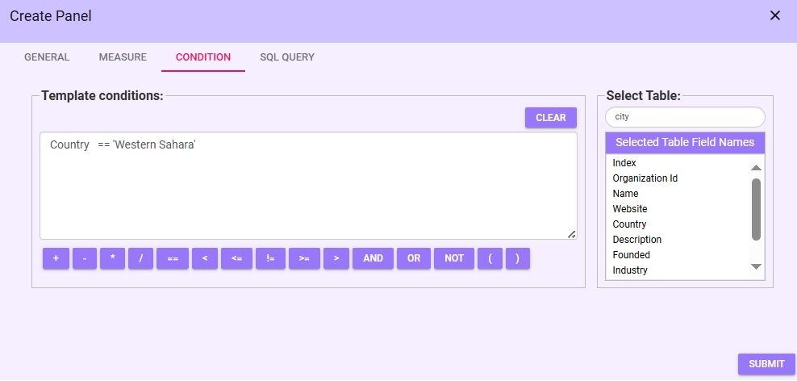 -->
<!-- 
*Panel View* -->

<!--  -->

### RAW Query 
The Raw Query tab allows users to define both conditions and expressions directly using SQL-like syntax. Users can refer to the condition tab to use the raw query.

<!-- 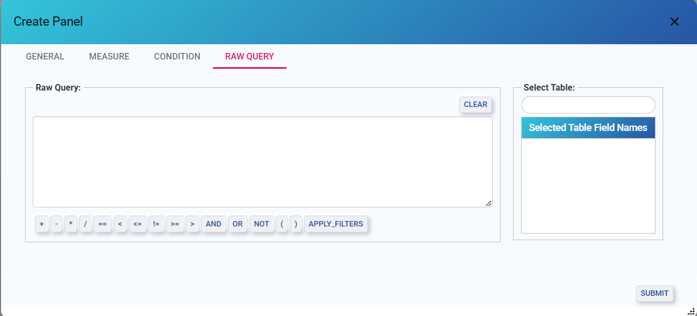 -->

- **Raw Query**: In the text box field, enter a custom condition.

***Note***: *Enclose all conditions in single quotes.*

- **Operators**: Use the same operators as in the Condition tab:
    - Arithmetic Operators: +, -, *, /
    - Comparison Operators: ==, <, >, <=, >=, !=
    - Logical Operators: AND, OR, NOT
    - Parentheses: Use ( ) to group conditions.
    - Apply Filters: Whenever users are using a raw query, and if there is a WHERE clause in the query, `{apply_filters}` should be added. 
- **Clear Button**: Reset the SQL query input box.
- **Select Table**: The same table selected in the General tab will be displayed here.
    - **Selected Table Field Names**: Select the field name that was chosen in the field name section in the General tab.
- **Submit**: Execute the query and refresh the Box Panel with the updated dataset.

<!-- Once the Raw Query is submitted, the panel will reflect the updated dataset. -->

<!-- ## [Table](/create_dashboard/table)
Displays raw or processed data in tabular form. Provides a clear, structured view of detailed information for easy analysis.

- To create a Table panel, the configuration of General, Measure, or Raw Query is important. -->

## TABLE
<!-- This section describes how to configure the Table Panel, including General, Measure, Condition, SQL Query, and Conditional Formatting tabs. -->

#### Steps to Add a Tabel Panel

**Step 1**: Select **Table** from the **Add Panel** options and click **Submit**.

<!--  -->

A table panel will appear on the Dashboard.

<!--  -->

**Step 2**: Click the **Edit Icon** to open a configuration tab with various fields for customization.

<!-- 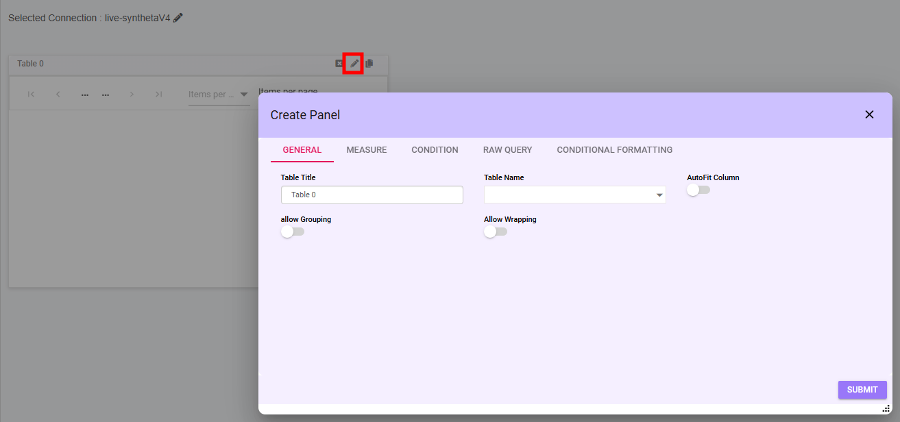 -->

The following options are available for customizing the Table Panel:

### General 
The General tab allows user to configure basic properties of the table panel.

<!-- 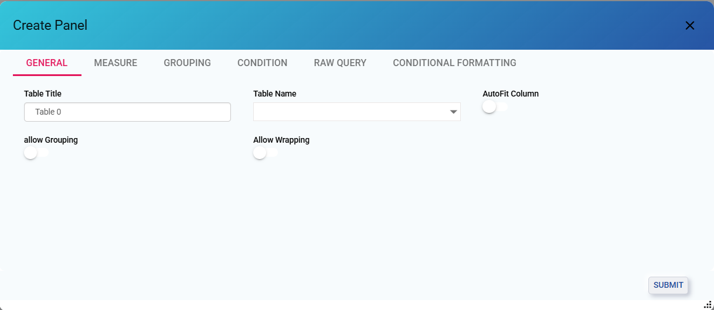 -->

- **Table Title**: Enter a title for the table panel.
- **Table Name**: Select a table from the dropdown menu. The list is populated based on the selected database connection.
- **AutoFit Column**: Toggle to enable automatic adjustment of column widths.
- **Allow Grouping**: Enable grouping functionality for table rows. 
    - for this user needs to drag and drop the column.

<!--  -->

<!-- - **Allow Server-Side Paging**: Toggle to allow pagination for large datasets. -->
- **Allow Wrapping**: Toggle to enable or disable text wrapping in table cells.
<!-- - **Submit**: Save your settings and apply the configuration. -->

#### Various Filtering and Customization Options
When the user clicks on the three dots, various filtering and customization options are available:

<!--  -->

- **Autofit All Columns**: Adjusts the width of all columns to fit the content.
- **Autofit This Column**: Adjusts the width of the selected column to fit its content.
- **Group by This Column**: Groups the data based on the selected column.
- **Ungroup by This Column**: Removes grouping for the selected column.
- **Sort Ascending**: Sorts the data in ascending order based on the selected column.
- **Sort Descending**: Sorts the data in descending order based on the selected column.
- **Columns**: Click the arrow to view a list of all columns. user can deselect specific columns, and the data will update accordingly.
- **Filters**: Click the arrow to display a list of fields. Disable specific fields to filter the data and display results accordingly.

### Measure
The Measure tab is used to configure columns and their properties for the table.

<!--  -->

- **Table Name**: The table name selected in the General tab the same will be selected here.
- **Field Name**: Field names are fetched from the selected table. User can choose multiple Field names by enabling the checkbox.
- **Header Text**: Enter the column's header label

**Add Button**: Add the configured column to the table. All added columns will be displayed in a tabular view for review and editing.

**Submit Button**: Click on add to Save settings and apply the configuration.

#### Action
##### Edit
Click the **Edit Button** to modify the selected field. When editing, the following options will be visible:

- **Text Alignment**: Allows you to set the alignment for the columns.
- **Column Type**: Select the data type for the column, such as string, number, or date.
- **Format Type**: This option is dependent on the selected column type and allows you to define the formatting style.
- **Visible Column**: A toggle option to control the visibility of the column. Enabling or disabling this option will make the column visible or hidden, respectively.
- **Enable Hyperlink**: A toggle option that, when enabled, allows the column to be converted into a hyperlink.

<!-- 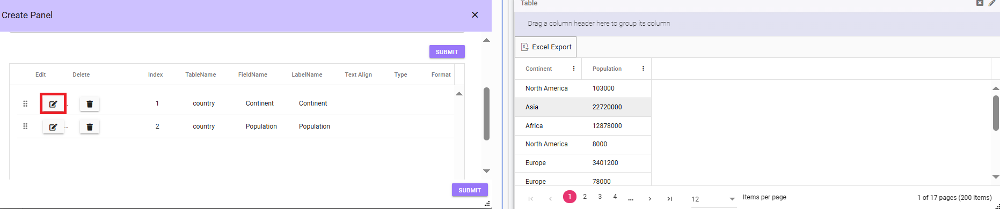 -->

##### Delete
Click on the **Delete Button** To remove the Selected Field

<!--  -->

##### Dots
Click on the **dots** to drag and rearrange the position of the fields.

<!-- 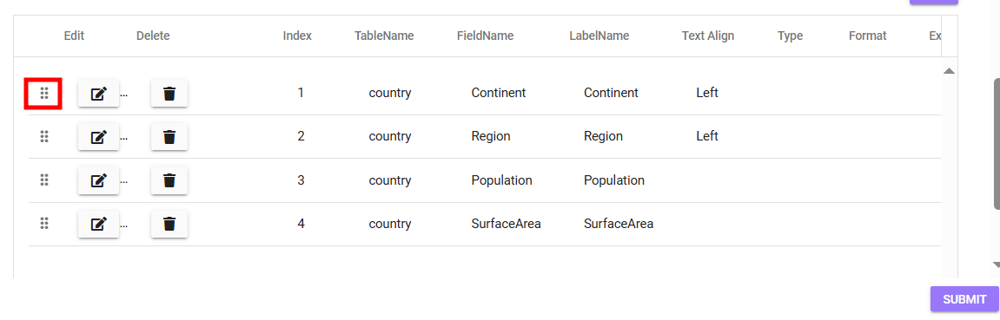 -->

### Grouping
<!--  -->

- **Table Name**: The table name selected in the General tab the same will be selected here.
- **Field Name**: Field names are fetched from the selected table. User can choose Field names from the dropdown menu.
- **Title Name**: It is used to add title for each level 
- **Level Number**: Select the level number 0-10. and user can add multiple levels.
- **Raw Query**: Allows User to define custom SQL-based queries.

**Add Button**: Add the configured column to the table. All added columns will be displayed in a tabular view for review and editing.

**Submit Button**: Click on Submit to Save settings and apply the configuration.

### Condition
The Condition tab is used to refine and filter data using logical expressions.

<!-- 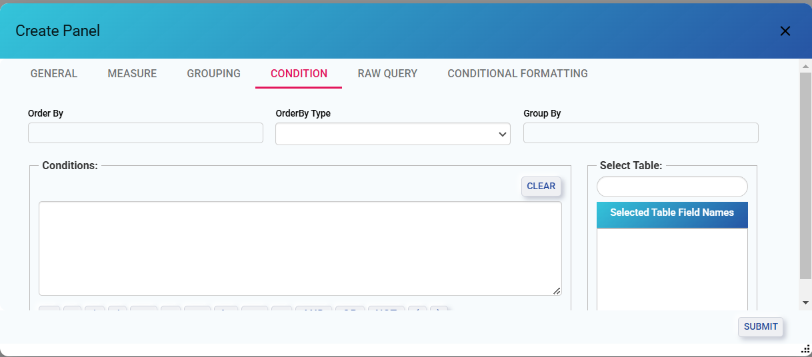 -->

- **Order By**: Define fields to sort data.
- **Order By Type**: Select sorting order (Ascending or Descending).
- **Group By**: Specify fields to group data for aggregation.
- **Conditions**: Use this section to create logical filtering expressions.
    - **Input Box**: Enter filter expressions (e.g., country == 'Africa').
        - **Operators**: Use available buttons to add:
            - Arithmetic Operators: +, -, *, /
            - Comparison Operators: ==, <, >, <=, >=, !=
            - Logical Operators: AND, OR, NOT
            - Parentheses: ( ) to group conditions.
    - **Clear Button**: Reset the condition input box.
- **Select Table**: Choose fields from the table to include in the condition.
    - **Selected Table Field Names**: View selected fields.
- **Submit**: Apply conditions and update the dataset.

<!--  -->

***Note***: *The condition should be written within single quotes (').*

### RAW Query 
The RAW Query tab allows you to define custom SQL-based filters and queries for the table panel.

<!-- 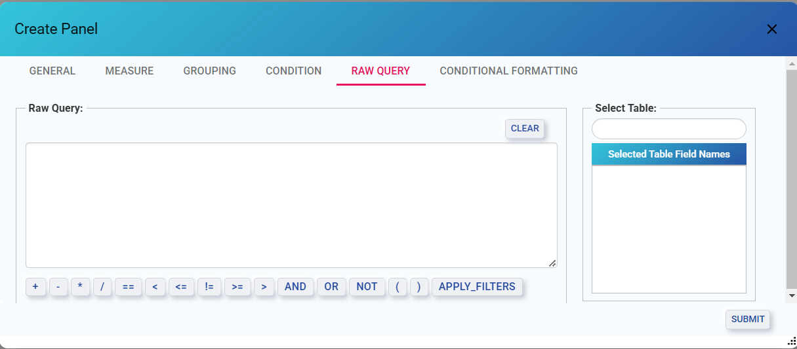 -->

- **SQL Query**:
    - **Input Box**: User can Write Sql Query expressions for filtering data.
        - **Operators**:
            - Arithmetic Operators: +, -, *, /
            - Comparison Operators: ==, <, >, <=, >=, !=
            - Logical Operators: AND, OR, NOT
            - Parentheses: Use ( ) to group conditions.
            - Apply Filters: Whenever users are using a raw query, and if there is a WHERE clause in the query, `{apply_filters}` should be added.    
    - **Clear Button**: Clear the SQL query input box.
- **Select Table**: Choose fields for SQL conditions.
    - **Selected Table Field Names**: View the fields added to the query.
- **Submit**: Execute the query and update the dataset.

***Note***: *Setting up a RAW query is the same as setting a condition, but SQL queries are used.*

### Conditional Formatting
The Conditional Formatting tab allows you to customize table styling based on field values.

<!-- 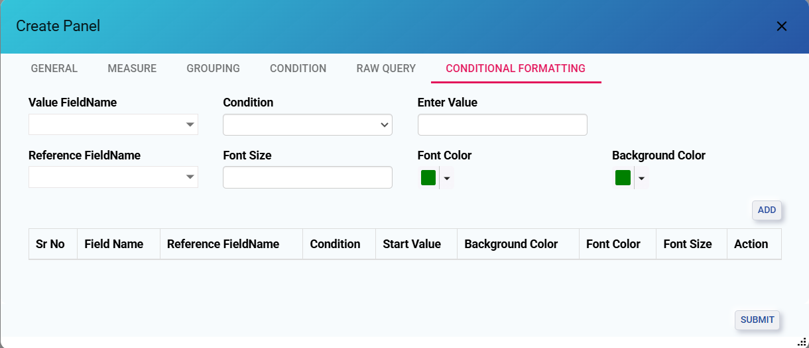 -->

- **Value Field Name**: Select the field to be evaluated for conditional formatting.
- **Condition**: Specify a condition for the field.
- **Enter Value**: Enter a static value for the condition.
- **Reference Field Name**: Use another field as a reference for the condition.
- **Font Size**: Set the font size for the formatted cells.
- **Font Color**: Choose a font color for the conditionally formatted cells.
- **Background Color**: Select a background color for the formatted cells.

**Add Button**: Click on the Add button once the all the fields are configured the fields will be seen below in the tabular form.

- **Submit**: Save and apply the conditional formatting.

##### Example
- To apply conditional formatting to a single field, the user must select a condition, enter a value, and save it. The formatting will be displayed in the table. Once submitted, the panel will update based on the specified condition.

- To apply conditional formatting to two different fields, the user must select a condition. Entering a value is optional, but the user must link the Reference Field Name to the Value Field Name. The condition will be applied accordingly.

<!--  -->

#### Export Excel
User can click on **Export Excel** on the panel to download the excel file.

<!-- 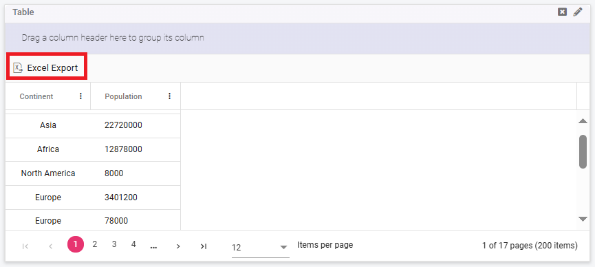 -->

#### Drill Down 
To drill down into a particular column or piece of information, the user can simply click on that specific data, and the detailed information will open. However, there is a restriction in the RAW Query section: users need to ensure that if they are using any query, the alias name they provide must match the field name present in the table.

## PIVOT 
#### Steps to add Pivot Panel

**Step 1**: Select **Pivot** from the **Add Panel** options and click **Submit**.

<!--  -->

A table panel will appear on the Dashboard.

<!--  -->

**Step 2**: Click the **Edit Icon** to open a configuration tab with various fields for customization.

<!-- 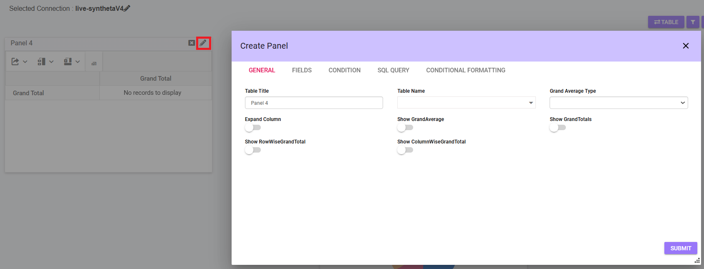 -->

The following options are available for customizing the Pivot Panel:

### General
This tab allows users to configure the overall settings of the pivot table.

<!--  -->

- **Table Title**: Enter a title for the table.
- **Table Name**: Select a table from the dropdown menu. The list is populated based on the selected database connection.
- **Grand Average Type**: Choose one of the following options:
    - Average with visible data
    - Average excluding zeros
    - Average across all data
- **Expand Column**: Enable or disable column expansion.
- **Show Grand Average**: Toggle the display of the grand average.
- **Show Grand Totals**: Toggle the display of grand totals.
- **Show Row-Wise Grand Total**: Enable or disable the row-wise grand total.
- **Show Column-Wise Grand Total**: Enable or disable the column-wise grand total.

<!-- ***Note***: *User can toggle row and column grand totals in the General Tab or click the relevant icon on the panel.* -->

### Fields
Used to select and define the fields to be displayed in the pivot table. Users can categorize fields as rows, columns, or values, apply formatting, and add expressions for calculations. This tab is essential for structuring and organizing the data.

<!-- 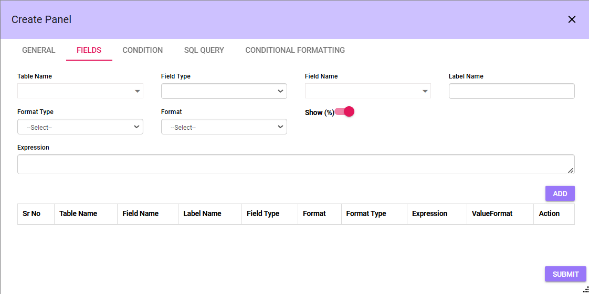 -->

- **Table Name**: Select a table from the dropdown menu. The list is populated based on the selected database connection.
- **Field Type**: Select the type of field:
    - Column
    - Value
    - Row
    - Format
- **Field Name**: Field names are fetched from the selected table. Choose a specific field name..
- **Label Name**: Enter a label for the field.
- **Format Type**: Choose the desired format type.
- **Format**: Define the format settings.
- **Show (%)**: Toggle the display of percentage values.
- **Expression**: Add a custom expression for the field.
- **Add**: Add the field to the table. 
    - After the fields are selected and added, they will be displayed in the table below.
- **Submit**: Save the field configuration.

<!-- ***Note***: *Once fields are added, they will appear in the table below.* -->

<!-- 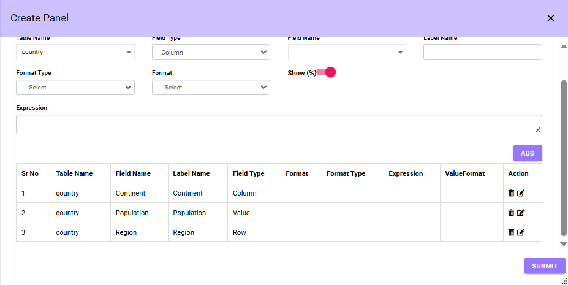 -->

<!-- ***Note***: *The panel will only display data after completing both General and Fields configurations.* -->

<!--  -->

**Show Subtotals:**

*Displays subtotals for rows and columns separately. The user can adjust the position of subtotals by selecting the desired option from the Subtotal Position setting.*

**Grand Totals:**

*Users can enable or disable row and column grand totals either through the toggle options in the General tab or by clicking the corresponding icon directly on the panel.*

<!--  -->

### Condition
Provides options to filter and refine data using logical expressions and grouping. Users can set conditions to display specific subsets of data, sort it, or group it by selected fields. It helps in narrowing down the data for better insights.

<!--  -->

- **Order By**: Specify the field to sort by.
- **OrderBy Type**: Select the sorting order (e.g., ascending or descending).
- **Group By**: Choose a field for grouping data.
- **Conditions:** Define filter criteria using the input box. Examples
    - **Condition Input Box**: Enter custom filter expressions.
        - **Operators**:
            - Arithmetic Operators: +, -, *, /
            - Comparison Operators: ==, <, >, <=, >=, !=
            - Logical Operators: AND, OR, NOT
            -  Parentheses: Use ( ) to group expressions.
- **Clear Button**: Reset the condition input box.
- **Select Table**: Choose fields from the table for conditions.
    - **Selected Table Field Names**: View the selected fields.
- **Submit**: Apply conditions to the dataset.

<!-- ***Note***: *If a condition is applied, the panel will dynamically update and display data based on the specified condition.* -->

<!--  -->

### RAW Query 
Allows users to write custom SQL queries for advanced filtering and manipulation of the dataset.

<!-- 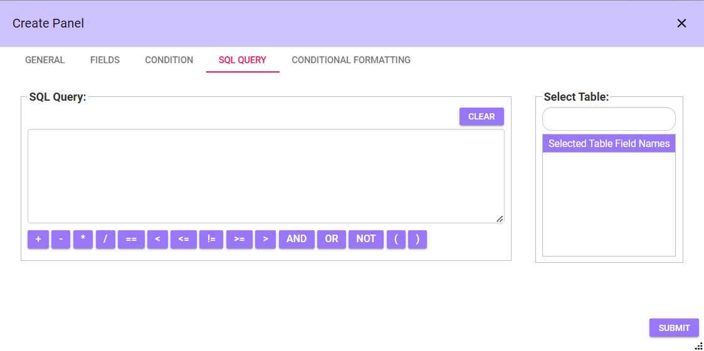 -->

- **SQL Query**: Create logical expressions for filtering data.
- **Operators**:
    - Arithmetic Operators: +, -, *, /
    - Comparison Operators: ==, <, >, <=, >=, !=
    - Logical Operators: AND, OR, NOT
    - Parentheses: Use ( ) to group conditions.
- **Clear Button**: Clear the SQL query input box.
- **Select Table**: Choose fields for SQL conditions.
    - **Selected Table Field Names**: View the fields added to the query.
- **Submit**: Execute the query and update the dataset.

<!-- ***Note***: *The SQL Query tab works similarly to the Condition tab, as both are used to filter and refine data. However, the SQL Query tab allows users to write custom SQL statements for advanced data manipulation, offering greater flexibility and control compared to the predefined options in the Condition tab.* -->

### Conditional Formatting
Enables customization of the table’s appearance based on data values. Users can define conditions to change font size, font color, or background color for specific fields or values, making the table more visually intuitive

<!-- 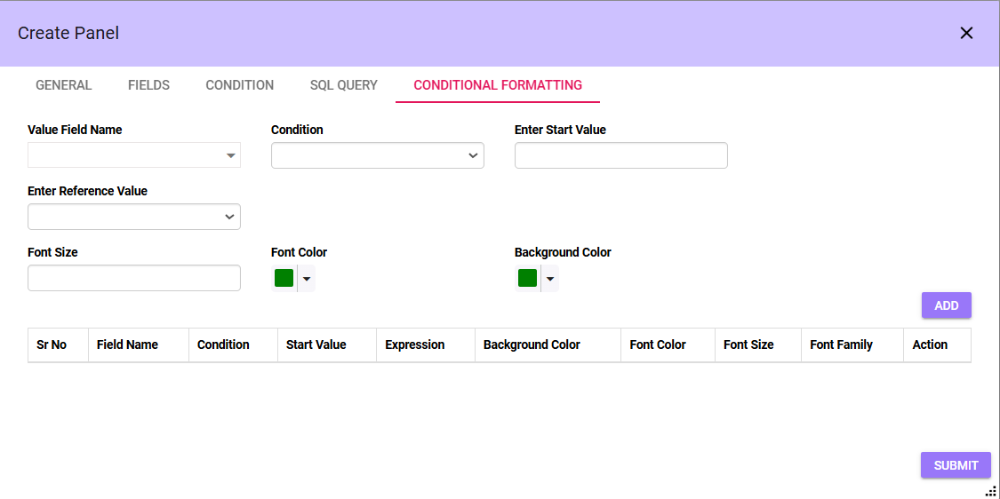 -->

- **Value Field Name**: Select the field to be evaluated for conditional formatting.
- **Condition**: Specify a condition for the field.
- **Enter start Value**: Enter a static value for the condition.
- **Enter Reference Value**: Select the value from the dropdown menu.
- **Font Size**: Set the font size for the formatted cells.
- **Font Color**: Choose a font color for the conditionally formatted cells.
- **Background Color**: Select a background color for the formatted cells.
- **Add**: Click on Add button all the selected information will be displayed in a tabular fomat with actions
- **Submit**: Save and apply the conditional formatting.

<!-- ***Note***: *The Pivot Panel reflects changes dynamically based on the applied conditional formatting.*

- *If the user wants to apply conditional formatting to a single field, they need to specify the condition and enter the required value*
- *For conditions like "between," the user must provide both a start value and an end value. The panel will update and reflect the changes based on the applied formatting.*

***Note*** -->

##### Download
Can download the table in PDF, Excel, and CSV formats.

<!-- 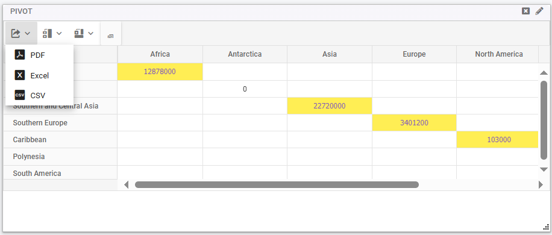 -->

Users can download the file after applying conditional formatting, and the downloaded file will reflect the applied formatting.

<!--  -->

## CARD
#### Steps to Add Card Panel
**Step 1**: Select **Card** from the **Add Panel** options and click **Submit**.

<!--  -->

A Card panel will appear on the Dashboard.

<!-- 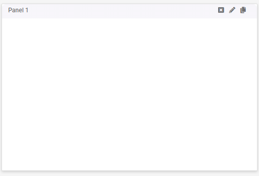 -->

**Step 2**: Click the **Edit Icon** to open a configuration tab with various fields for customization.

<!-- 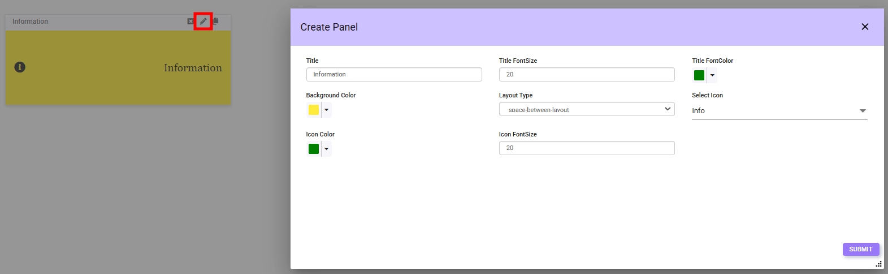 -->

<!-- 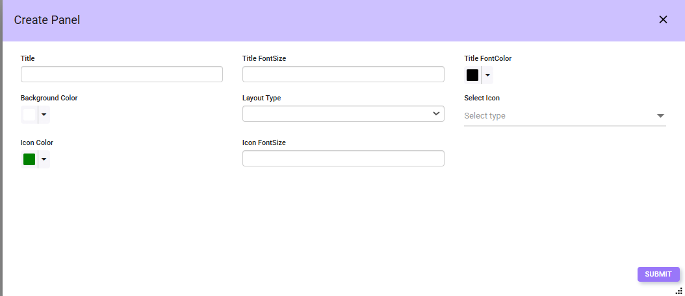 -->

### Panel Configuration Options:

- **Title**: Enter the name of the panel.  
- **Title Font Size**: Adjust the font size of the panel title.  
- **Title Font Color**: Choose the font color for the title.  
- **Background Color**: Select the background color for the panel.  
- **Layout Type**: Choose a layout type from the dropdown menu:  

  - **Space-between Layout** :

  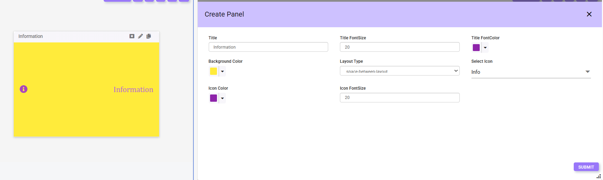

  - **Reverse Horizontal Layout** 
    
  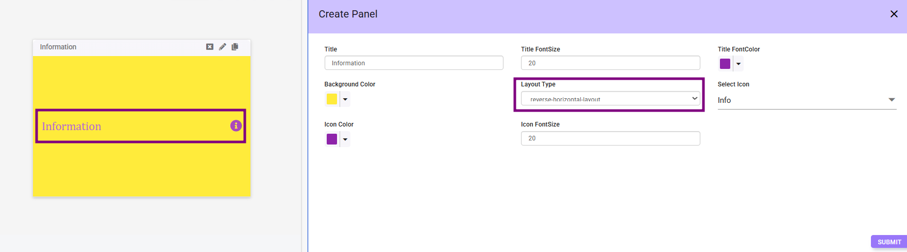
 
  - **Vertical Layout**  
  
  

  - **Horizontal Layout**  

  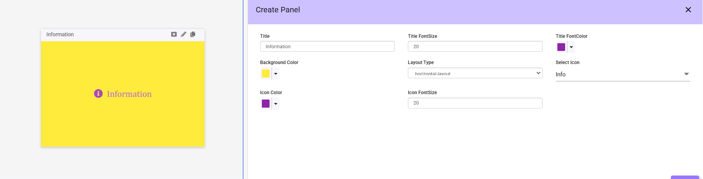
 
- **Select Icon**: Choose an icon from the dropdown menu.  
- **Icon Color**: Select the color of the icon.  
- **Icon Font Size**: Adjust the font size of the icon.

<!--  -->

## DATE PICKER
The Date Picker allows users to select a date for filtering or data input. Here's how to configure the Date Picker panel:

#### Adding a Date Picker
Select **Date Picker** in the **Add Panel** and click on **Submit**.

<!--  -->

A panel box will appear.

<!--  -->

- **Calendar Icon**: Click on the icon to select a particular date.By default, the current date will be pre-selected.
- **Edit Icon**: Click on the Edit icon, a tab will open where the user can configure the fields. 

<!--  -->

**Date Picker Fields**
<!--  -->

- **Table Name**: Select a table from the dropdown menu. The table names are populated based on the selected database connection.
- **Field Name**:  Field names are populated based on the selected table name. Choose the field to associate with the Date Picker.
- **Label Name**: Enter a label name that will be displayed on the panel.
- **Date Format**: User will have select the data format based on the date format in the database.
- **Submit**: Click the Submit button to save the configuration.

## DATE RANGE PICKER
The Date Range Picker allows users to select a range of dates by specifying both a Start Date and an End Date. This feature is useful for filtering data within a specific time period.

#### Steps to Add Date Range Picker
- Select **Date Range Picker** in the **Add Panel** and click on **Submit**.

<!--  -->

A panel will appear on the Dashboard

- **Calendar Icon**: Click on the calender icon to choose the date range. The Date Range Picker will show two fields for the user to select the Start Date and End Date.

<!--  -->

- **Edit Icon**: Click on the Edit icon, a tab will open where the user can configure the fields. 

<!-- 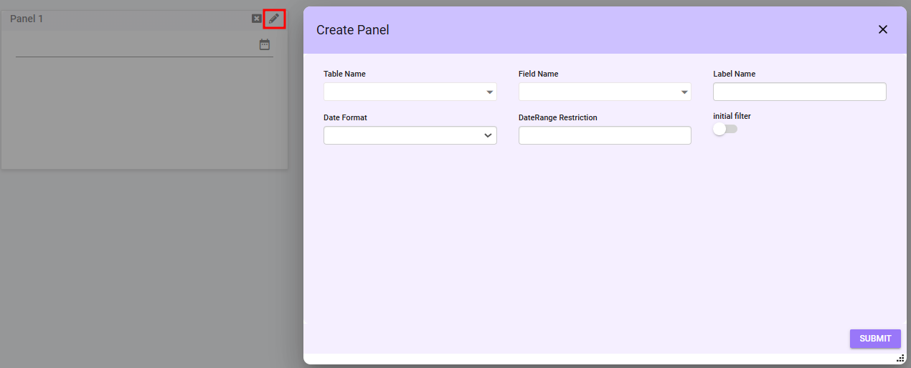 -->

**Date Range Picker Fields**<!-- 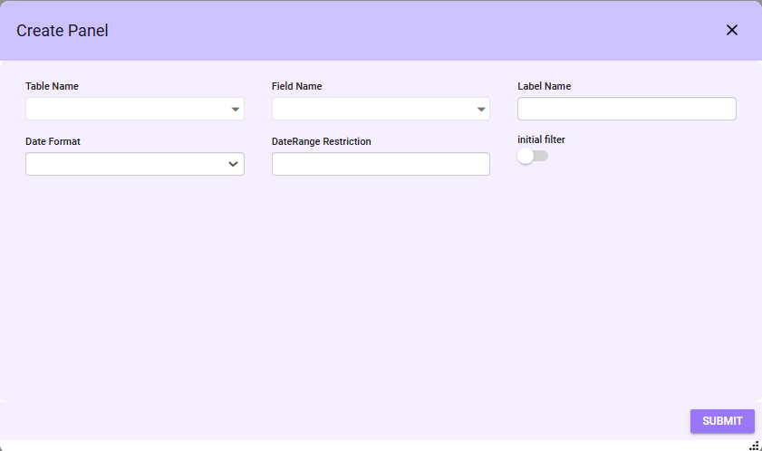 -->

- **Table Name**: Select a table from the dropdown menu. The table names are populated based on the selected database connection.
- **Field Name**:  Field names are populated based on the selected table name. Choose the field to associate with the Date Picker.
- **Label Name**: Enter a label name to be displayed on the panel for the Date Range Picker.
- **Date Format**: Select the desired date format from the dropdown menu.
- **Date Range Restriction**: Specify any restrictions or constraints on the date range. User can dynamically adjust the range based on the Restrictions.
- **Initial Filter**: This is a toggle option  
    - **Enabled**: When enabled, it overrides any date range selections made, using the values provided in the initial filter during dashboard creation.  
    - **Disabled**: When disabled, data will shown according to the initial filter selection.
- **Submit**: After making the necessary selections, click the Submit button to apply the configuration.

***Note***: *When the initial filter is enabled, an icon will appear in the top right corner of the panel, indicating that the filter has been applied.*

## LIST BOX
The List Box feature allows users to configure and display a list of options or data records with extensive customization capabilities.

#### Steps to List Box 
Select **List Box** from the **Add Panel** options and click **Submit**.

<!--  -->

A List Box panel will appear on the Dashboard.

<!--  -->

Click the **Edit Icon** to open a configuration tab with various fields for customization.

<!-- 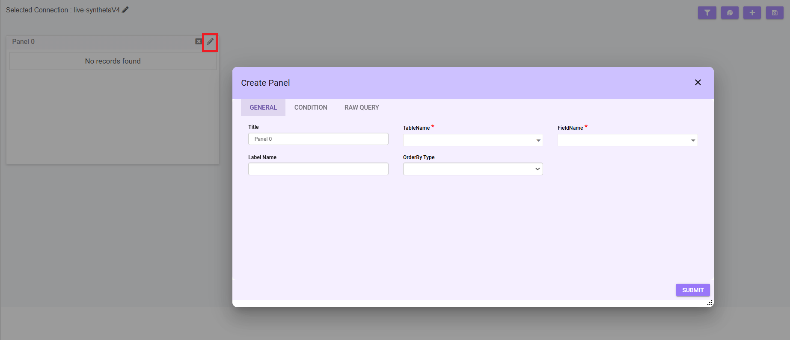 -->

### General
The General tab allows you to configure the basic appearance and properties of the List Box. This tab is selected by default.

<!--  -->

- **Title**: The panel's name is displayed as the panel name on the dashboard by default, but users can modify it.
- **Table Name**: Select a table from the dropdown menu. The list is populated based on the selected database connection.
- **Field Name**: Field names are fetched from the selected table. Choose a specific field to display as list options.
- **Label Name**: By default, the field name is used as the label name, but users can change it if necessary.
- **Order By Type**: Define the sorting order for the list options (e.g., ascending or descending).
- **Submit**: Click Submit to save the general settings.

Once the General settings are submitted, the panel will appear as shown below:

<!-- 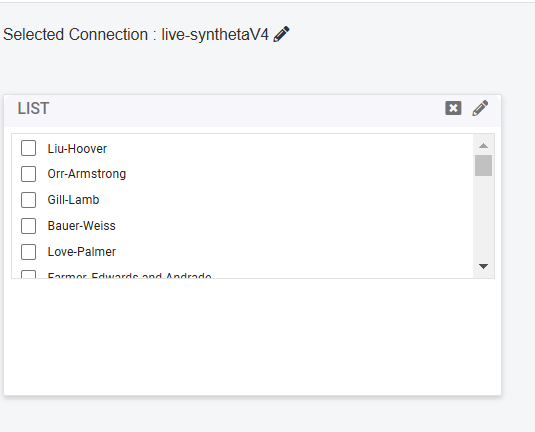 -->

If user wants to set a condition to filter the data in the list click on the pencil icon and click on the condition tab 

### Condition
The Condition tab is used to filter the list data by applying specific conditions using various operators.

<!-- 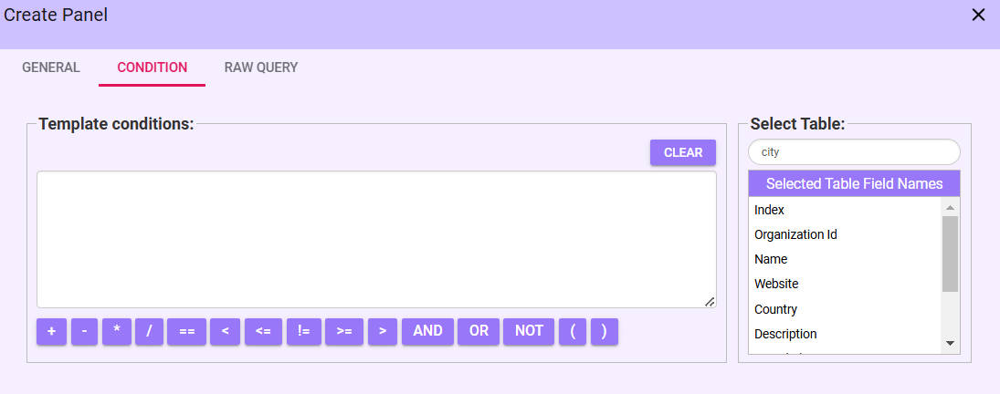 -->

- **Template condition**: Enter a custom condition in the text box (e.g., name == 'Gil-Lamb').
    - **Operators**:Use the following operators to build conditions
        - Arithmetic Operators: +, -, *, /
        - Comparison Operators: ==, <, >, <=, >=, !=
        - Logical Operators: AND, OR, NOT
        - Parentheses: Use ( ) to group expressions.
    - **Clear Button**: Reset the condition input box.
- **Select Table**: The table selected in the General tab will be displayed here.
    - **Selected Table Field Names**: Choose the field name selected in the General tab.
- **Submit**: Apply conditions to filter the dataset.

***Note***: *Enclose all conditions in single quotes.At once only one condition can be given*

<!--  -->

<!-- Once conditions are submitted, the panel will update as shown below: -->

<!--  -->

### RAW Query
The Raw Query tab allows users to define both conditions and expressions directly using SQL-like syntax.

***Note***: *User can refer condition tab to use the raw query.*

<!--  -->

- **SQL Query**: In the Text box field Enter custom condition.
- **Operators**: Use the same operators as in the Condition tab
    - Arithmetic Operators: +, -, *, /
    - Comparison Operators: ==, <, >, <=, >=, !=
    - Logical Operators: AND, OR, NOT
    - Parentheses: Use ( ) to group conditions.
    - Apply Filters: Whenever users are using a raw query, and if there is a WHERE clause in the query, `{apply_filters}` should be added.
- **Clear Button**: Click on Clear to Clear the SQL query input box.
- **Select Table**: Whatever table is selected in general tab the same will be displayed here.
    - **Selected Table Field Names**: Select the field name which was selected in the field name section in the general tab.
- **Submit**: Execute the query and update the dataset.
<!-- 
*Note: Enclose all conditions in single quotes.*

Once the Raw Query is submitted, the panel will reflect the updated dataset.

*Note: User can write sql query in raw query. The query provided in the raw query should be optimized based on the database structure.* -->

## DROPDOWN LIST
The Dropdown List Panel provides a single-select dropdown menu for filtering or displaying specific data. This component supports customizable fields, conditions, and raw SQL queries for dynamic data management.

#### Steps to Add a Dropdown List
Select **Dropdown List** from the dropdown of **Add Panel** options and click **Submit**.

<!-- 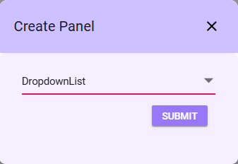 -->

A dropdown list panel will appear on the Dashboard.

<!-- 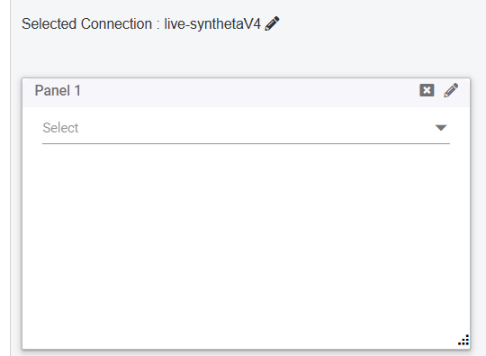 -->

Click the **Edit Icon** to open a configuration tab with various fields for customization.

<!-- 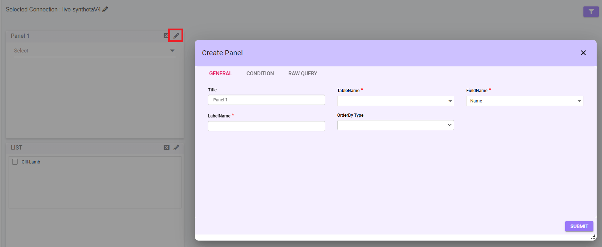 -->

### General
Set up the dropdown's basic attributes:

<!--  -->

- **Title**: The panel's name is displayed as the panel name on the dashboard by default, but users can modify it.
- **Table Name**: Select a table from the dropdown menu. The list is populated based on the selected database connection.
- **Field Name**: Field names are fetched from the selected table. Choose a specific field to display as dropdown list options.
- **Label Name**: By default, the field name is used as the label name, but users can change it if necessary.
- **Order By Type**: Define the sorting order for the list options (e.g., ascending or descending).
- **Submit**: Click Submit to save the general settings.

Once the General settings are submitted, the panel will appear as shown below:

<!-- 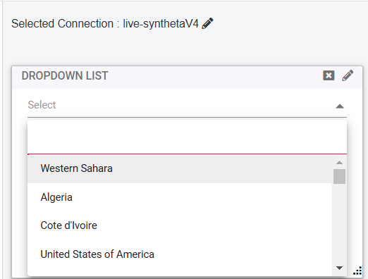 -->

### Condition
The Condition tab is used to filter the list data by applying specific conditions using various operators.

<!-- 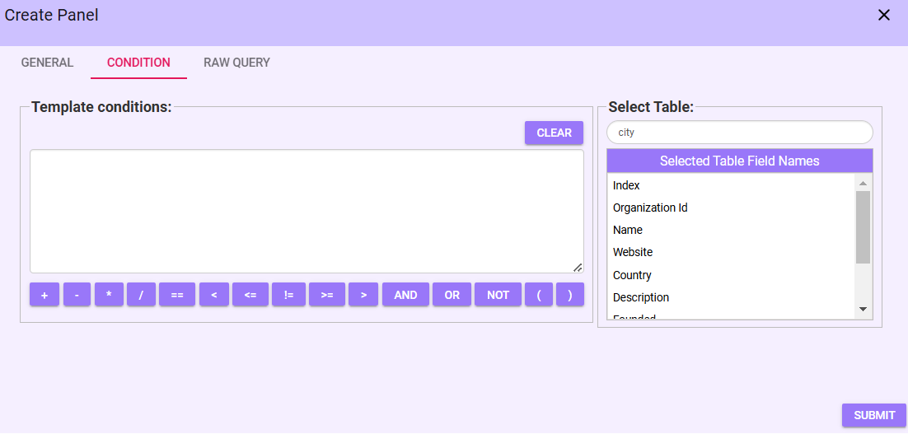 -->

- **Template condition**: Enter a custom condition in the text box (e.g., name == 'Gil-Lamb').
    - **Operators**:Use the following operators to build conditions
        - Arithmetic Operators: +, -, *, /
        - Comparison Operators: ==, <, >, <=, >=, !=
        - Logical Operators: AND, OR, NOT
        - Parentheses: Use ( ) to group expressions.
    - **Clear Button**: Reset the condition input box.
- **Select Table**: The table selected in the General tab will be displayed here.
    - **Selected Table Field Names**: Choose the field name selected in the General tab.
- **Submit**: Apply conditions to filter the dataset.

*Note: Enclose all conditions in single quotes.At once only one condition can be given*

### RAW Query 
The Raw Query tab allows users to define both conditions and expressions directly using SQL-like syntax. User can refer condition tab to use the raw quer.

<!--  -->

- **RAW Query**: In the Text box field Enter custom condition.
    - **Operators**: Use the same operators as in the Condition tab:
        - Arithmetic Operators: +, -, *, /
        - Comparison Operators: ==, <, >, <=, >=, !=
        - Logical Operators: AND, OR, NOT
        - Parentheses: Use ( ) to group conditions.
        - Apply Filters: Whenever users are using a raw query, and if there is a WHERE clause in the query, `{apply_filters}` should be added.
    - **Clear Button**: Click on Clear to Clear the SQL query input box.
- **Select Table**: Whatever table is selected in general tab the same will be displayed here.
    - **Selected Table Field Names**: Select the field name which was selected in the field name section in the general tab.
- **Submit**: Execute the query and update the dataset.

<!-- *NOTE: Enclose all conditions in single quotes.*

Once the Raw Query is submitted, the panel will reflect the updated dataset.

*Note: User can write sql query in raw query.The query provided in the raw query should be optimized based on the database structure* -->

## MULTI SELECT DROPDOWN 
The Multi-Select Dropdown Panel allows users to configure a dropdown with multiple selection options. This component provides flexible filtering and supports conditions and raw SQL queries for dynamic data population.

#### Steps to add Multi Select Dropdown

Select **Multi Select Dropdown** from the dropdown menu of **Add Panel** options and click **Submit**.

<!-- 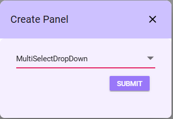 -->

A multi select dropdown list panel will appear on the Dashboard.

<!--  -->

Click the **Edit Icon** to open a configuration tab with various fields for customization.

<!--  -->

### General
Set up the dropdown's basic attributes:

<!--  -->

- **Title**: The panel's name is displayed as the panel name on the dashboard by default, but users can modify it.
- **Table Name**: Select a table from the dropdown menu. The list is populated based on the selected database connection.
- **Field Name**: Field names are fetched from the selected table. Choose a specific field to display as multiselect dropdown list options.
- **Label Name**: By default, the field name is used as the label name, but users can change it if necessary.
- **Order By Type**: Define the sorting order for the list options (e.g., ascending or descending).
- **Submit**: Click Submit to save the general settings.

Once the General settings are submitted, the panel will appear as shown below:

<!--  -->

The Condition tab is used to filter the list data by applying specific conditions using various operators.

<!-- 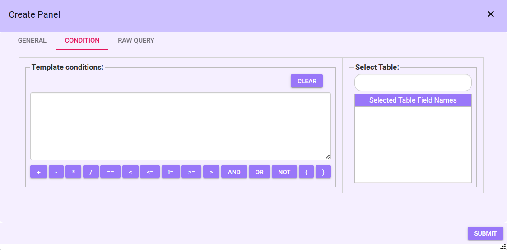 -->

- **Template condition**: Enter a custom condition in the text box.
    - **Operators**: Use the following operators to build conditions
        - Arithmetic Operators: +, -, *, /
        - Comparison Operators: ==, <, >, <=, >=, !=
        - Logical Operators: AND, OR, NOT
        - Parentheses: Use ( ) to group expressions.
    - **Clear Button**: Reset the condition input box.
- **Select Table**: The table selected in the General tab will be displayed here.
    - **Selected Table Field Names**: Choose the field name selected in the General tab.
- **Submit**: Apply conditions to filter the dataset.

***Note***: *Enclose all conditions in single quotes.At once only one condition can be given*

### RAW Query 
The Raw Query tab allows users to define both conditions and expressions directly using SQL-like syntax.

***Note***: *User can refer condition tab to use the raw query.*

<!--  -->

- **RAW Query**: In the Text box field Enter custom condition.
    - **Operators**: Use the same operators as in the Condition tab:
        - Arithmetic Operators: +, -, *, /
        - Comparison Operators: ==, <, >, <=, >=, !=
        - Logical Operators: AND, OR, NOT
        - Parentheses: Use ( ) to group conditions.
        - Apply Filters: Whenever users are using a raw query, and if there is a WHERE clause in the query, `{apply_filters}` should be added.
    - **Clear Button**: Click on Clear to Clear the SQL query input box.
- **Select Table**: Whatever table is selected in general tab the same will be displayed here.
    - **Selected Table Field Names**: Select the field name which was selected in the field name section in the general tab.
- **Submit**: Execute the query and update the dataset.

<!-- *NOTE: Enclose all conditions in single quotes.*

Once the Raw Query is submitted, the panel will reflect the updated dataset.

*Note: User can write sql query in raw query.The query provided in the raw query should be optimized based on the database structure* -->

## INPUT BOX 

#### Steps to add a Input Box
Select **Input Box** from the **Add Panel** options and click **Submit**.

<!-- 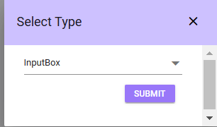 -->

A List Box panel will appear on the Dashboard.

<!--  -->

Click the **Edit Icon** to open a configuration tab with various fields for customization.

<!-- 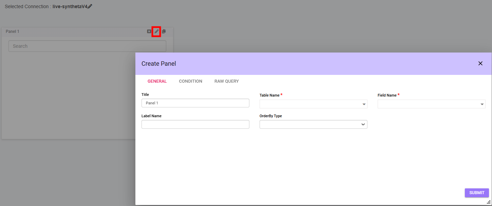 -->

### General
The General tab allows you to configure the basic appearance and properties of the List Box. This tab is selected by default.

<!--  -->

- **Title**: The panel's name is displayed as the panel name on the dashboard by default, but users can modify it.
- **Table Name**: Select a table from the dropdown menu. The list is populated based on the selected database connection.
- **Field Name**: Field names are fetched from the selected table. Choose a specific field to display as list options.
- **Label Name**: By default, the field name is used as the label name, but users can change it if necessary.
- **Order By Type**: Define the sorting order for the list options (e.g., ascending or descending).
- **Submit**: Click Submit to save the general settings.

If user wants to set a condition to filter the data in the list click on the pencil icon and click on the condition tab 

### Condition
The Condition tab is used to filter the list data by applying specific conditions using various operators.

<!-- 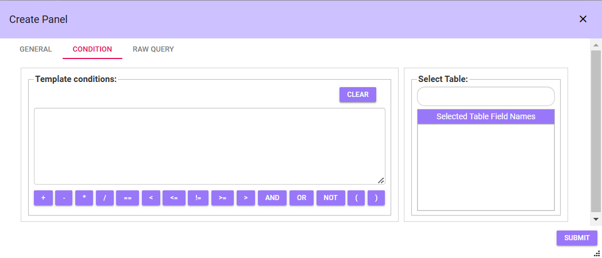 -->

- **Template condition**: Enter a custom condition in the text box (e.g., name == 'Gil-Lamb').
    - **Operators**: Use the following operators to build conditions
        - Arithmetic Operators: +, -, *, /
        - Comparison Operators: ==, <, >, <=, >=, !=
        - Logical Operators: AND, OR, NOT
        - Parentheses: Use ( ) to group expressions.
    - **Clear Button**: Reset the condition input box.
- **Select Table**: The table selected in the General tab will be displayed here.
    - **Selected Table Field Names**: Choose the field name selected in the General tab.
- **Submit**: Apply conditions to filter the dataset.

***Note***: *Enclose all conditions in single quotes.At once only one condition can be given*

### RAW Query
The Raw Query tab allows users to define both conditions and expressions directly using SQL-like syntax.

<!-- ***Note***: *User can refer condition tab to use the raw query.* -->

<!--  -->

- **SQL Query**: In the Text box field Enter custom condition.
    - **Operators**: Use the same operators as in the Condition tab
        - Arithmetic Operators: +, -, *, /
        - Comparison Operators: ==, <, >, <=, >=, !=
        - Logical Operators: AND, OR, NOT
        - Parentheses: Use ( ) to group conditions.
        - Apply Filters: Whenever users are using a raw query, and if there is a WHERE clause in the query, `{apply_filters}` should be added.
    - **Clear Button**: Click on Clear to Clear the SQL query input box.
- **Select Table**: Whatever table is selected in general tab the same will be displayed here.
    - **Selected Table Field Names**: Select the field name which was selected in the field name section in the general tab.
- **Submit**: Execute the query and update the dataset.

<!-- Once the Raw Query is submitted, the panel will reflect the updated dataset.

*Note: Enclose all conditions in single quotes.*

*Note: User can write sql query in raw query.The query provided in the raw query should be optimized based on the database structure.* -->

## RAW DATA DUMP
The Raw Data Dump feature allows users to configure and retrieve tabular data directly from the database. It provides flexibility in selecting and filtering data using SQL queries and custom conditions.

#### Steps to Add Raw Data Dump
Select **Raw Data Dump** from the **Add Panel** options and click **Submit**.

<!-- 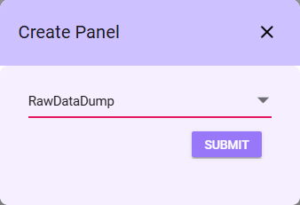 -->

A dropdown list panel will appear on the Dashboard.

<!-- 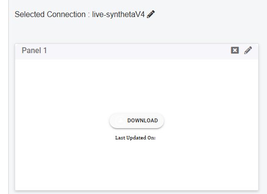 -->

Click the **Edit Icon** to open a configuration tab with various fields for customization.

<!--  -->

### General
Customize the appearance and basic properties of the Raw Data Dump panel:

<!--  -->

- **Table Name**: Select a table from the dropdown menu. The list is populated based on the selected database connection.
- **Label Name**: Enter a label to display on the panel.
- **Label Font Size**: Set the font size for the label (default: 16).
- **Background Color**: Choose a background color using the color picker or hex code.
- **Text Color**: Select the text color for the displayed data.
- **Submit**: Click on submit to save the selection made.

### RAW query 
Use SQL-like expressions for data filtering and selection

<!-- 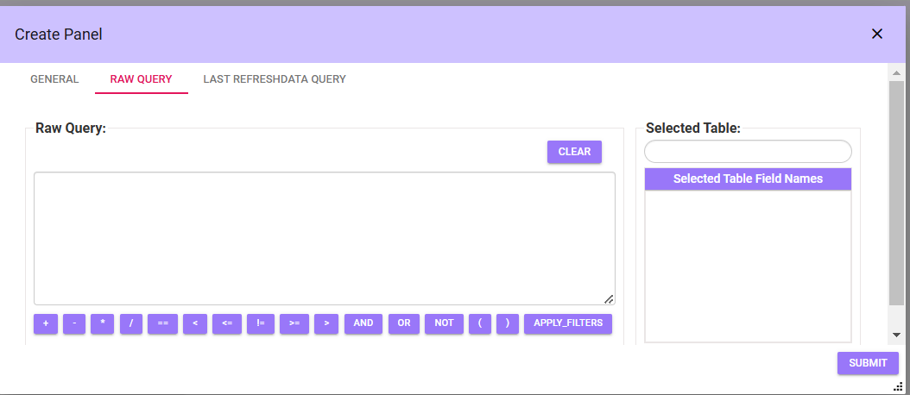 -->

- **RAW Query**: Create logical expressions for filtering data.
    - **Operators**:
        - Arithmetic Operators: +, -, *, /
        - Comparison Operators: ==, <, >, <=, >=, !=
        - Logical Operators: AND, OR, NOT
        - Parentheses: Use ( ) to group conditions.
        - Apply Filters: Whenever users are using a raw query, and if there is a WHERE clause in the query, `{apply_filters}` should be added.
- **Clear Button**: Clear the SQL query input box.
- **Select Table**: Choose fields for SQL conditions.
    - **Selected Table Field Names**: View the fields added to the query.
- **Submit**: Execute the query and update the dataset.

*Note: User can write sql query in raw query.The query provided in the raw query should be optimized based on the database structure*

### Last Refresh Data Query 
The Last Refreshed Query displays the most recent updates from the database, ensuring that the information is up-to-date.
<!--  -->

- **Condition Input Box**: Enter custom filter expressions 
    - **Operators**:
        - Arithmetic Operators: +, -, *, /
        - Comparison Operators: ==, <, >, <=, >=, !=
        - Logical Operators: AND, OR, NOT
        - Parentheses: Use ( ) to group expressions.
- **Clear Button**: Reset the condition input box.
- **Select Table**: Choose fields from the table for conditions.
    - **Selected Table Field Names**: View the selected fields.
- **Submit**: Apply conditions to refresh the .

*For Example: The formula for refreshing the data (select max(refreshtime) as refreshtime from abc).*

**Raw Data dump Panel Download**

<!--  -->

On the panel user can click on the download button to download the reports.

## 4. Dashboard Save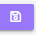
The Dashboard Save feature allows users to save updated dashboard with relevant data. This ensures that dashboards are well-documented, visually identifiable, and accessible for future use. 

- Click on the last icon **Dashboard Save**.

A form will open 

<!-- 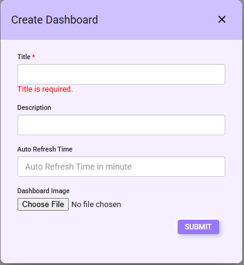 -->

- **Title**: Displays the given name as the title of the dashboard.
- **Description**: Add a description for the dashboard.
- **Auto Refresh Time**: Set the refresh interval, limited to minutes.
    - Once the time is set, the dashboard will refresh automatically at the specified interval.
- **Dashboard Image**: Upload an image for the dashboard.
- **Submit**: Click on *submit* to Save the dashboard.

***Note***: *Once the dashboard is saved, it will appear at the end.*