# DATE PICKER
The Date Picker allows users to select a date for filtering or data input. Here's how to configure the Date Picker panel:

**Adding a Date Picker**

Select **Date Picker** in the **Add Panel** and click on **Submit**.

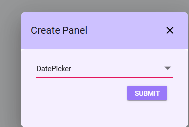

A panel box will appear.

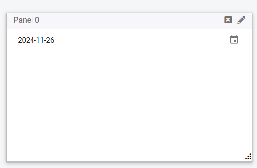

- **Calendar Icon**: Click on the icon to select a particular date.By default, the current date will be pre-selected.
- **Pencil Icon**: Click on the pencil icon, a tab will open where the user can configure the fields. 

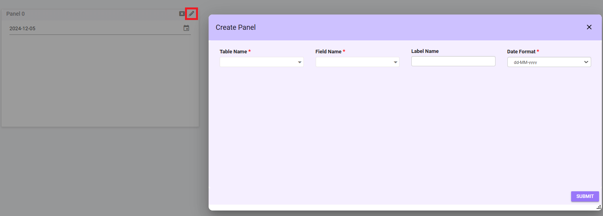

## Date Picker Fields
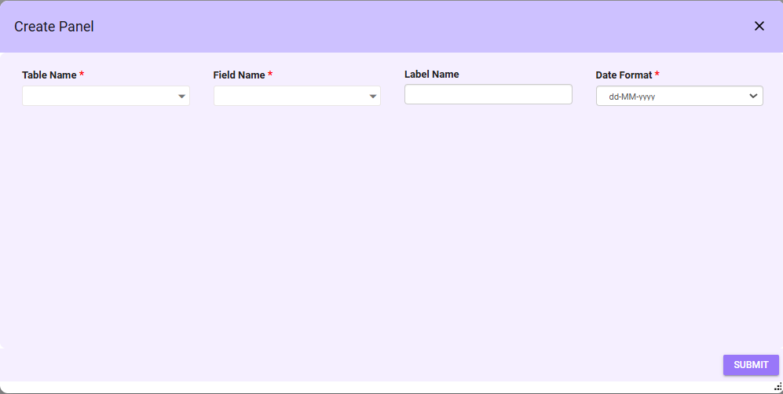

- **Table Name**: Select a table from the dropdown menu. The table names are populated based on the selected database connection.
- **Field Name**:  Field names are populated based on the selected table name. Choose the field to associate with the Date Picker.
- **Label Name**: Enter a label name that will be displayed on the panel.
- **Date Format**: Select the preferred date format from the dropdown menu.
- **Submit**: Click the Submit button to save the configuration.

# DATE RANGE PICKER
The Date Range Picker allows users to select a range of dates by specifying both a Start Date and an End Date. This feature is useful for filtering data within a specific time period.

**Adding a DateRange Picker**

- Select **Date Range Picker** in the **Add Panel** and click on **Submit**.

A panel will appear on the Dashboard

- **Calendar Icon**: Click on the calender icon to choose the date range. The Date Range Picker will show two fields for the user to select the Start Date and End Date.

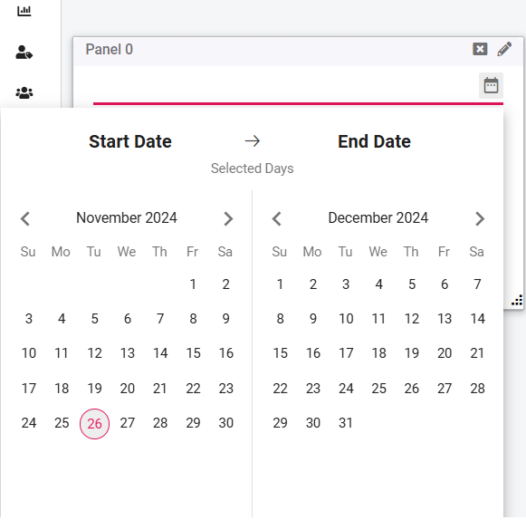

- **Pencil Icon**: Click on the pencil icon, a tab will open where the user can configure the fields. 

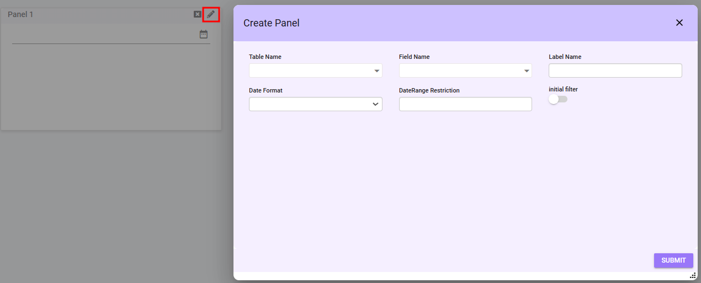

## Date Range Picker Fields
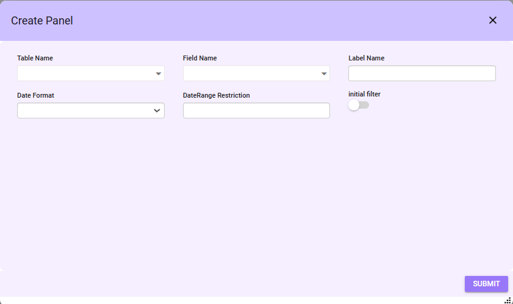

- **Table Name**: Select a table from the dropdown menu. The table names are populated based on the selected database connection.
- **Field Name**:  Field names are populated based on the selected table name. Choose the field to associate with the Date Picker.
- **Label Name**: Enter a label name to be displayed on the panel for the Date Range Picker.
- **Date Format**: Select the desired date format from the dropdown menu.
- **Date Range Restriction**: Specify any restrictions or constraints on the date range. This could be things like limiting the range to specific dates or dynamically adjusting the range based on user preferences.
- **Initial Filter**: This is a toggle option  
    - **Enabled**: When enabled, it overrides any date range selections made, using the values provided in the initial filter during dashboard creation.  
    - **Disabled**: When disabled, only the date range restriction values are considered, ignoring the initial filter settings.
- **Submit**: After making the necessary selections, click the Submit button to apply the configuration.

***Note***: *When the initial filter is enabled, an icon will appear in the top right corner of the panel, indicating that the filter has been applied.*

# LIST BOX
The List Box feature allows users to configure and display a list of options or data records with extensive customization capabilities.

**Adding a List Box Panel**

Select **List Box** from the **Add Panel** options and click **Submit**.

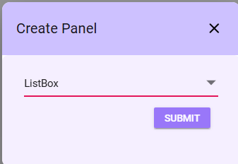

A List Box panel will appear on the Dashboard.

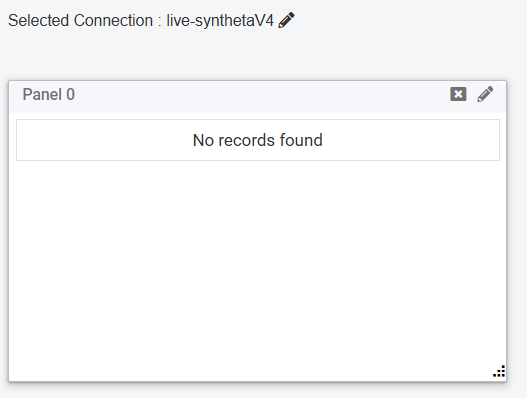

Click the **Pencil Icon** to open a configuration tab with various fields for customization.

## General
The General tab allows you to configure the basic appearance and properties of the List Box. This tab is selected by default.

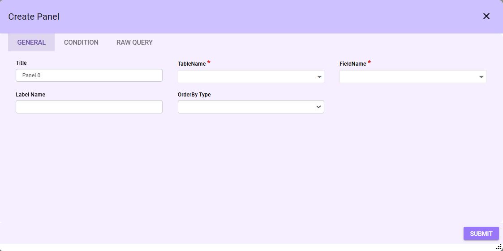

- **Title**: The panel's name is displayed as the panel name on the dashboard by default, but users can modify it.
- **Table Name**: Select a table from the dropdown menu. The list is populated based on the selected database connection.
- **Field Name**: Field names are fetched from the selected table. Choose a specific field to display as list options.
- **Label Name**: By default, the field name is used as the label name, but users can change it if necessary.
- **Order By Type**: Define the sorting order for the list options (e.g., ascending or descending).
- **Submit**: Click Submit to save the general settings.

Once the General settings are submitted, the panel will appear as shown below:

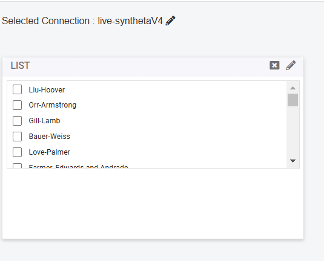

If user wants to set a condition to filter the data in the list click on the pencil icon and click on the condition tab 

## Condition
The Condition tab is used to filter the list data by applying specific conditions using various operators.

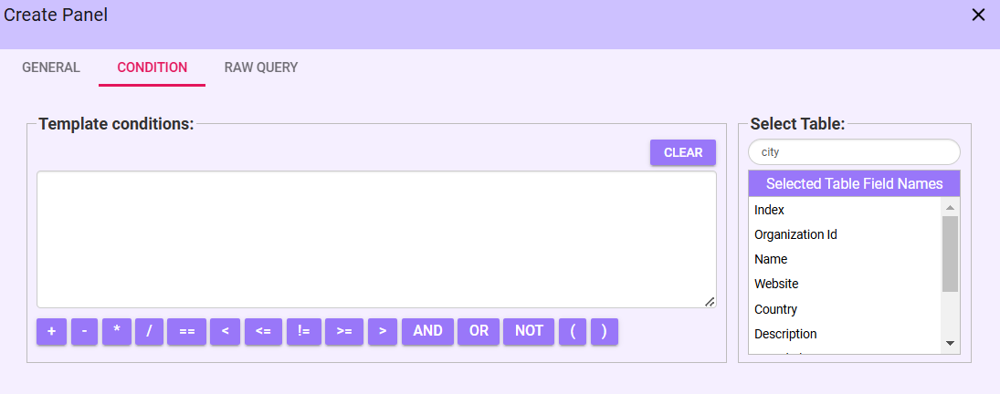

- **Template condition**: Enter a custom condition in the text box (e.g., name == 'Gil-Lamb').
    - **Operators**:Use the following operators to build conditions
        - Arithmetic Operators: +, -, *, /
        - Comparison Operators: ==, <, >, <=, >=, !=
        - Logical Operators: AND, OR, NOT
        - Parentheses: Use ( ) to group expressions.
    - **Clear Button**: Reset the condition input box.
- **Select Table**: The table selected in the General tab will be displayed here.
    - **Selected Table Field Names**: Choose the field name selected in the General tab.
- **Submit**: Apply conditions to filter the dataset.

*Note: Enclose all conditions in single quotes.At once only one condition can be given*

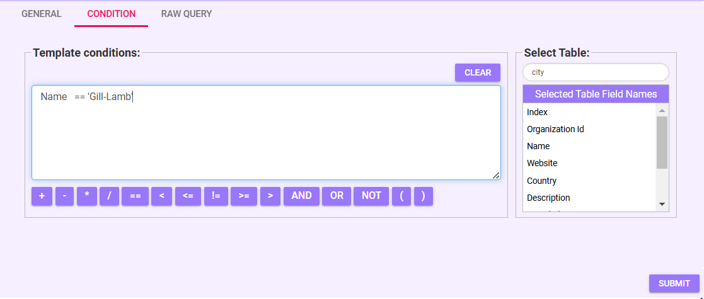

Once conditions are submitted, the panel will update as shown below:

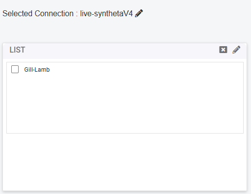

## RAW Query
The Raw Query tab allows users to define both conditions and expressions directly using SQL-like syntax.

*Note: User can refer condition tab to use the raw query.*

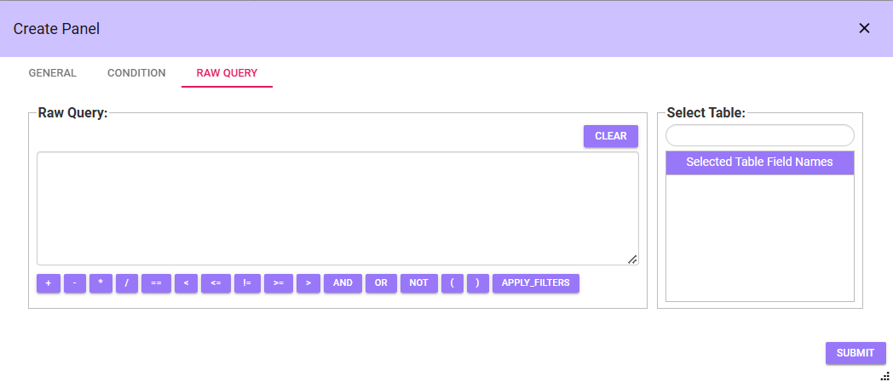

- **SQL Query**: In the Text box field Enter custom condition.
- **Operators**: Use the same operators as in the Condition tab
    - Arithmetic Operators: +, -, *, /
    - Comparison Operators: ==, <, >, <=, >=, !=
    - Logical Operators: AND, OR, NOT
    - Parentheses: Use ( ) to group conditions.
    - Apply Filters: Whenever users are using a raw query, and if there is a WHERE clause in the query, `{apply_filters}` should be added.
- **Clear Button**: Click on Clear to Clear the SQL query input box.
- **Select Table**: Whatever table is selected in general tab the same will be displayed here.
    - **Selected Table Field Names**: Select the field name which was selected in the field name section in the general tab.
- **Submit**: Execute the query and update the dataset.

*Note: Enclose all conditions in single quotes.*

Once the Raw Query is submitted, the panel will reflect the updated dataset.

*Note: User can write sql query in raw query. The query provided in the raw query should be optimized based on the database structure.*

# DROPDOWN LIST
The Dropdown List Panel provides a single-select dropdown menu for filtering or displaying specific data. This component supports customizable fields, conditions, and raw SQL queries for dynamic data management.

**Adding a Dropdown List Panel**

Select **Dropdown List** from the dropdown of **Add Panel** options and click **Submit**.

A dropdown list panel will appear on the Dashboard.

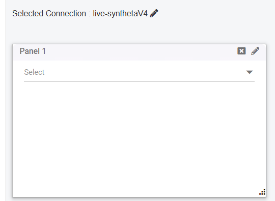

Click the **Pencil Icon** to open a configuration tab with various fields for customization.

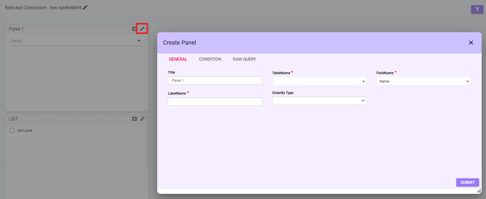

## General
Set up the dropdown's basic attributes:

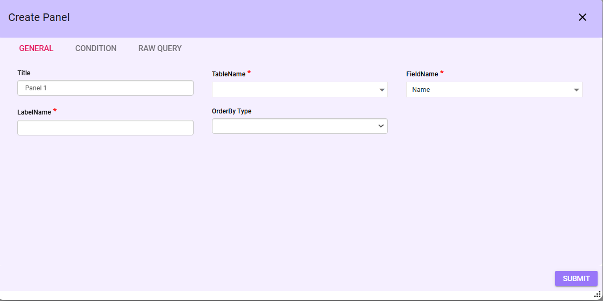

- **Title**: The panel's name is displayed as the panel name on the dashboard by default, but users can modify it.
- **Table Name**: Select a table from the dropdown menu. The list is populated based on the selected database connection.
- **Field Name**: Field names are fetched from the selected table. Choose a specific field to display as dropdown list options.
- **Label Name**: By default, the field name is used as the label name, but users can change it if necessary.
- **Order By Type**: Define the sorting order for the list options (e.g., ascending or descending).
- **Submit**: Click Submit to save the general settings.

Once the General settings are submitted, the panel will appear as shown below:

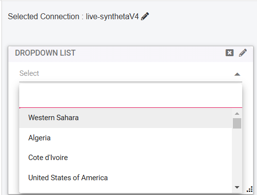

## Condition
The Condition tab is used to filter the list data by applying specific conditions using various operators.

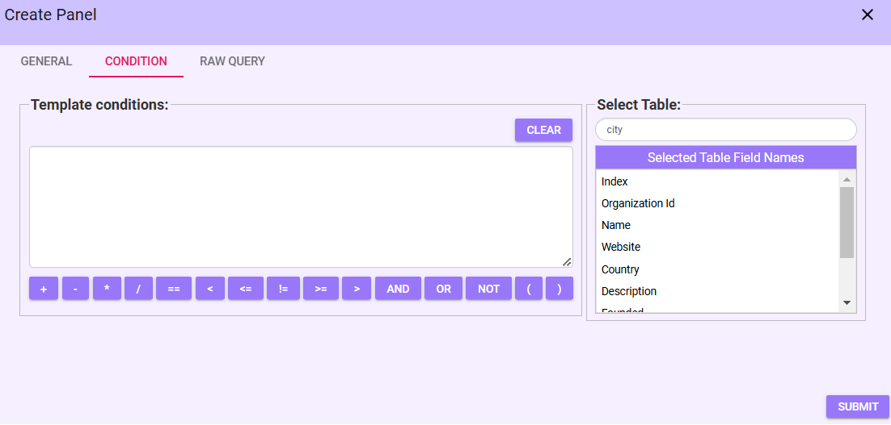

- **Template condition**: Enter a custom condition in the text box (e.g., name == 'Gil-Lamb').
    - **Operators**:Use the following operators to build conditions
        - Arithmetic Operators: +, -, *, /
        - Comparison Operators: ==, <, >, <=, >=, !=
        - Logical Operators: AND, OR, NOT
        - Parentheses: Use ( ) to group expressions.
    - **Clear Button**: Reset the condition input box.
- **Select Table**: The table selected in the General tab will be displayed here.
    - **Selected Table Field Names**: Choose the field name selected in the General tab.
- **Submit**: Apply conditions to filter the dataset.

*Note: Enclose all conditions in single quotes.At once only one condition can be given*

## RAW Query 
The Raw Query tab allows users to define both conditions and expressions directly using SQL-like syntax. User can refer condition tab to use the raw quer.

- **RAW Query**: In the Text box field Enter custom condition.
    - **Operators**: Use the same operators as in the Condition tab:
        - Arithmetic Operators: +, -, *, /
        - Comparison Operators: ==, <, >, <=, >=, !=
        - Logical Operators: AND, OR, NOT
        - Parentheses: Use ( ) to group conditions.
        - Apply Filters: Whenever users are using a raw query, and if there is a WHERE clause in the query, `{apply_filters}` should be added.
    - **Clear Button**: Click on Clear to Clear the SQL query input box.
- **Select Table**: Whatever table is selected in general tab the same will be displayed here.
    - **Selected Table Field Names**: Select the field name which was selected in the field name section in the general tab.
- **Submit**: Execute the query and update the dataset.

*NOTE: Enclose all conditions in single quotes.*

Once the Raw Query is submitted, the panel will reflect the updated dataset.

*Note: User can write sql query in raw query.The query provided in the raw query should be optimized based on the database structure*

# MULTI SELECT DROPDOWN 
The Multi-Select Dropdown Panel allows users to configure a dropdown with multiple selection options. This component provides flexible filtering and supports conditions and raw SQL queries for dynamic data population.

Select **Multi Select Dropdown** from the dropdown menu of **Add Panel** options and click **Submit**.

A multi select dropdown list panel will appear on the Dashboard.

Click the **Pencil Icon** to open a configuration tab with various fields for customization.

## General
Set up the dropdown's basic attributes:

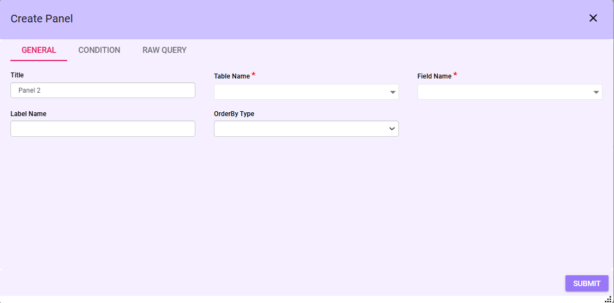

- **Title**: The panel's name is displayed as the panel name on the dashboard by default, but users can modify it.
- **Table Name**: Select a table from the dropdown menu. The list is populated based on the selected database connection.
- **Field Name**: Field names are fetched from the selected table. Choose a specific field to display as multiselect dropdown list options.
- **Label Name**: By default, the field name is used as the label name, but users can change it if necessary.
- **Order By Type**: Define the sorting order for the list options (e.g., ascending or descending).
- **Submit**: Click Submit to save the general settings.

Once the General settings are submitted, the panel will appear as shown below:

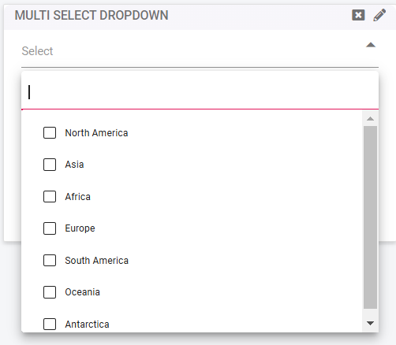

The Condition tab is used to filter the list data by applying specific conditions using various operators.

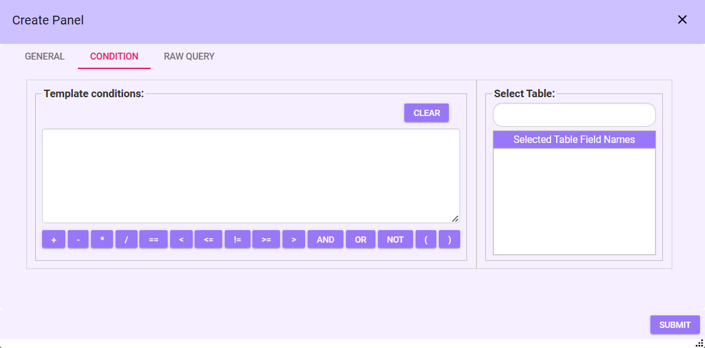

- **Template condition**: Enter a custom condition in the text box.
    - **Operators**: Use the following operators to build conditions
        - Arithmetic Operators: +, -, *, /
        - Comparison Operators: ==, <, >, <=, >=, !=
        - Logical Operators: AND, OR, NOT
        - Parentheses: Use ( ) to group expressions.
    - **Clear Button**: Reset the condition input box.
- **Select Table**: The table selected in the General tab will be displayed here.
    - **Selected Table Field Names**: Choose the field name selected in the General tab.
- **Submit**: Apply conditions to filter the dataset.

*Note: Enclose all conditions in single quotes.At once only one condition can be given*

## RAW Query 
The Raw Query tab allows users to define both conditions and expressions directly using SQL-like syntax.

*Note: User can refer condition tab to use the raw query.*

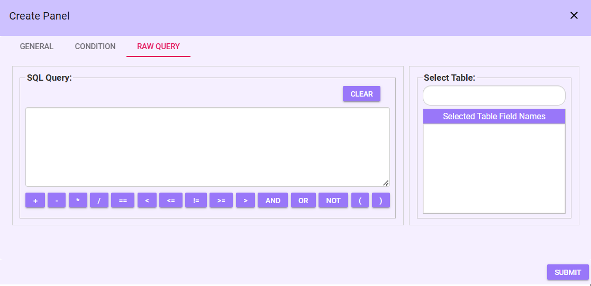

- **RAW Query**: In the Text box field Enter custom condition.
    - **Operators**: Use the same operators as in the Condition tab:
        - Arithmetic Operators: +, -, *, /
        - Comparison Operators: ==, <, >, <=, >=, !=
        - Logical Operators: AND, OR, NOT
        - Parentheses: Use ( ) to group conditions.
        - Apply Filters: Whenever users are using a raw query, and if there is a WHERE clause in the query, `{apply_filters}` should be added.
    - **Clear Button**: Click on Clear to Clear the SQL query input box.
- **Select Table**: Whatever table is selected in general tab the same will be displayed here.
    - **Selected Table Field Names**: Select the field name which was selected in the field name section in the general tab.
- **Submit**: Execute the query and update the dataset.

*NOTE: Enclose all conditions in single quotes.*

Once the Raw Query is submitted, the panel will reflect the updated dataset.

*Note: User can write sql query in raw query.The query provided in the raw query should be optimized based on the database structure*

# INPUT BOX 

**Adding a Input Box Panel**

Select **Input Box** from the **Add Panel** options and click **Submit**.

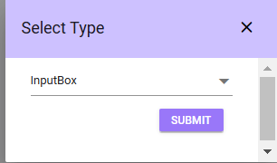

A List Box panel will appear on the Dashboard.

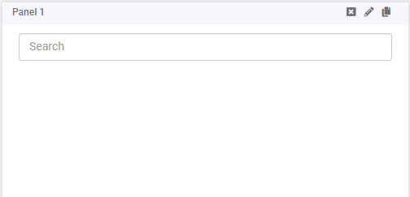

Click the **Pencil Icon** to open a configuration tab with various fields for customization.

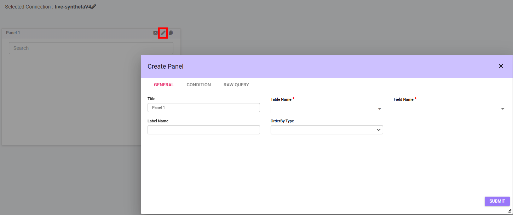

## General
The General tab allows you to configure the basic appearance and properties of the List Box. This tab is selected by default.

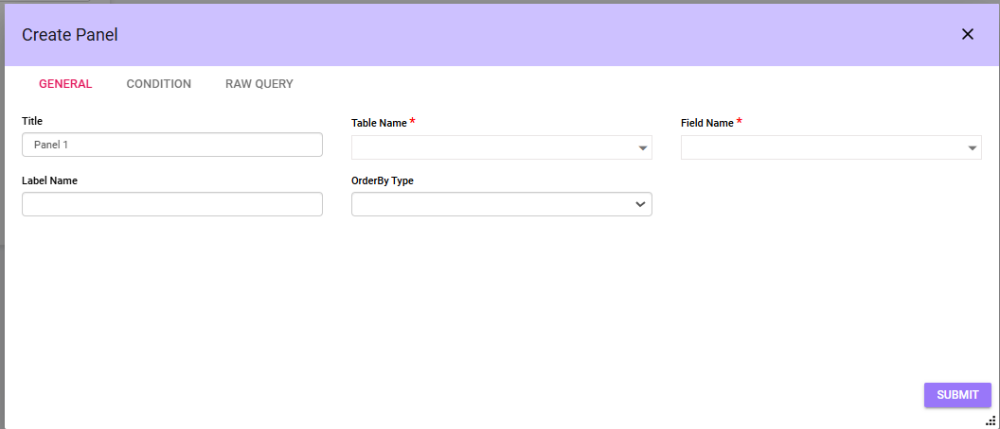

- **Title**: The panel's name is displayed as the panel name on the dashboard by default, but users can modify it.
- **Table Name**: Select a table from the dropdown menu. The list is populated based on the selected database connection.
- **Field Name**: Field names are fetched from the selected table. Choose a specific field to display as list options.
- **Label Name**: By default, the field name is used as the label name, but users can change it if necessary.
- **Order By Type**: Define the sorting order for the list options (e.g., ascending or descending).
- **Submit**: Click Submit to save the general settings.

If user wants to set a condition to filter the data in the list click on the pencil icon and click on the condition tab 

## Condition
The Condition tab is used to filter the list data by applying specific conditions using various operators.

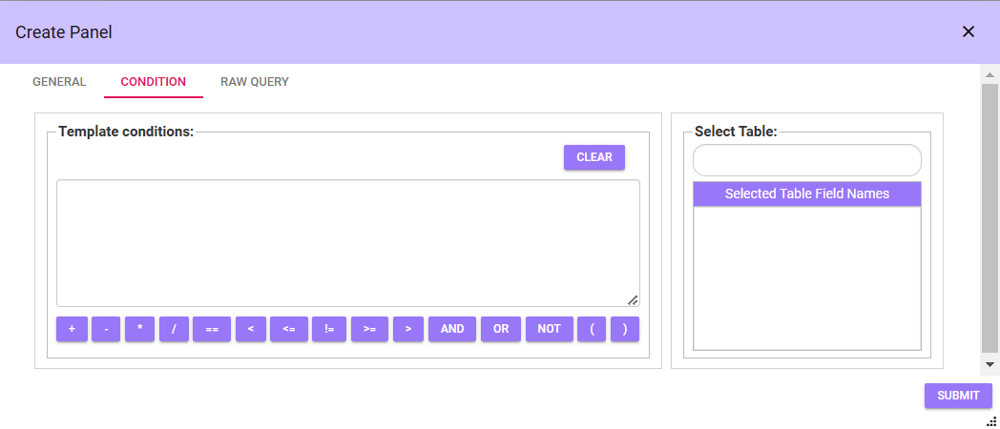

- **Template condition**: Enter a custom condition in the text box (e.g., name == 'Gil-Lamb').
    - **Operators**: Use the following operators to build conditions
        - Arithmetic Operators: +, -, *, /
        - Comparison Operators: ==, <, >, <=, >=, !=
        - Logical Operators: AND, OR, NOT
        - Parentheses: Use ( ) to group expressions.
    - **Clear Button**: Reset the condition input box.
- **Select Table**: The table selected in the General tab will be displayed here.
    - **Selected Table Field Names**: Choose the field name selected in the General tab.
- **Submit**: Apply conditions to filter the dataset.

*Note: Enclose all conditions in single quotes.At once only one condition can be given*

## RAW Query
The Raw Query tab allows users to define both conditions and expressions directly using SQL-like syntax.

*Note: User can refer condition tab to use the raw query.*

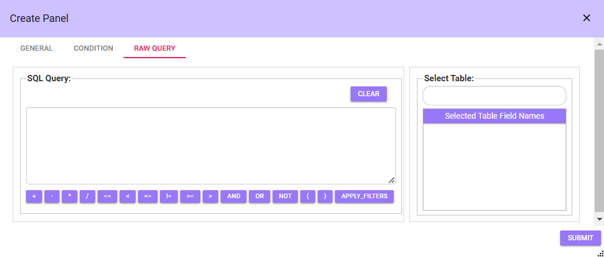

- **SQL Query**: In the Text box field Enter custom condition.
    - **Operators**: Use the same operators as in the Condition tab
        - Arithmetic Operators: +, -, *, /
        - Comparison Operators: ==, <, >, <=, >=, !=
        - Logical Operators: AND, OR, NOT
        - Parentheses: Use ( ) to group conditions.
        - Apply Filters: Whenever users are using a raw query, and if there is a WHERE clause in the query, `{apply_filters}` should be added.
    - **Clear Button**: Click on Clear to Clear the SQL query input box.
- **Select Table**: Whatever table is selected in general tab the same will be displayed here.
    - **Selected Table Field Names**: Select the field name which was selected in the field name section in the general tab.
- **Submit**: Execute the query and update the dataset.

Once the Raw Query is submitted, the panel will reflect the updated dataset.

*Note: Enclose all conditions in single quotes.*

*Note: User can write sql query in raw query.The query provided in the raw query should be optimized based on the database structure.*

# RAW DATA DUMP
The Raw Data Dump feature allows users to configure and retrieve tabular data directly from the database. It provides flexibility in selecting and filtering data using SQL queries and custom conditions.

Select List Box from the Add Panel options and click Submit.

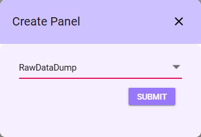

A dropdown list panel will appear on the Dashboard.

Click the **Pencil Icon** to open a configuration tab with various fields for customization.

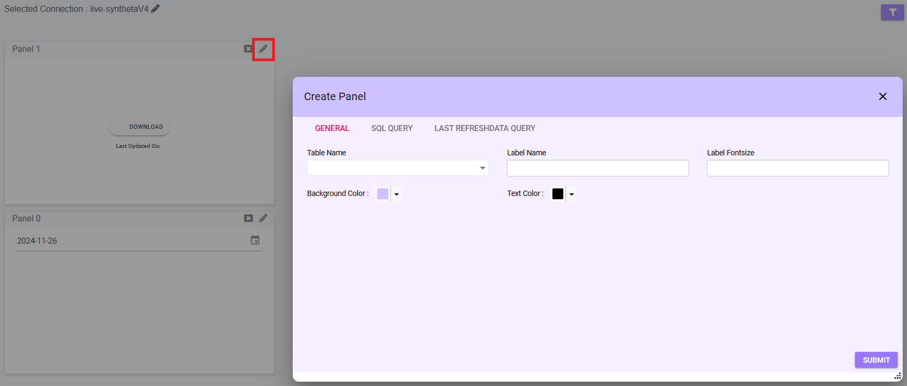

## General
Customize the appearance and basic properties of the Raw Data Dump panel:

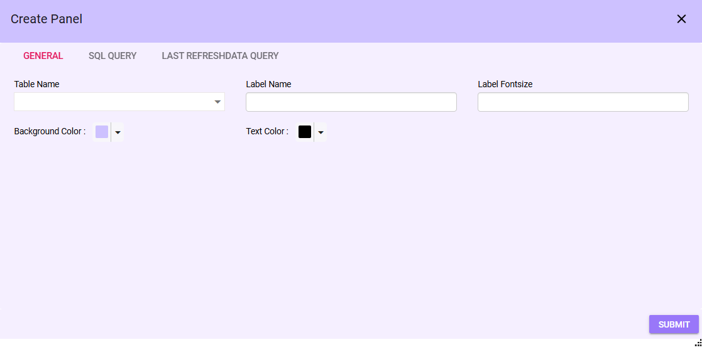

- **Table Name**: Select a table from the dropdown menu. The list is populated based on the selected database connection.
- **Label Name**: Enter a label to display on the panel.
- **Label Font Size**: Set the font size for the label (default: 16).
- **Background Color**: Choose a background color using the color picker or hex code.
- **Text Color**: Select the text color for the displayed data.
- **Submit**: Click on submit to save the selection made.

## RAW query 
Use SQL-like expressions for data filtering and selection

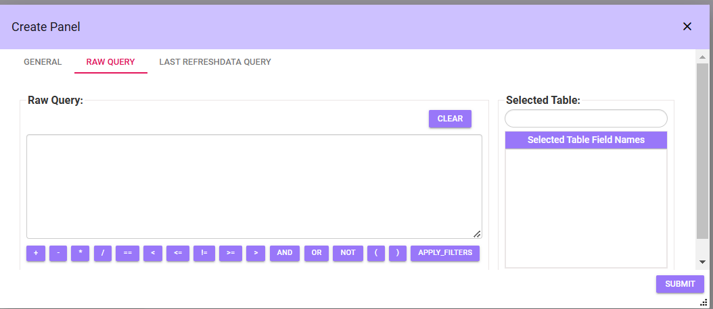

- **RAW Query**: Create logical expressions for filtering data.
    - **Operators**:
        - Arithmetic Operators: +, -, *, /
        - Comparison Operators: ==, <, >, <=, >=, !=
        - Logical Operators: AND, OR, NOT
        - Parentheses: Use ( ) to group conditions.
        - Apply Filters: Whenever users are using a raw query, and if there is a WHERE clause in the query, `{apply_filters}` should be added.
- **Clear Button**: Clear the SQL query input box.
- **Select Table**: Choose fields for SQL conditions.
    - **Selected Table Field Names**: View the fields added to the query.
- **Submit**: Execute the query and update the dataset.

*Note: User can write sql query in raw query.The query provided in the raw query should be optimized based on the database structure*

## Last Refresh Data Query 
Configure filters and conditions for updating the raw data

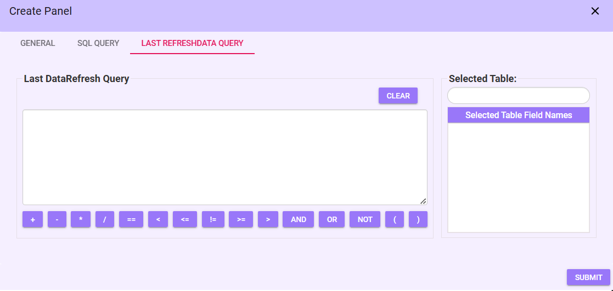

- **Condition Input Box**: Enter custom filter expressions 
    - **Operators**:
        - Arithmetic Operators: +, -, *, /
        - Comparison Operators: ==, <, >, <=, >=, !=
        - Logical Operators: AND, OR, NOT
        - Parentheses: Use ( ) to group expressions.
- **Clear Button**: Reset the condition input box.
- **Select Table**: Choose fields from the table for conditions.
    - **Selected Table Field Names**: View the selected fields.
- **Submit**: Apply conditions to refresh the .

*For Example: The formula for refreshing the data (select max(refreshtime) as refreshtime from abc).*

**Raw Data dump Panel Download**

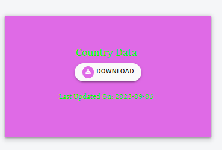

On the panel user can click on the download button to download the reports.