# PIVOT 
A Pivot Table is a powerful tool used in data visualization and analysis to summarize, organize, and transform data into a structured table format. It allows users to dynamically group, sort, and calculate metrics (such as totals, averages, or percentages) based on selected fields, enabling deeper insights from raw data.

**Adding a Tabel Panel**

**Step 1**: Select **Pivot** from the **Add Panel** options and click **Submit**.

A table panel will appear on the Dashboard.

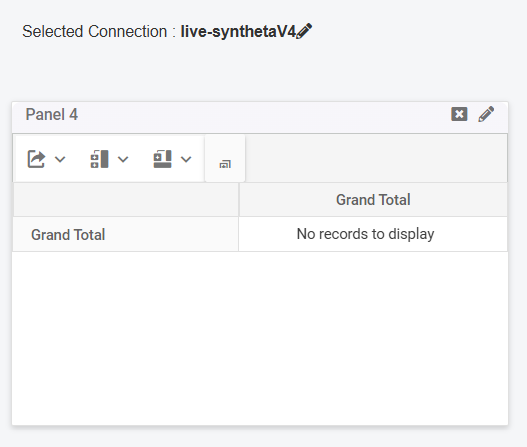

**Step 2**: Click the **Pencil Icon** to open a configuration tab with various fields for customization.

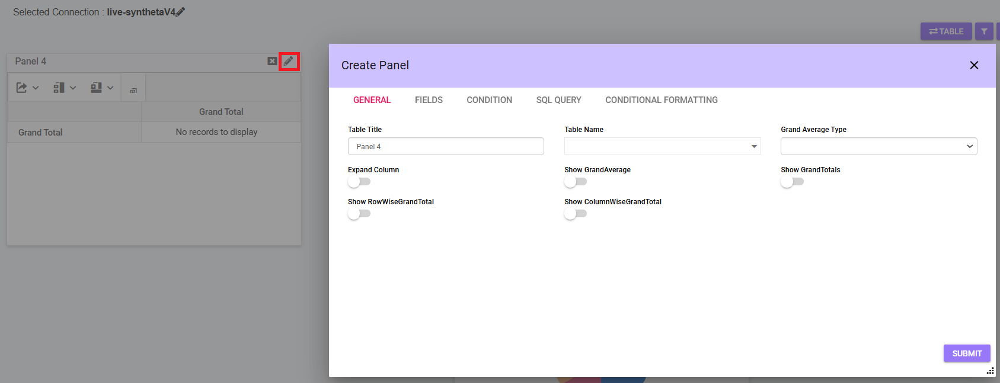

The following options are available for customizing the Pivot Panel:

## General
This tab allows users to configure the overall settings of the pivot table.

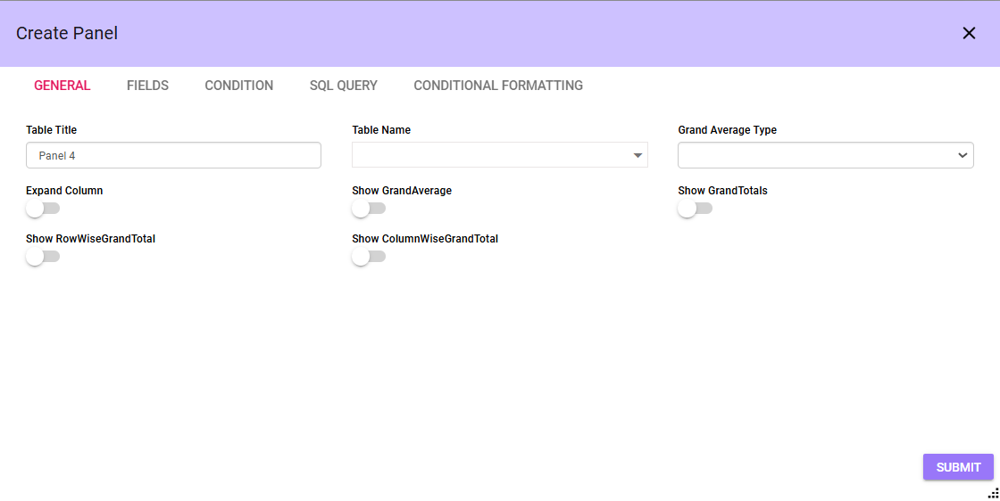

- **Table Title**: Enter a title for the table.
- **Table Name**: Select a table from the dropdown menu. The list is populated based on the selected database connection.
- **Grand Average Type**: Choose one of the following options:
    - Average with visible data
    - Average excluding zeros
    - Average across all data
- **Expand Column**: Enable or disable column expansion.
- **Show Grand Average**: Toggle the display of the grand average.
- **Show Grand Totals**: Toggle the display of grand totals.
- **Show Row-Wise Grand Total**: Enable or disable the row-wise grand total.
- **Show Column-Wise Grand Total**: Enable or disable the column-wise grand total.

***Note***: *User can toggle row and column grand totals in the General Tab or click the relevant icon on the panel.*

## Fields
Used to select and define the fields to be displayed in the pivot table. Users can categorize fields as rows, columns, or values, apply formatting, and add expressions for calculations. This tab is essential for structuring and organizing the data.

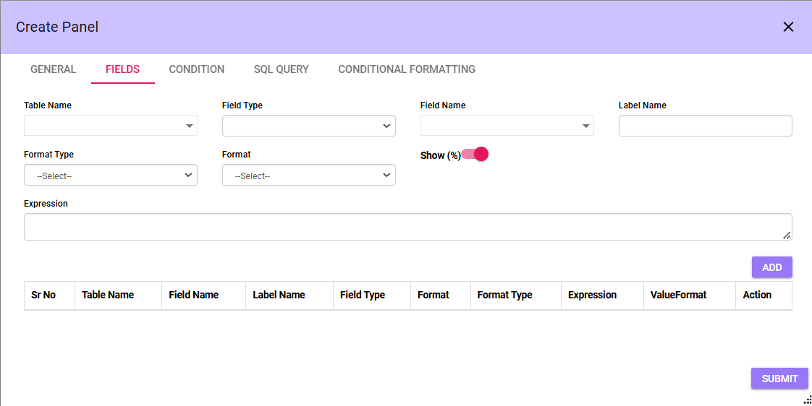

- **Table Name**: Select a table from the dropdown menu. The list is populated based on the selected database connection.
- **Field Type**: Select the type of field:
    - Column
    - Value
    - Row
    - Format
- **Field Name**: Field names are fetched from the selected table. Choose a specific field name..
- **Label Name**: Enter a label for the field.
- **Format Type**: Choose the desired format type.
- **Format**: Define the format settings.
- **Show (%)**: Toggle the display of percentage values.
- **Expression**: Add a custom expression for the field.
- **Add**: Add the field to the table. 
    - After the fields are selected and added, they will be displayed in the table below.
- **Submit**: Save the field configuration.

***Note***: *Once fields are added, they will appear in the table below.*

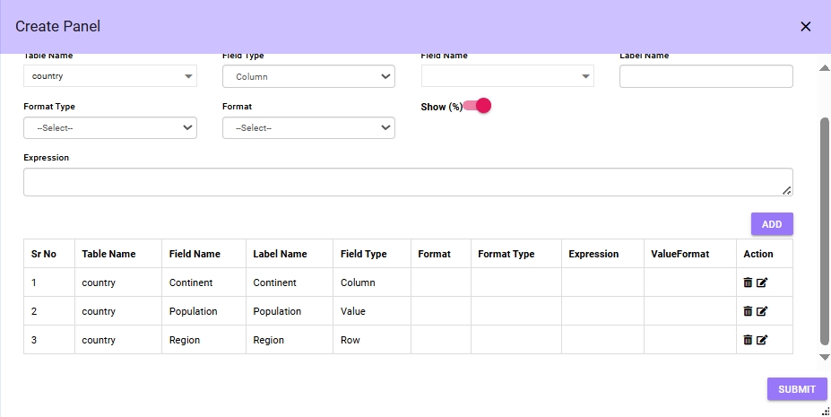

***Note***: *The panel will only display data after completing both General and Fields configurations.*

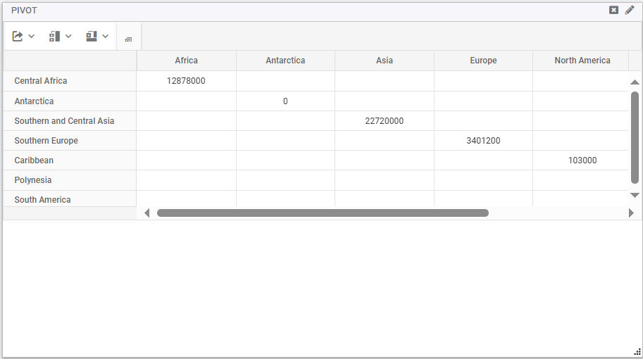

**Show Subtotals:**

*Displays subtotals for rows and columns separately. The user can adjust the position of subtotals by selecting the desired option from the Subtotal Position setting.*

**Grand Totals:**

*Users can enable or disable row and column grand totals either through the toggle options in the General tab or by clicking the corresponding icon directly on the panel.*

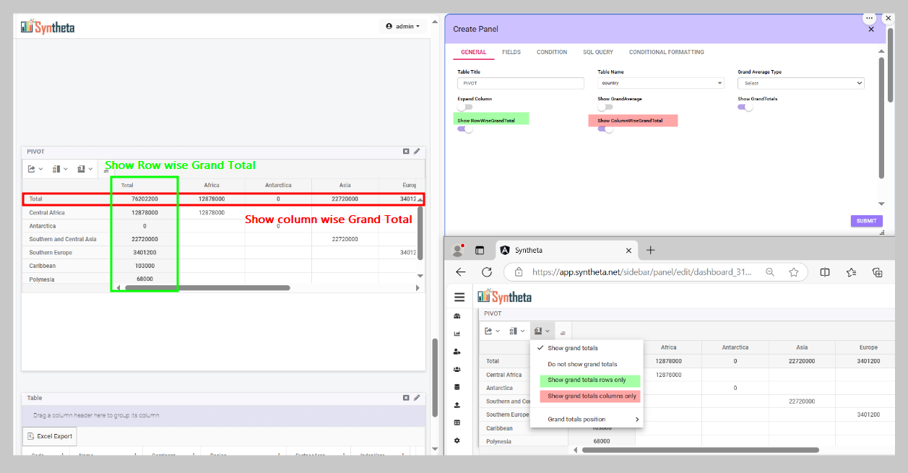

## Condition
Provides options to filter and refine data using logical expressions and grouping. Users can set conditions to display specific subsets of data, sort it, or group it by selected fields. It helps in narrowing down the data for better insights.

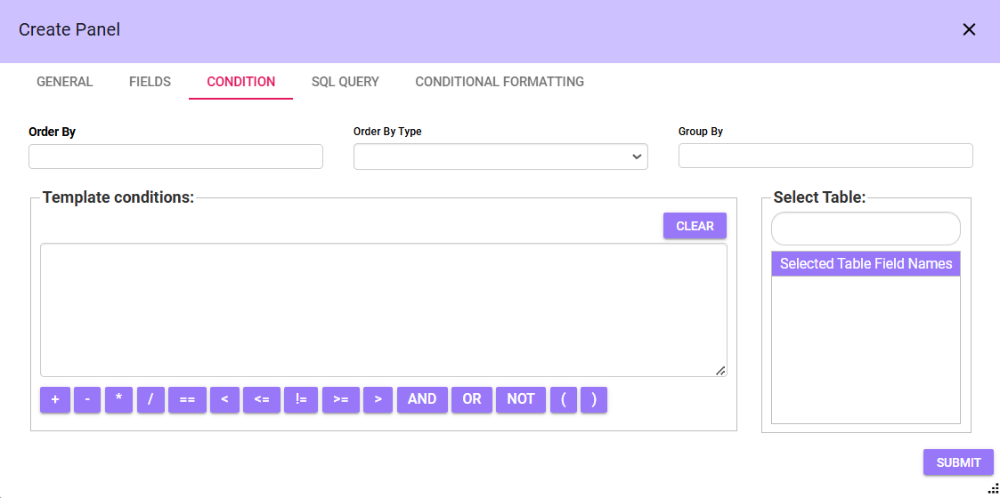

- **Order By**: Specify the field to sort by.
- **OrderBy Type**: Select the sorting order (e.g., ascending or descending).
- **Group By**: Choose a field for grouping data.
- **Conditions:** Define filter criteria using the input box. Examples
    - **Condition Input Box**: Enter custom filter expressions.
        - **Operators**:
            - Arithmetic Operators: +, -, *, /
            - Comparison Operators: ==, <, >, <=, >=, !=
            - Logical Operators: AND, OR, NOT
            -  Parentheses: Use ( ) to group expressions.
- **Clear Button**: Reset the condition input box.
- **Select Table**: Choose fields from the table for conditions.
    - **Selected Table Field Names**: View the selected fields.
- **Submit**: Apply conditions to the dataset.

***Note***: *If a condition is applied, the panel will dynamically update and display data based on the specified condition.*

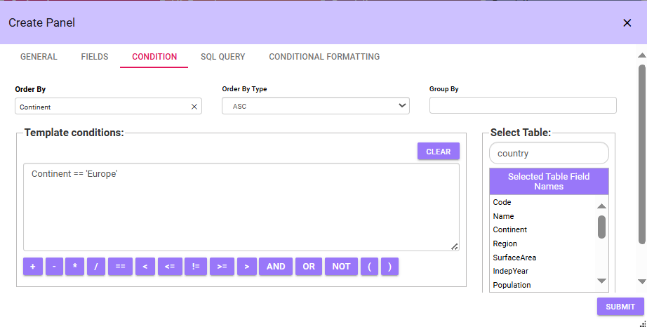

## SQL Query 
Allows users to write custom SQL queries for advanced filtering and manipulation of the dataset.

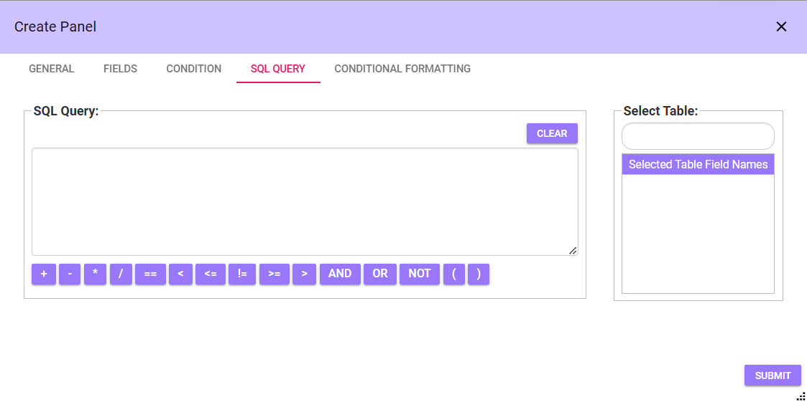

- **SQL Query**: Create logical expressions for filtering data.
- **Operators**:
    - Arithmetic Operators: +, -, *, /
    - Comparison Operators: ==, <, >, <=, >=, !=
    - Logical Operators: AND, OR, NOT
    - Parentheses: Use ( ) to group conditions.
- **Clear Button**: Clear the SQL query input box.
- **Select Table**: Choose fields for SQL conditions.
    - **Selected Table Field Names**: View the fields added to the query.
- **Submit**: Execute the query and update the dataset.

***Note***: *The SQL Query tab works similarly to the Condition tab, as both are used to filter and refine data. However, the SQL Query tab allows users to write custom SQL statements for advanced data manipulation, offering greater flexibility and control compared to the predefined options in the Condition tab.*

## Conditional Formatting
Enables customization of the table’s appearance based on data values. Users can define conditions to change font size, font color, or background color for specific fields or values, making the table more visually intuitive

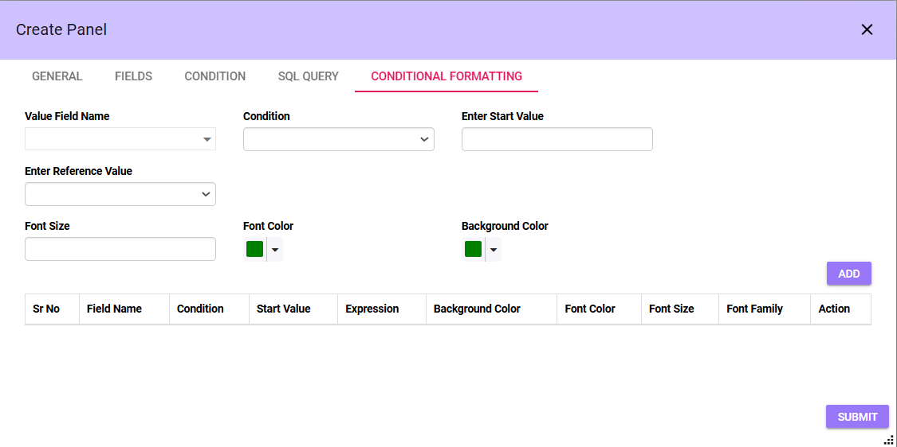

- **Value Field Name**: Select the field to be evaluated for conditional formatting.
- **Condition**: Specify a condition for the field.
- **Enter start Value**: Enter a static value for the condition.
- **Enter Reference Value**: Select the value from the dropdown menu.
- **Font Size**: Set the font size for the formatted cells.
- **Font Color**: Choose a font color for the conditionally formatted cells.
- **Background Color**: Select a background color for the formatted cells.
- **Add**: Click on Add button all the selected information will be displayed in a tabular fomat with actions
- **Submit**: Save and apply the conditional formatting.

***Note***: *The Pivot Panel reflects changes dynamically based on the applied conditional formatting.*

- *If the user wants to apply conditional formatting to a single field, they need to specify the condition and enter the required value*
- *For conditions like "between," the user must provide both a start value and an end value. The panel will update and reflect the changes based on the applied formatting.*
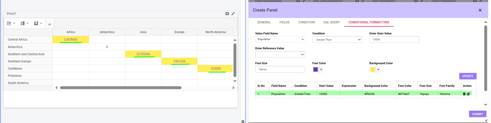

***Note***

***Download***

*Clicking the first icon provides three download options: PDF, Excel, and CSV. The user can choose any format to download the file.*

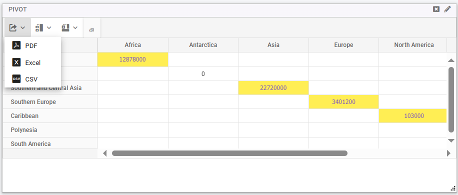

*Users can download the file after applying conditional formatting, and the downloaded file will reflect the applied formatting.*

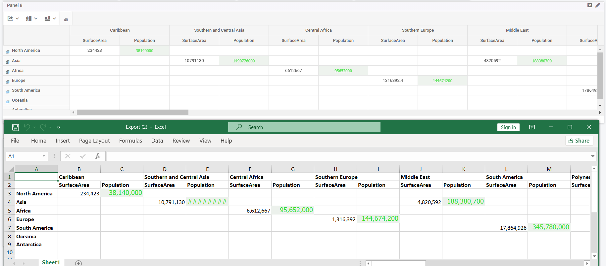