# TABLE
This section describes how to configure the Table Panel, including General, Measure, Condition, SQL Query, and Conditional Formatting tabs.
## Adding a Tabel Panel

**Step 1**: Select **Table** from the **Add Panel** options and click **Submit**.

A table panel will appear on the Dashboard.

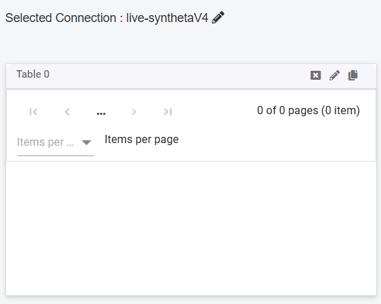

**Step 2**: Click the *Pencil Icon* to open a configuration tab with various fields for customization.

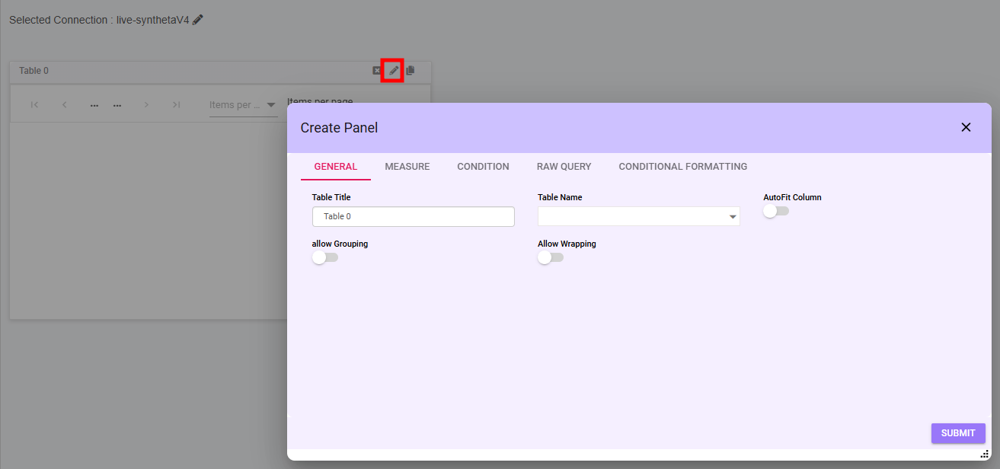

The following options are available for customizing the Table Panel:

## General 
The General tab allows user to configure basic properties of the table panel.

- **Table Title**: Enter a title for the table panel.
- **Table Name**: Select a table from the dropdown menu. The list is populated based on the selected database connection.
- **AutoFit Column**: Toggle to enable automatic adjustment of column widths.
- **Allow Grouping**: Enable grouping functionality for table rows. 
    - for this user needs to drag and drop the column.

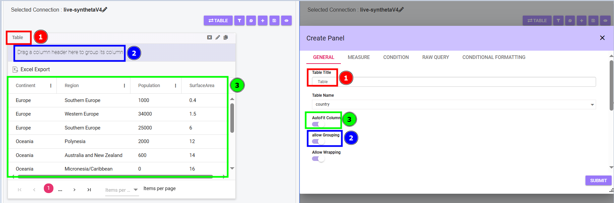

<!-- - **Allow Server-Side Paging**: Toggle to allow pagination for large datasets. -->
- **Allow Wrapping**: Toggle to enable or disable text wrapping in table cells.
- **Submit**: Save your settings and apply the configuration.

### Various Filtering and Customization Options

When the user clicks on the three dots, various filtering and customization options are available:

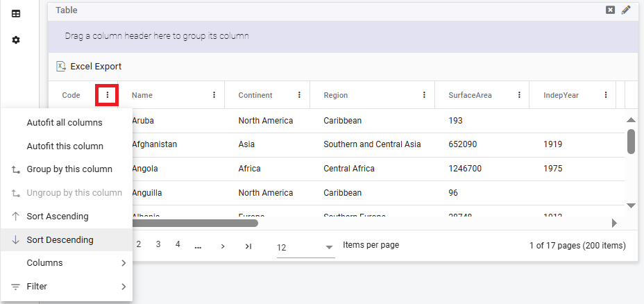

- **Autofit All Columns**: Adjusts the width of all columns to fit the content.
- **Autofit This Column**: Adjusts the width of the selected column to fit its content.
- **Group by This Column**: Groups the data based on the selected column.
- **Ungroup by This Column**: Removes grouping for the selected column.
- **Sort Ascending**: Sorts the data in ascending order based on the selected column.
- **Sort Descending**: Sorts the data in descending order based on the selected column.
- **Columns**: Click the arrow to view a list of all columns. user can deselect specific columns, and the data will update accordingly.
- **Filters**: Click the arrow to display a list of fields. Disable specific fields to filter the data and display results accordingly.

## Measure
The Measure tab is used to configure columns and their properties for the table.

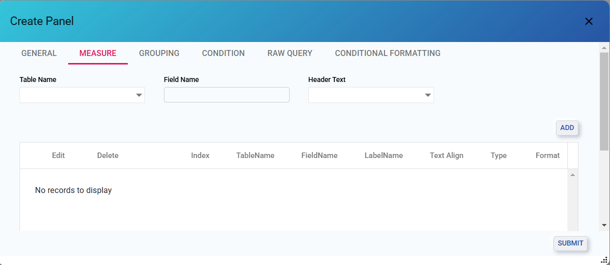

- **Table Name**: The table name selected in the General tab the same will be selected here.
- **Field Name**: Field names are fetched from the selected table. User can choose multiple Field names by enabling the checkbox.
- **Header Text**: Enter the column's header label.

**Add Button**: Add the configured column to the table. All added columns will be displayed in a tabular view for review and editing.

**Submit Button**: Click on Submit to Save settings and apply the configuration.

### Action
#### Edit
Click the **Edit Button** to edit the selected field

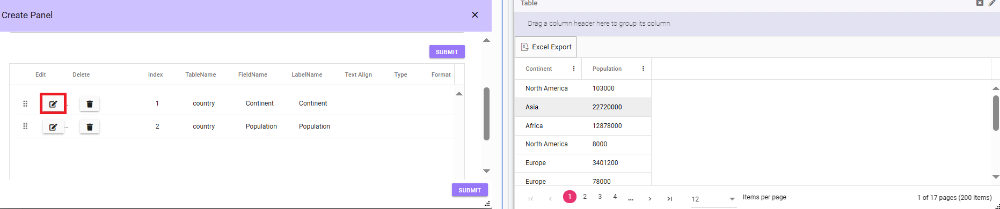

After editing the required info the details will be shown in the table like text align , type visible etc.

#### Delete
Click on the **Delete Button** To remove the Selected Field

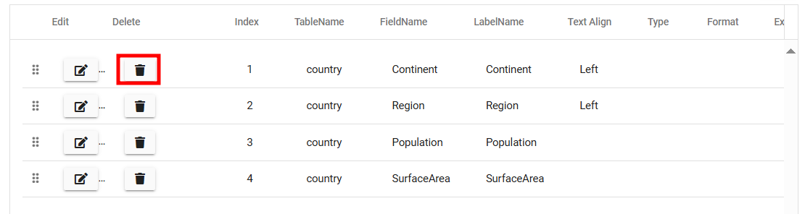

#### Dots
Click on the **dots** to drag and rearrange the position of the fields.

## Grouping

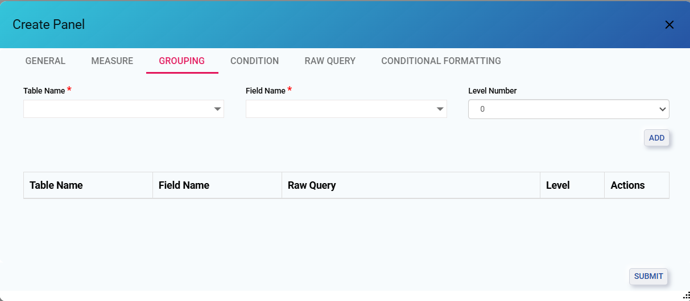

- **Table Name**: The table name selected in the General tab the same will be selected here.
- **Field Name**: Field names are fetched from the selected table. User can choose Field names from the dropdown menu.
- **Level Number**: Select the level number 0-10. and user can add multiple levels.

**Add Button**: Add the configured column to the table. All added columns will be displayed in a tabular view for review and editing.

**Submit Button**: Click on Submit to Save settings and apply the configuration.

## Condition
The Condition tab is used to refine and filter data using logical expressions.

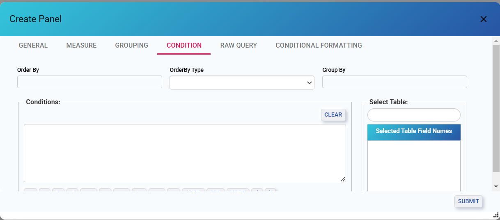

- **Order By**: Define fields to sort data.
- **Order By Type**: Select sorting order (Ascending or Descending).
- **Group By**: Specify fields to group data for aggregation.
- **Conditions**: Use this section to create logical filtering expressions.
    - **Input Box**: Enter filter expressions (e.g., country == 'Africa').
        - **Operators**: Use available buttons to add:
            - Arithmetic Operators: +, -, *, /
            - Comparison Operators: ==, <, >, <=, >=, !=
            - Logical Operators: AND, OR, NOT
            - Parentheses: ( ) to group conditions.
    - **Clear Button**: Reset the condition input box.
- **Select Table**: Choose fields from the table to include in the condition.
    - **Selected Table Field Names**: View selected fields.
- **Submit**: Apply conditions and update the dataset.

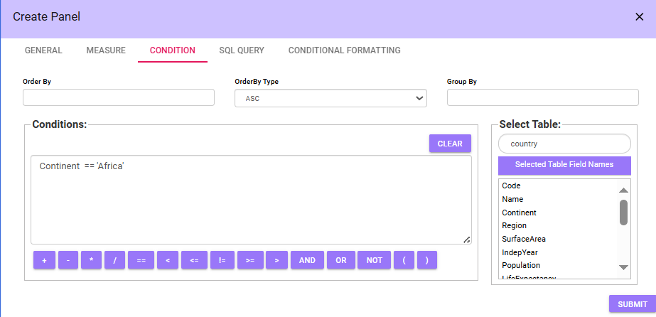

***Note***: *The condition should be written within single quotes (').*

## RAW Query 
The RAW Query tab allows you to define custom SQL-based filters and queries for the table panel.

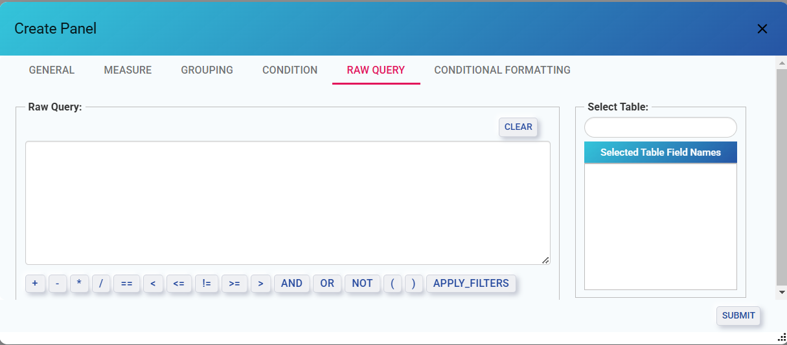

- **SQL Query**:
    - **Input Box**: User can Write Sql Query expressions for filtering data.
        - **Operators**:
            - Arithmetic Operators: +, -, *, /
            - Comparison Operators: ==, <, >, <=, >=, !=
            - Logical Operators: AND, OR, NOT
            - Parentheses: Use ( ) to group conditions.
            - Apply Filters: Whenever users are using a raw query, and if there is a WHERE clause in the query, `{apply_filters}` should be added.    
    - **Clear Button**: Clear the SQL query input box.
- **Select Table**: Choose fields for SQL conditions.
    - **Selected Table Field Names**: View the fields added to the query.
- **Submit**: Execute the query and update the dataset.

***Note***: *Setting up a RAW query is the same as setting a condition, but SQL queries are used.*

## Conditional Formatting
The Conditional Formatting tab allows you to customize table styling based on field values.

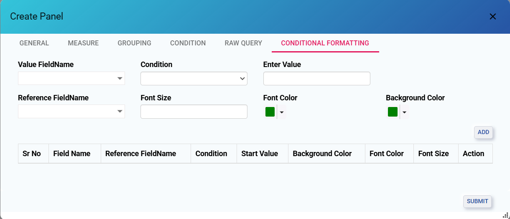

- **Value Field Name**: Select the field to be evaluated for conditional formatting.
- **Condition**: Specify a condition for the field.
- **Enter Value**: Enter a static value for the condition.
- **Reference Field Name**: Use another field as a reference for the condition.
- **Font Size**: Set the font size for the formatted cells.
- **Font Color**: Choose a font color for the conditionally formatted cells.
- **Background Color**: Select a background color for the formatted cells.

**Add Button**: Click on the Add button once the all the fields are configured the fields will be seen below in the tabular form.

- **Submit**: Save and apply the conditional formatting.

#### Example
- To apply conditional formatting to a single field, the user must select a condition, enter a value, and save it. The formatting will be displayed in the table. Once submitted, the panel will update based on the specified condition.

- To apply conditional formatting to two different fields, the user must select a condition. Entering a value is optional, but the user must link the Reference Field Name to the Value Field Name. The condition will be applied accordingly.

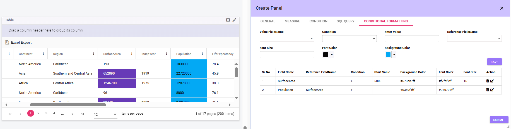

## Export Excel
User can click on **Export Excel** on the panel to download the excel file.

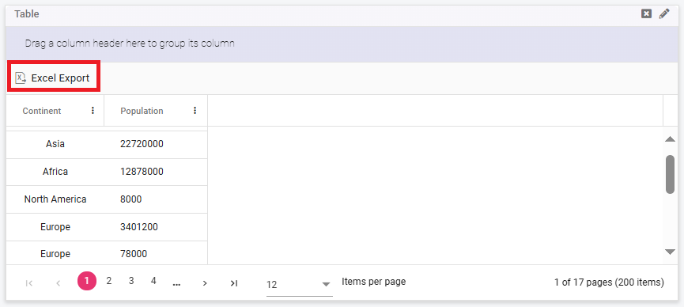

## Drill Down 
To drill down into a particular column or piece of information, the user can simply click on that specific data, and the detailed information will open. However, there is a restriction in the RAW Query section: users need to ensure that if they are using any query, the alias name they provide must match the field name present in the table.