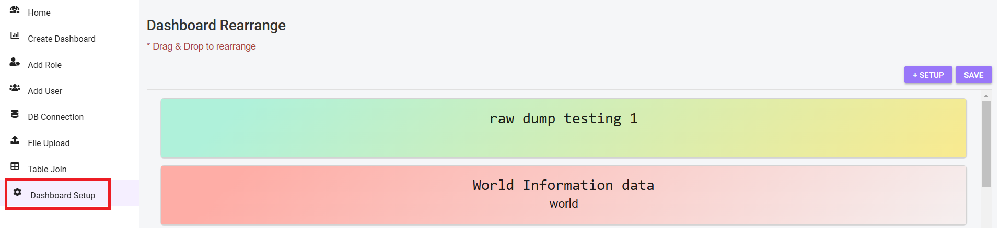
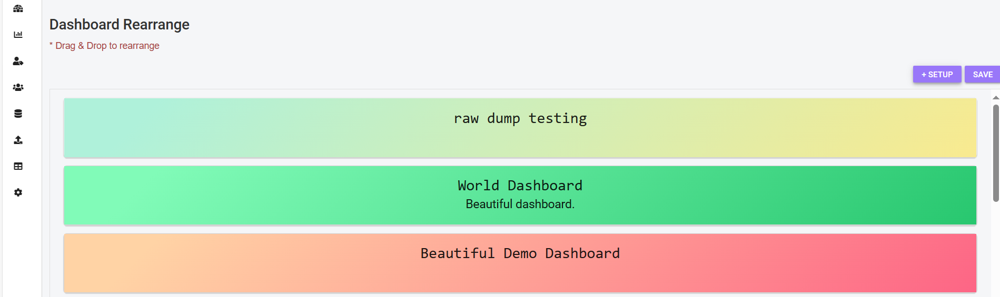
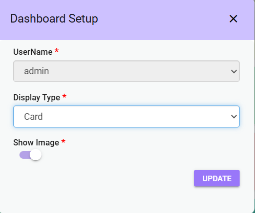
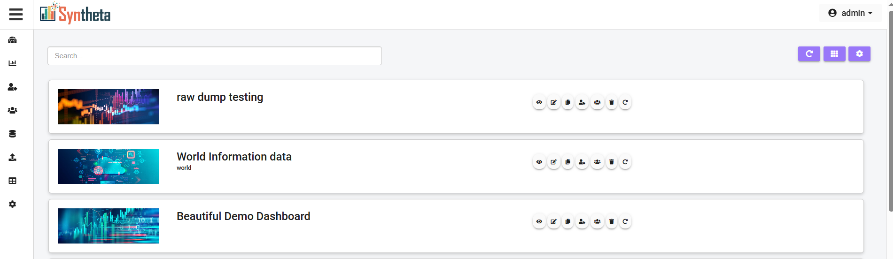
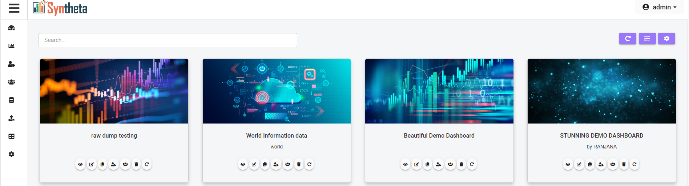
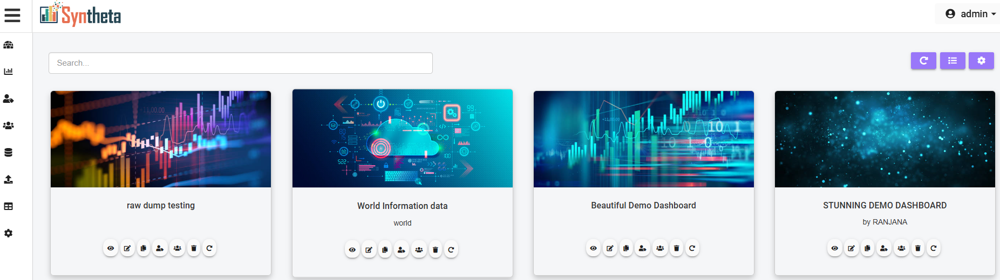
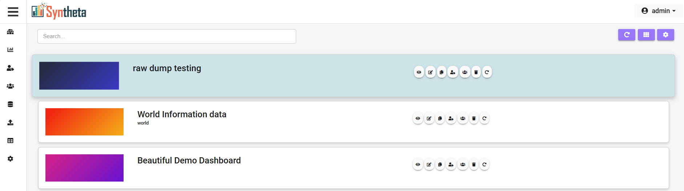

# DASHBOARD SETUP
The Dashboard Setup feature allows users to customize the layout and appearance of their dashboards on the home page.

**Step 1**: Click **Dashboard Setup**.

The **Dashboard Rearrange window** will open , where all created dashboards are listed.

## Rearrange Dashboards
- Drag and drop dashboard tiles to reorder or swap their places on the home page.

## Customize Display Settings
**SET UP**: Click on the **SET UP** button.

To customize the display settings. A pop-up will appear with the following options:

- **Username**: The user name will be selected as the same as the login person.

- **Display Type**: Choose the display type for dashboards, and the choosen type will be seen on the home page.

    - **List View**: Displays dashboards in a vertical list.

    

    - **Card View**: Displays dashboards in horizontal cards.

    
        
- **Show Image**: This is a Toggle option.

    - when show image is enabled dashboards will be displayed in full color and design.
    

    - when disabled the dashboard are in default style.
    

- **Update**: Click **Update** to apply the selected changes.

***NOTE***: *When the user logins what ever option is choosen in display type the same will be reflected.*

**SAVE**: Click **Save Button** to save any modifications made.

## Note
*The user can access Dashboard setup page by clicking the Dashboard Setup option in the sidebar menu or by selecting the Dashboard Setup icon on the home page.*