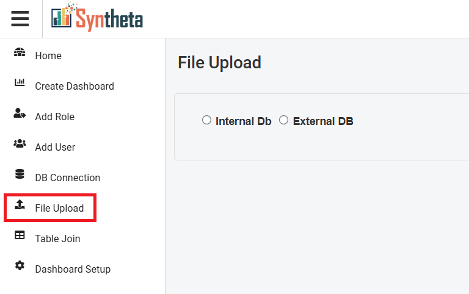
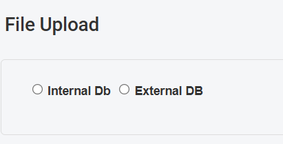
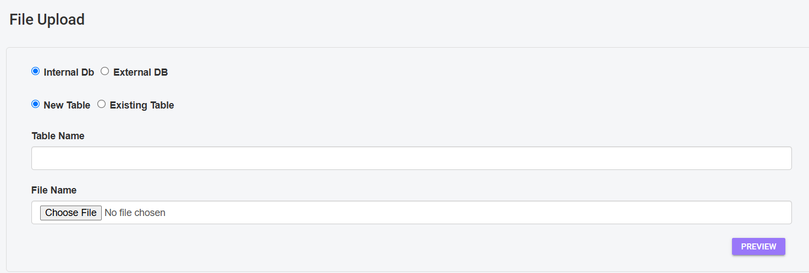
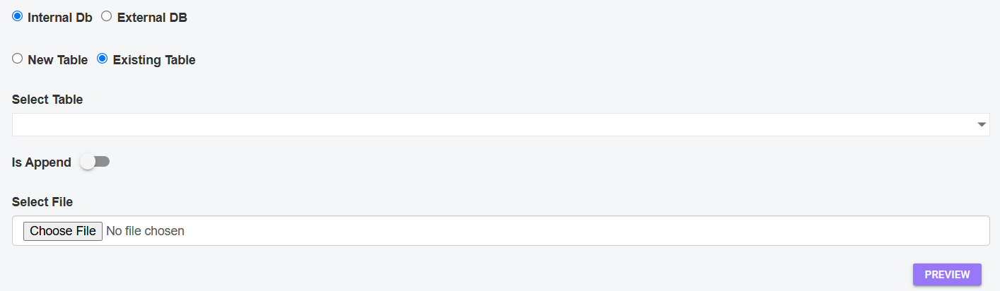
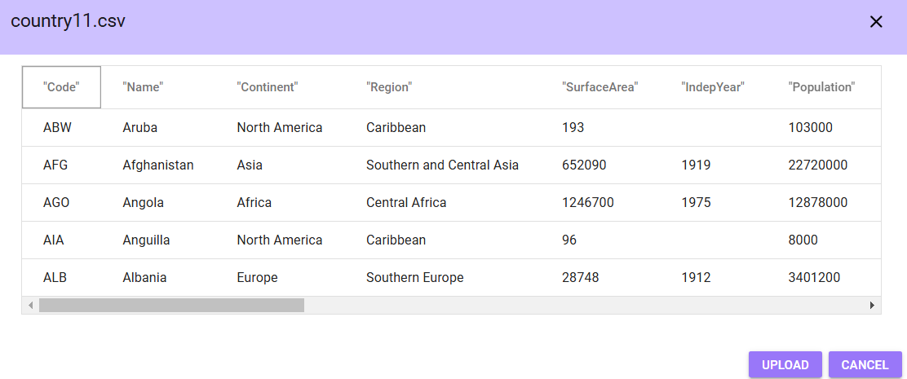
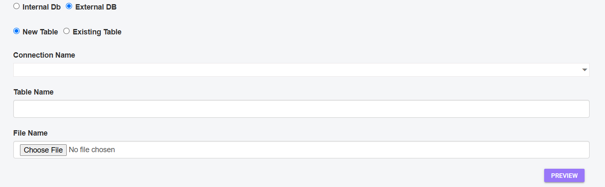
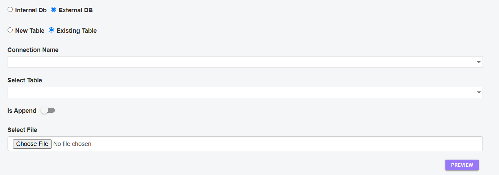

# FILE UPLOAD
The file upload process allows users to upload files (such as Excel or CSV files) into a database. Depending on the system's configuration, these files can be uploaded into either an Internal DB or an External DB

## File Upload Selection
**Step 1**: Click on the "File Upload".

A tab will open

**Step 2**: Choose Database Type

User can upload files to two types of databases:

1. **Internal DB**: An Internal DB is a database that is managed within your own system or application. It could be part of an internal infrastructure, an application server, or an on-premise database that you're using for your organization. Typically, these databases are not accessible from external networks unless configured otherwise (e.g., through a VPN or firewall settings).
2. **External DB**: An External DB refers to a database that is hosted outside of your system, typically on an external server or a cloud-based platform. These databases are usually accessible over the internet, which means they can be accessed remotely and managed from different locations.

## 1. Internal DB
When Internal DB is selected there are two different options to choose

- New Table 
- Existing Table

### New Table
If New Table is selected

- **Table Name**: Enter a new name for the table.
- **File Name**: Select the file (Excel: .xls, .xlsx, or CSV: .csv).
- **Preview**: Click Preview to review the file's content before uploading.

After previewing the file, user can either Upload the data or Cancel if needed.

**Upload**: Click on **Upload button** to upload the data.

**Cancel**: Click on **Cancel button** to Cancel the data.

### Exisiting Table
If Exisiting Table is selected

- **Select Table**: Choose an existing table from the dropdown.
- **Is Append?**: Toggle to enable appending the file data to the table.
    - Enabled: Data is appended to the table.
    - Disabled: Data is not appended, overwriting the existing table content.
- **File Name**: Choose the file (Excel or CSV).
- **Preview**: Click Preview to review the file's content before uploading.

After previewing the file, user can either Upload the data or Cancel if needed.

**Upload**: Click on **Upload button** to upload the data.

**Cancel**: Click on **Cancel button** to Cancel the data.

## 2. External DB
When External DB there are two different options to choose

- New Table 
- Existing Table

### New Table

- **Connection Name**: Select the database connection from the dropdown.
- **Table Name**: Enter a new name for the table.
- **File Name**: Choose the file (Excel or CSV).
- **Preview**: Click Preview to review the file's content before uploading.

After previewing the file, user can either Upload the data or Cancel if needed.

**Upload**: Click on **Upload button** to upload the data.

**Cancel**: Click on **Cancel button** to Cancel the data.

### Existing Table

- **Connection Name**: Select the database connection.
- **Select Table**: Choose an existing table from the dropdown.
- **Is Append?**: Toggle to enable appending the file data to the existing table.
    - Enabled: Data is appended.
    - Disabled: Data is not appended, overwriting the table.
- **File Name**: Choose the file (Excel or CSV).
- **Preview**: Click Preview to check the content before uploading.

After previewing the file, you can either Upload the data or Cancel if needed.

**Upload**: Click on **Upload button** to upload the data.

**Cancel**: Click on **Cancel button** to Cancel the data.