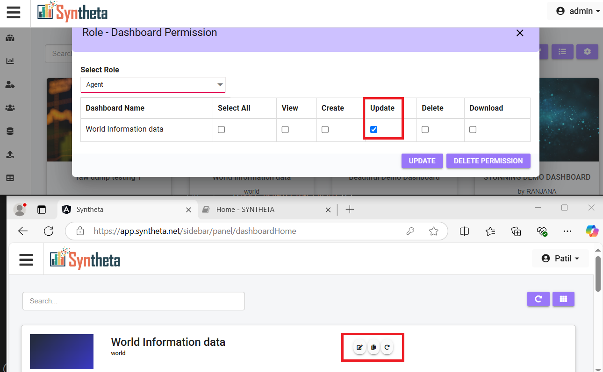

# HOME
The Home Page is the central interface for users to manage and interact with their dashboards. It provides a range of features that allow users to customize their dashboard layout, set permissions, and access detailed views. 

## HOME PAGE VIEW
Once the user is logged in or clicks on **Home**, they will be directed to the Home Page, where they can see the dashboard overview.

## ICONS OVERVIEW

### Search Bar
- Allows the user to **Search** for a specific dashboard.

## 1.Refresh All
- Click on the 1st icon **Refresh All**.

This refreshes the cache for all dashboards on the home page.

## 2.List View/Card View/
- Click the 2nd icon **List View/Card View** to toggle between List View and Card View, allowing user to change the dashboard layout.

## 3.DashBorad Setup
- Click on the 3rd icon **Dashboard Setup** to open the **Dashboard Rearrange window**, where all created dashboards are listed.

**Dashboard Rearrange** 

- Drag and drop dashboard tiles to reorder or swap their places on the home page.

- **SET UP**: Click on the **SET UP** button on the top right corner above the dashboard tiles to customize the display settings. 

    A pop-up will appear with the following options:

    

    - **Username**: The user name will be selected as the same as the login person.

    - **Display Type**: Choose the display type for dashboards, and the choosen type will be seen on the home page.

        a. **List View**: Displays dashboards in a vertical list.

        

        b. **Card View**: Displays dashboards in horizontal cards.

        

    - **Show Image**: This is a toggle option
        - When enabled on dashboards are full color and design.
        

        - when disabled or off to show the default dashboard style.
        

    - **Update**: Click **Update** to apply the selected changes.
- **Save**: Click **Save Button** to save any modifications made.

***NOTE***: when the user logins what ever option is choosen in display type the same will be reflected.List View/Card View is just* *used for the view on the page after login.*

## DASBOARD ICONS
- Users can interact with the dashboard icons for additional functionality.

## 1.View 
Click on the **View** icon (or anywhere on the dashboard) to open a detailed view of the dashboard.     

For more details, visit the [View Dashboard](/home/view_dashboard/).

## 2.Update
Click the **Update** icon to access dashboard settings.

- A new window opens with the following options

- Users can access and edit the panel individually by clicking the **Pencil Icon**, or remove the panel by clicking the **Cancel Icon**.

<!-- - In the same page on the top right corner there are 6 icons

#### 1.Table
Click on the 1st icon **Table**.

- **Old Table Name**: Select the current table name.
- **New Table Name**: Choose the new table name.
- **Replace Table**: Click to save the changes.

#### 2.Initial Filters
Click on The 2nd icon *Intial filters*.

a tab will open

- **Table Name**: Select the table name.
- **Field Name**: Choose the desired field.
- **Label Name**: Enter a custom label for the filter.
- **Filter Type**: Select from available filter types:
    - *Date*: Choose the current date or specify the number of previous days.
    - *Day*: Select the current day or specify the number of previous days.
    - *Week*: Select the current week or specify the number of previous weeks.
    - *Month*: Choose the current month or specify the number of previous months.
    - *Year*: Select the current year or specify the number of previous years.

For dynamic values, additional input boxes appear where users can increase or decrease the value using arrow buttons.

- **Submit**: Saves the configured filters.
<!-- - **Delete**: Removes the selected filter configuration. -->

<!-- #### 3.Role Mapping
Click on *Role mapping*.

a form will open 

- **Table Name**: Select the table.
- **Field Name**: Choose the field.
- **Role**: Assign a role from the dropdown menu.
- **Submit**: Click *Submit* to save the configuration. 

    The role mapping will appear in a table with action buttons:

    - **Edit**: Click on **Edit** to Modify an existing role mapping.
    - **Delete**: Click on **Delete** to Remove a role mapping.
- **Save**: Click *Save* once all changes are finalized.

### 4.Add Panel
Click on the 4th icon **Add Panel**.

Users can refer to the [Add Panel](/create_dashboard/add_panel) option to create various types of visual representations and apply filters.

#### 5.Update
Click on the 5th icon **Update**.

A form will open 

- **Title**: Displays the selected dashboard.
- **Description**: Add a description for the dashboard.
- **Active**: Toggle to enable or disable the dashboard.
    - *Enabled*: The dashboard is active and visible.
    - *Disabled*: The dashboard is inactive.
- **Dashboard Image**: Upload an image for the dashboard.
- **Update**: Save changes by clicking Update.

#### 6.View
Click on last icon **View**. 

A confirmation dialog appears: "Are you sure you want to leave this page?"

Select Yes to open the selected dashboard view page. -->

## 3.Copy Dashboard
Click *Copy Dashboard* to create a duplicate of the existing dashboard. and will be visible at the bottom.

## 4.Role Permission
Click the *Role Permission* to assign specific permissions for the selected dashboard to different roles.

A pop-up appears with the following options

- **Select Role**: Choose a role from the dropdown.
- **Dashboard Permissions**: Set access permissions for the dashboard, including View, Create, Update, Delete, and Download.
- **Submit**: Click on **Submit** to submit the user permission settings.    
    - *View*: When View access is granted, users logged in under the selected role can see view icon and refresh cache icon.
    
    - *Create*: When Create access is granted, users logged in under the selected role can see copy dashboard, role permissions, user permissions, and Refresh Cache icon.
    
    - *Update*: When Update access is granted, users logged in under the selected role can edit/Update,Copy Dashboard, and Refresh Cache.
    
    - *Delete*: When Delete access is granted, users logged in under the selected role can delete items and refresh the dashboard..
    
    - *Download*: When Download access is granted, users logged in under the selected role can download dashboard data and refresh the dashboard.

- **Update**: Click on **Update** to update the permissions after selection.
- **Delete Permission**: Click on **Delete Permission** to Remove all selected permissions.

## 5.User Permission
Click the *User Permission icon* to assign specific permissions for the selected dashboard to different roles.

- **Select Role**: User can select the required role from the dropdown menu.
- **Select User**: User can select the required User from the dropdown related to the particular user.
- **Submit**: Click on **Submit** to submit the user permission settings.

    - *View*: When View access is granted, users logged in under the selected role can view the *Dashboard and Refresh* icon and use them.
    - *Create*: When Create access is granted, users logged in under the selected role can view *Copy Dashboard, Role Permissions, User Permissions, and refresh* Icons and can use them.
    - *Update*: When Update access is granted, users logged in under the selected role can view *Update, Copy Dashboard and Refresh* icons and can use them.
    - *Delete*: When Delete access is granted, users logged in under the selected role can view *Delete and Refresh* Icons and can use them.
    - *Download*: When Download access is granted, users logged in under the selected role can view *Download and Refresh* icons and can use them.
- **Update**: Click on **Update** to update the permissions after selection.
- **Delete Permission**: Click on **Delete Permission** to Remove all selected permissions.

*Note: When User permissions are given they override role permissions.*

## 6.Delete
Click the **Delete** icon to remove a dashboard from the system.

## 7.Refresh
Click the **Refresh** icon to refresh the cache for each dashboard.

## USER LOGIN
Click on the logged-in username in the top-right corner to access two options:

- **User Settings**: Click on **User Settings** A page will open allowing the user to view and edit their username, email, and password.

Users can update their password and save the changes.

- **Logout**: Click on **Logout** to sign out of the application.