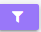

# VIEW DASHBOARD

## View 

Click on the **View** icon (or anywhere on the dashboard) to open a detailed view of the dashboard.     

On the top-right corner, icons are available:

## Update
Click on **Update icon** 

This will open the dashboard where the user can update or edit dashboard.

## Clear Cache
Click on **Clear Cache** to Clear the cache for the currently viewed dashboard.

## Apply Filter
Click on **Apply Filter** to Apply selected filters to the dashboard.

## Clear Filter
Click on **Clear Filter** to Clear all applied filters.

**For example**:

- To apply filters to fields such as list boxes, dropdowns, multi-select dropdowns, and input boxes, select the desired options, check the corresponding checkboxes. To apply a filter individually, the user can click the Apply Filter icon located on the panel.f the user wants to apply filters for all fields at once, they can use the Apply All Filters option in the top-right corner.To clear any applied filters, click the Clear Filter icon available in the same locations.

- Once filters are applied, the appropriate panels—such as charts, boxes, tables, or pivot views—will dynamically update and display based on the selected criteria.

## Applied Filter

Click on **Applied Filter** 

A tab will open where user can see the list of all the selected/applied filters 

- **Bookmark Filter**: To bookmark a specific filter, the user can select the desired filters, review them in the **Applied Filter** tab, and click **Save** to bookmark those filters.  

- **Removing Filters**: Users can remove any selected filter by clicking the **X** icon next to it. By default, filters will be set to  the Default section. Users can toggle them to the Yours section if desired.

- The selected filters will be showed under yours section of applied filters.

**Save**: Click Save to save any modifications made to the filters.

**Delete**: Click Delete to remove filters entirely.

- If an admin or super admin applies filters and are sets as default, these filters will appear in the Default section of the applied filters for any user viewing that dashboard. When the user logs in and checks the applied filters section:

    - The admin/super admin's default filters will remain under the Default section.Users cannot remove these default filters but can apply additional filters, which will appear under the Yours section of the applied filters.

**Download**

Click on **Download** to save the reports. Each table includes an option to download its respective report separately.

