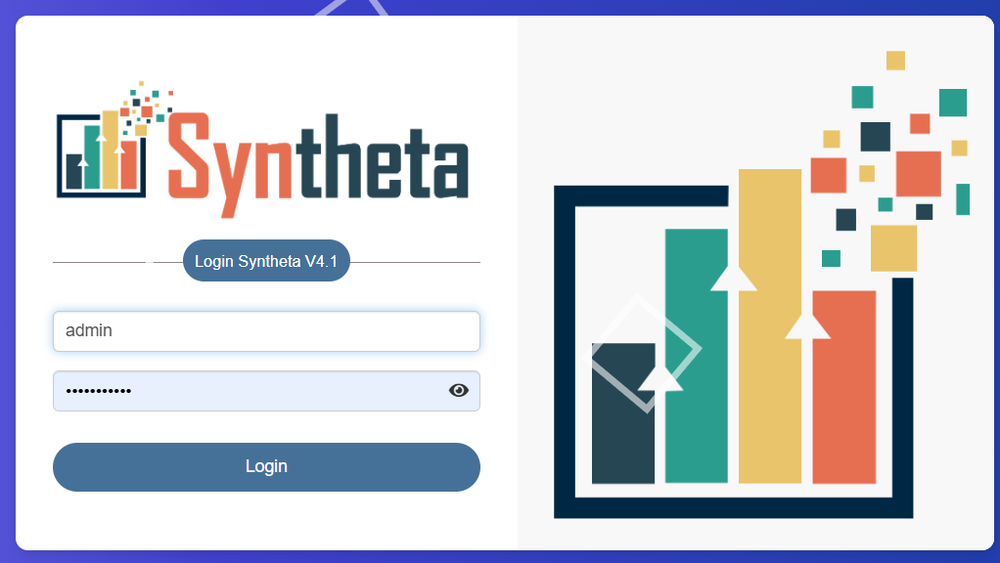
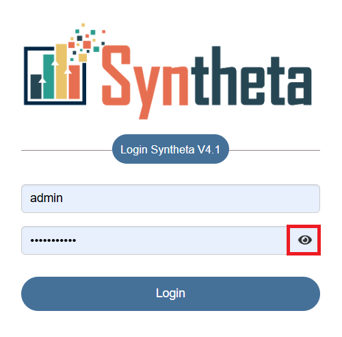

# LOGIN INSTRUCTION
This document provides a comprehensive guide on how to access the webpage by logging in and access its features.

Open a web browser and navigate to the link.

This is how the login page will appear.

The sign-in form allows users to enter their credentials to access the link.

## Sign In Process
- **Step 1**: **Username Field**: The user needs to type a valid username.
- **Step 2**: **Password Field**: The user needs to type in the valid password.Password conditions to users and enforce them.
    - At least one uppercase letter.
    - At least one lowercase letter.
    - At least one numeric character.
    - At least one special character(e.g., !, @, #, $, %, etc.).
- **Step 3**: **Login In Button**: Click on the "Login In" button.

The user will be logged in and the webpage will be opened.and the page would look like this

## Note

To view the typed password, the user can click on the eye icon.  

