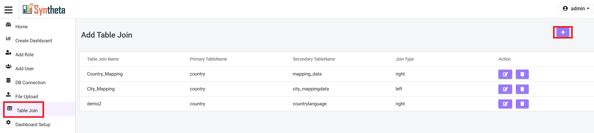
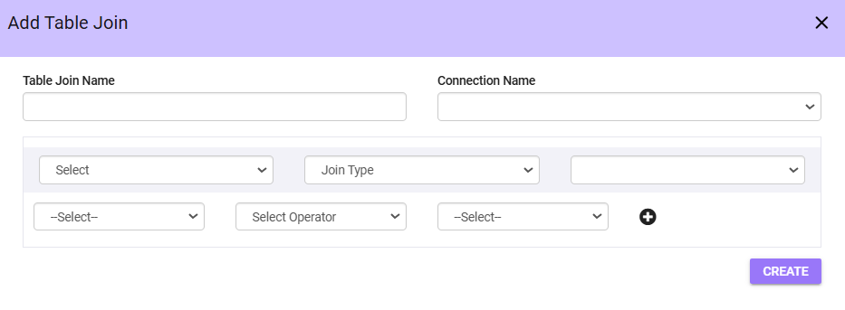
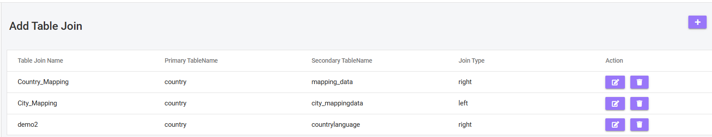
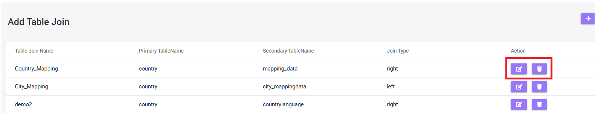

#  TABLE JOIN
The Add Table Join form allows users to define and configure table joins in the database. This feature is typically used to combine data from multiple tables based on specific relationships and conditions.

## Accessing Table Join form
**Step 1**: Click on "Table Join".

**Step 2**: Click on "Add".
(on the top right corner)

A form will open 

**Step 3**: **Table Join Name**: Enter a descriptive name for the table join in the Table Join Name field.

**Step 4**: **Connection Name**: Select the database connection from the dropdown menu.

**Step 5**: Tables Selection

- **Left Table**: Select the primary table for the join.
- **Right Table**: Select the secondary table for the join.

**Step 6**: Choose the type of join to apply:

- *Left Join*: Includes all rows from the left table, even if no match exists in the right table.
- *Right Join*: Includes all rows from the right table, even if no match exists in the left table.
- *Inner Join*: Includes rows with matching values in both tables.
- *Outer Join*: Combines all rows from both tables, with matches where possible.
- *Cross Join*: Combines all rows from the left table with all rows from the right table.

**Step 7**: Define the conditions for the join:

- **Left Column**: Select the column from the left table.
- **Right Column**: Select the column from the right table.

**Step 8**: **Operator**: Specify the relationship between the selected columns using one of the following operators:

- = (Equal)
- <= (Less Than or Equal To)
- >= (Greater Than or Equal To)
- != (Not Equal)
- < (Less Than)
- > (Greater Than)

**Step 9**: To add more conditions: Click the **+** button to create a new row for an additional condition.

**Step 10**: **Create**: Click on **Create** to save.

## View Table Join

- **View Created Table join**: User can see all created Table join including their *Primary TableName*, *Secondary Table Name*, *Join Type*.

## Manage Table Join Actions

### Edit
Click the *Edit icon* to make any changes.
### Delete
Click the *Delete icon* to remove an unwanted.